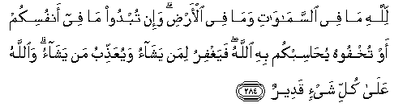
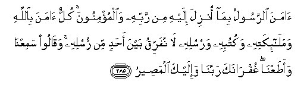
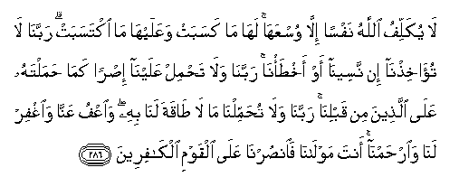

  
[Intangible Textual Heritage](../../index)  [Islam](../index) 
[Index](index)   
[Hypertext Qur'an](../htq/index)  [Unicode](../uq/002.htm#002_284) 
[Palmer](../sbe06/002)  [Pickthall](../pick/002.htm#002_284)  [Yusuf Ali
English](../yaq/yaq002)  [Rodwell](../qr/002)   
  
[Sūra II.: Baqara, or the Heifer. Index](002)  
  [Previous](00239)  [Next](00301) 

------------------------------------------------------------------------

  
*The Holy Quran*, tr. by Yusuf Ali, \[1934\], at Intangible Textual
Heritage

------------------------------------------------------------------------

# Sūra II.: Baqara, or the Heifer.

### Section 40

------------------------------------------------------------------------

284. Lill<u>a</u>hi m<u>a</u> fee a**l**ssam<u>a</u>w<u>a</u>ti
wam<u>a</u> fee al-ar<u>d</u>i wa-in tubdoo m<u>a</u> fee anfusikum aw
tukhfoohu yu<u>ha</u>sibkum bihi All<u>a</u>hu fayaghfiru liman
yash<u>a</u>o wayuAAa<u>thth</u>ibu man yash<u>a</u>o
wa**A**ll<u>a</u>hu AAal<u>a</u> kulli shay-in qadeer**un**

284\. To God belongeth all  
That is in the heavens  
And on earth. Whether  
Ye show what is in your minds  
Or conceal it, God  
Calleth you to account for it.  
He forgiveth whom He pleaseth,  
And punishefh whom He pleaseth.  
For God hath power  
Over all things.

------------------------------------------------------------------------

285. <u>A</u>mana a**l**rrasoolu bim<u>a</u> onzila ilayhi min rabbihi
wa**a**lmu/minoona kullun <u>a</u>mana bi**A**ll<u>a</u>hi
wamal<u>a</u>-ikatihi wakutubihi warusulihi l<u>a</u> nufarriqu bayna
a<u>h</u>adin min rusulihi waq<u>a</u>loo samiAAn<u>a</u>
waa<u>t</u>aAAn<u>a</u> ghufr<u>a</u>naka rabban<u>a</u> wa-ilayka
alma<u>s</u>eer**u**

285\. The Apostle believeth  
In what hath been revealed  
To him from his Lord,  
As do the men of faith.  
Each one (of them) believeth  
In God, His angels,  
His books, and His apostles.  
"We make no distinction (they say)  
Between one and another  
Of His apostles." And they say:  
"We hear, and we obey:  
(We seek) Thy forgiveness,  
Our Lord, and to Thee  
Is the end of all journeys."

------------------------------------------------------------------------

286. L<u>a</u> yukallifu All<u>a</u>hu nafsan ill<u>a</u>
wusAAah<u>a</u> lah<u>a</u> m<u>a</u> kasabat waAAalayh<u>a</u>
m<u>a</u> iktasabat rabban<u>a</u> l<u>a</u>
tu-<u>a</u>khi<u>th</u>n<u>a</u> in naseen<u>a</u> aw
akh<u>t</u>a/n<u>a</u> rabban<u>a</u> wal<u>a</u> ta<u>h</u>mil
AAalayn<u>a</u> i<u>s</u>ran kam<u>a</u> <u>h</u>amaltahu AAal<u>a</u>
alla<u>th</u>eena min qablin<u>a</u> rabban<u>a</u> wal<u>a</u>
tu<u>h</u>ammiln<u>a</u> m<u>a</u> l<u>a</u> <u>ta</u>qata lan<u>a</u>
bihi wa**o**AAfu AAann<u>a</u> wa**i**ghfir lan<u>a</u>
wa**i**r<u>h</u>amn<u>a</u> anta mawl<u>a</u>n<u>a</u>
fa**o**n<u>s</u>urn<u>a</u> AAal<u>a</u> alqawmi alk<u>a</u>fireen**a**

286\. On no soul doth God  
Place a burden greater  
Than it can bear.  
It gets every good that it earns,  
And it suffers every ill that if earns.  
(Pray:) "Our Lord!  
Condemn us not  
If we forget or fall  
Into error; our Lord!  
Lay not on us a burden  
Like that which Thou  
Didst lay on those before us;  
Our Lord! lay not on us  
A burden greater than we  
Have strength to bear.  
Blot out our sins,  
And grant us forgiveness,  
Have mercy on us.  
Thou art our Protector;  
Help us against those  
Who stand against Faith"

------------------------------------------------------------------------

[Next: Section 1 (1-9)](00301)

