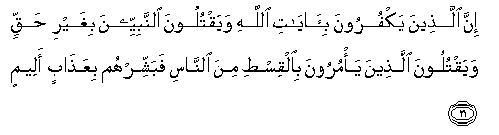
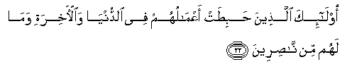
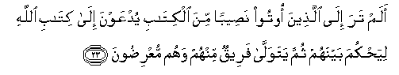
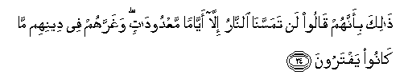
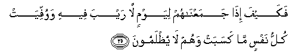
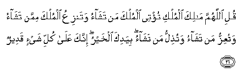
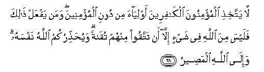
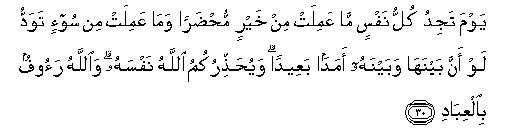

  
[Intangible Textual Heritage](../../index)  [Islam](../index) 
[Index](index)   
[Hypertext Qur'an](../htq/index)  [Unicode](../uq/003.htm#003_021) 
[Palmer](../sbe06/003)  [Pickthall](../pick/003.htm#003_021)  [Yusuf Ali
English](../yaq/yaq003)  [Rodwell](../qr/003)   
  
[Sūra III.: Āl-i-’Imrān, or The Family of ’Imrān. Index](003)  
  [Previous](00302)  [Next](00304) 

------------------------------------------------------------------------

  
*The Holy Quran*, tr. by Yusuf Ali, \[1934\], at Intangible Textual
Heritage

------------------------------------------------------------------------

# Sūra III.: Āl-i-’Imrān, or The Family of ’Imrān.

### Section 3

------------------------------------------------------------------------

21. Inna alla<u>th</u>eena yakfuroona bi-<u>a</u>y<u>a</u>ti
All<u>a</u>hi wayaqtuloona a**l**nnabiyyeena bighayri <u>h</u>aqqin
wayaqtuloona alla<u>th</u>eena ya/muroona bi**a**lqis<u>t</u>i mina
a**l**nn<u>a</u>si fabashshirhum biAAa<u>tha</u>bin aleem**in**

21\. As to those who deny  
The Signs of God, and in defiance  
Of right, slay the prophets,  
And slay those who teach  
Just dealing whith mankind,  
Announce to them a grievous penalty.

------------------------------------------------------------------------

22. Ol<u>a</u>-ika alla<u>th</u>eena <u>h</u>abi<u>t</u>at
aAAm<u>a</u>luhum fee a**l**dduny<u>a</u> wa**a**l-<u>a</u>khirati
wam<u>a</u> lahum min n<u>as</u>ireen**a**

22\. They are those whose works  
Will bear no fruit  
In this world  
And in the Hereafter,  
Nor will they have  
Anyone to help.

------------------------------------------------------------------------

23. Alam tara il<u>a</u> alla<u>th</u>eena ootoo na<u>s</u>eeban mina
alkit<u>a</u>bi yudAAawna il<u>a</u> kit<u>a</u>bi All<u>a</u>hi
liya<u>h</u>kuma baynahum thumma yatawall<u>a</u> fareequn minhum wahum
muAAri<u>d</u>oon**a**

23\. Hast thou not turned  
Thy vision to those  
Who have been given a portion  
Of the Book? They are  
Invited to the Book of God,  
To settle their dispute,  
But a party of them  
Turn back and decline  
(The arbitration).

------------------------------------------------------------------------

24. <u>Tha</u>lika bi-annahum q<u>a</u>loo lan tamassan<u>a</u>
a**l**nn<u>a</u>ru ill<u>a</u> ayy<u>a</u>man maAAdood<u>a</u>tin
wagharrahum fee deenihim m<u>a</u> k<u>a</u>noo yaftaroon**a**

24\. This because they say:  
"The Fire shall not touch us  
But for a few numbered days":  
For their forgeries deceive them  
As to their own religion.

------------------------------------------------------------------------

25. Fakayfa i<u>tha</u> jamaAAn<u>a</u>hum liyawmin l<u>a</u> rayba
feehi wawuffiyat kullu nafsin m<u>a</u> kasabat wahum l<u>a</u>
yu*<u>th</u>*lamoon**a**

25\. But how (will they fare)  
When We gather them together  
Against a Day about which  
There is no doubt,  
And each soul will be paid out  
Just what it has earned,  
Without (favour or) injustice?

------------------------------------------------------------------------

26. Quli all<u>a</u>humma m<u>a</u>lika almulki tu/tee almulka man
tash<u>a</u>o watanziAAu almulka mimman tash<u>a</u>o watuAAizzu man
tash<u>a</u>o watu<u>th</u>illu man tash<u>a</u>o biyadika alkhayru
innaka AAal<u>a</u> kulli shay-in qadeer**un**

26\. Say: "O God!  
Lord of Power (and Rule),  
Thou givest Power  
To whom Thou pleasest,  
And Thou strippest off Power  
From whom Thou pleasest:  
Thou enduest with honour  
Whom Thou pleasest,  
And Thou bringest low  
Whom Thou pleasest:  
In Thy hand is all Good."  
Verily, over all things  
Thou hast power.

------------------------------------------------------------------------

27. Tooliju allayla fee a**l**nnah<u>a</u>ri watooliju
a**l**nnah<u>a</u>ra fee allayli watukhriju al<u>h</u>ayya mina
almayyiti watukhriju almayyita mina al<u>h</u>ayyi watarzuqu man
tash<u>a</u>o bighayri <u>h</u>is<u>a</u>b**in**

27\. "Thou causest the Night  
To gain on the Day,  
And Thou causest the Day  
To gain on the Night;  
Thou bringest the Living  
Out of the Dead,  
And Thou bringest the Dead  
Out of the Living;  
And Thou givest sustenance  
To whom Thou pleasest,  
Without measure."

------------------------------------------------------------------------

28. L<u>a</u> yattakhi<u>th</u>i almu/minoona alk<u>a</u>fireena
awliy<u>a</u>a min dooni almu/mineena waman yafAAal <u>tha</u>lika
falaysa mina All<u>a</u>hi fee shay-in ill<u>a</u> an tattaqoo minhum
tuq<u>a</u>tan wayu<u>h</u>a<u>thth</u>irukumu All<u>a</u>hu nafsahu
wa-il<u>a</u> All<u>a</u>hi alma<u>s</u>eer**u**

28\. let not the Believers  
Take for friends or helpers  
Unbelievers rather than  
Believers: if any do that,  
In nothing will there be help  
From God: except by way  
Of precaution, that ye may  
Guard yourselves from them,  
But God cautions you  
(To remember) Himself;  
For the final goal  
Is to God.

------------------------------------------------------------------------

29. Qul in tukhfoo m<u>a</u> fee <u>s</u>udoorikum aw tubdoohu yaAAlamhu
All<u>a</u>hu wayaAAlamu m<u>a</u> fee a**l**ssam<u>a</u>w<u>a</u>ti
wam<u>a</u> fee al-ar<u>d</u>i wa**A**ll<u>a</u>hu AAal<u>a</u> kulli
shay-in qadeer**un**

29\. Say: "Whether ye hide  
What is in your hearts  
Or reveal it,  
God knows it all:  
He knows what is  
In the heavens,  
And what is on earth.  
And God has power  
Over all things.

------------------------------------------------------------------------

30. Yawma tajidu kullu nafsin m<u>a</u> AAamilat min khayrin
mu<u>hd</u>aran wam<u>a</u> AAamilat min soo-in tawaddu law anna
baynah<u>a</u> wabaynahu amadan baAAeedan
wayu<u>h</u>a<u>thth</u>irukumu All<u>a</u>hu nafsahu
wa**A**ll<u>a</u>hu raoofun bi**a**lAAib<u>a</u>d**i**

30\. "On the Day when every soul  
Will be confronted  
With all the good it has done,  
And all the evil it has done,  
It will wish there were  
A great distance  
Between it and its evil.  
But God cautions you  
(To remember) Himself.  
And God is full of kindness  
To those that serve Him."

------------------------------------------------------------------------

[Next: Section 4 (31-41)](00304)

