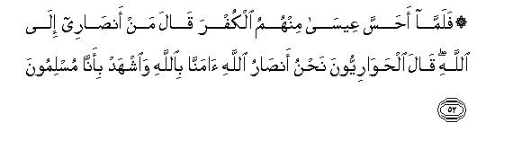

  
[Intangible Textual Heritage](../../index)  [Islam](../index) 
[Index](index)   
[Hypertext Qur'an](../htq/index)  [Unicode](../uq/003.htm#003_042) 
[Palmer](../sbe06/003)  [Pickthall](../pick/003.htm#003_042)  [Yusuf Ali
English](../yaq/yaq003)  [Rodwell](../qr/003)   
  
[Sūra III.: Āl-i-’Imrān, or The Family of ’Imrān. Index](003)  
  [Previous](00304)  [Next](00306) 

------------------------------------------------------------------------

  
*The Holy Quran*, tr. by Yusuf Ali, \[1934\], at Intangible Textual
Heritage

------------------------------------------------------------------------

# Sūra III.: Āl-i-’Imrān, or The Family of ’Imrān.

### Section 5

------------------------------------------------------------------------

42. Wa-i<u>th</u> q<u>a</u>lati almal<u>a</u>-ikatu y<u>a</u> maryamu
inna All<u>a</u>ha i<u>st</u>af<u>a</u>ki wa<u>t</u>ahharaki
wa**i**<u>st</u>af<u>a</u>ki AAal<u>a</u> nis<u>a</u>-i
alAA<u>a</u>lameen**a**

42\. Behold! the angels said:  
"O Mary! God hath chosen thee  
And purified thee—chosen thee  
Above the women of all nations.

------------------------------------------------------------------------

43. Y<u>a</u> maryamu oqnutee lirabbiki wa**o**sjudee wa**i**rkaAAee
maAAa a**l**rr<u>a</u>kiAAeen**a**

43\. "O Mary! worship  
Thy Lord devoutly:  
Prostrate thyself,  
And bow down (in prayer)  
With those who bow down."

------------------------------------------------------------------------

44. <u>Tha</u>lika min anb<u>a</u>-i alghaybi noo<u>h</u>eehi ilayka
wam<u>a</u> kunta ladayhim i<u>th</u> yulqoona aql<u>a</u>mahum ayyuhum
yakfulu maryama wam<u>a</u> kunta ladayhim i<u>th</u>
yakhta<u>s</u>imoon**a**

44\. This is part of the tidings  
Of the things unseen,  
Which We reveal unto thee  
(O Apostle!) by inspiration:  
Thou wast not with them  
When they cast lots  
With arrows, as to which  
Of them should be charged  
With the care of Mary:  
Nor wast thou with them  
When they disputed (the point).

------------------------------------------------------------------------

45. I<u>th</u> q<u>a</u>lati almal<u>a</u>-ikatu y<u>a</u> maryamu inna
All<u>a</u>ha yubashshiruki bikalimatin minhu ismuhu almasee<u>h</u>u
AAees<u>a</u> ibnu maryama wajeehan fee a**l**dduny<u>a</u>
wa**a**l-<u>a</u>khirati wamina almuqarrabeen**a**

45\. Behold! the angels said:  
"O Mary! God giveth thee  
Glad tidings of a Word  
From Him: his name  
Will be Christ Jesus,  
The son of Mary, held in honour  
In this world and the Hereafter  
And of (the company of) those  
Nearest to God;

------------------------------------------------------------------------

46. Wayukallimu a**l**nn<u>a</u>sa fee almahdi wakahlan wamina
a**l**<u>ssa</u>li<u>h</u>een**a**

46\. "He shall speak to the people  
In childhood and in maturity.  
And he shall be (of the company)  
Of the righteous."

------------------------------------------------------------------------

47. Q<u>a</u>lat rabbi ann<u>a</u> yakoonu lee waladun walam yamsasnee
basharun q<u>a</u>la ka<u>tha</u>liki All<u>a</u>hu yakhluqu m<u>a</u>
yash<u>a</u>o i<u>tha</u> qa<u>da</u> amran fa-innam<u>a</u> yaqoolu
lahu kun fayakoon**u**

47\. She said: "O my Lord!  
How shall I have a son  
When no man hath touched me?"  
He said: "Even so:  
God createth  
What He willeth:  
When He hath decreed  
A Plan, He but saith  
To it, 'Be,' and it is!

------------------------------------------------------------------------

48. WayuAAallimuhu alkit<u>a</u>ba wa**a**l<u>h</u>ikmata
wa**al**ttawr<u>a</u>ta wa**a**l-injeel**a**

48\. "And God will teach him  
The Book and Wisdom,  
The Law and the Gospel,

------------------------------------------------------------------------

49. Warasoolan il<u>a</u> banee isr<u>a</u>-eela annee qad ji/tukum
bi-<u>a</u>yatin min rabbikum annee akhluqu lakum mina
a**l**<u>tt</u>eeni kahay-ati a**l**<u>tt</u>ayri faanfukhu feehi
fayakoonu <u>t</u>ayran bi-i<u>th</u>ni All<u>a</u>hi waobri-o al-akmaha
wa**a**l-abra<u>s</u>a wao<u>h</u>yee almawt<u>a</u> bi-i<u>th</u>ni
All<u>a</u>hi waonabbi-okum bim<u>a</u> ta/kuloona wam<u>a</u>
taddakhiroona fee buyootikum inna fee <u>tha</u>lika la<u>a</u>yatan
lakum in kuntum mu/mineen**a**

49\. "And (appoint him)  
An apostle to the Children  
Of Israel, (with this message):  
"'I have come to you,  
With a Sign from your Lord,  
In that I make for you  
Out of clay, as it were,  
The figure of a bird,  
And breathe into it,  
And it becomes a bird  
By God's leave:  
And I heal those  
Born blind, and the lepers,  
And I quicken the dead,  
By God's leave;  
And I declare to you  
What ye eat, and what ye store  
In your houses. Surely  
Therein is a Sign for you  
If ye did believe;

------------------------------------------------------------------------

50. Wamu<u>s</u>addiqan lim<u>a</u> bayna yadayya mina
a**l**ttawr<u>a</u>ti wali-o<u>h</u>illa lakum baAA<u>d</u>a
alla<u>th</u>ee <u>h</u>urrima AAalaykum waji/tukum bi-<u>a</u>yatin min
rabbikum fa**i**ttaqoo All<u>a</u>ha waa<u>t</u>eeAAoon**i**

50\. "'(I have come to you),  
To attest the Law  
Which was before me.  
And to make lawful  
To you part of what was  
(Before) forbidden to you;  
I have come to you  
With a Sign from your Lord.  
So fear God,  
And obey me.

------------------------------------------------------------------------

51. Inna All<u>a</u>ha rabbee warabbukum fa**o**AAbudoohu h<u>atha</u>
<u>s</u>ir<u>at</u>un mustaqeem**un**

51\. "'It is God  
Who is my Lord  
And your Lord;  
Then worship Him.  
This is a Way  
That is straight.'"

------------------------------------------------------------------------

52. Falamm<u>a</u> a<u>h</u>assa AAees<u>a</u> minhumu alkufra
q<u>a</u>la man an<u>sa</u>ree il<u>a</u> All<u>a</u>hi q<u>a</u>la
al<u>h</u>aw<u>a</u>riyyoona na<u>h</u>nu an<u>sa</u>ru All<u>a</u>hi
<u>a</u>mann<u>a</u> bi**A**ll<u>a</u>hi wa**i**shhad bi-ann<u>a</u>
muslimoon**a**

52\. When Jesus found  
Unbelief on their part  
He said: "Who will be  
My helpers to (the work  
Of) God?" Said the Disciples:  
"We are God's helpers:  
We believe in God,  
And do thou bear witness  
That we are Muslims.

------------------------------------------------------------------------

53. Rabban<u>a</u> <u>a</u>mann<u>a</u> bim<u>a</u> anzalta
wa**i**ttabaAAn<u>a</u> a**l**rrasoola fa**o**ktubn<u>a</u> maAAa
a**l**shsh<u>a</u>hideen**a**

53\. "Our Lord! we believe  
In what Thou hast revealed,  
And we follow the Apostle;  
Then write us down  
Among those who bear witness."

------------------------------------------------------------------------

54. Wamakaroo wamakara All<u>a</u>hu wa**A**ll<u>a</u>hu khayru
alm<u>a</u>kireen**a**

54\. And (the unbelievers)  
Plotted and planned,  
And God too planned,  
And the best of planners  
Is God.

------------------------------------------------------------------------

[Next: Section 6 (55-63)](00306)

