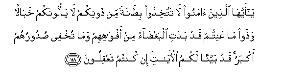

  
[Intangible Textual Heritage](../../index)  [Islam](../index) 
[Index](index)   
[Hypertext Qur'an](../htq/index)  [Unicode](../uq/003.htm#003_110) 
[Palmer](../sbe06/003)  [Pickthall](../pick/003.htm#003_110)  [Yusuf Ali
English](../yaq/yaq003)  [Rodwell](../qr/003)   
  
[Sūra III.: Āl-i-’Imrān, or The Family of ’Imrān. Index](003)  
  [Previous](00311)  [Next](00313) 

------------------------------------------------------------------------

  
*The Holy Quran*, tr. by Yusuf Ali, \[1934\], at Intangible Textual
Heritage

------------------------------------------------------------------------

# Sūra III.: Āl-i-’Imrān, or The Family of ’Imrān.

### Section 12

------------------------------------------------------------------------

110. Kuntum khayra ommatin okhrijat li**l**nn<u>a</u>si ta/muroona
bi**a**lmaAAroofi watanhawna AAani almunkari watu/minoona
bi**A**ll<u>a</u>hi walaw <u>a</u>mana ahlu alkit<u>a</u>bi
lak<u>a</u>na khayran lahum minhumu almu/minoona waaktharuhumu
alf<u>a</u>siqoon**a**

110\. Ye are the best  
Of Peoples, evolved  
For mankind,  
Enjoining what is right,  
Forbidding what is wrong,  
And believing in God.  
If only the People of the Book  
Had faith, it were best  
For them: among them  
Are some who have faith,  
But most of them  
Are perverted transgressors.

------------------------------------------------------------------------

111. Lan ya<u>d</u>urrookum ill<u>a</u> a<u>th</u>an wa-in
yuq<u>a</u>tilookum yuwallookumu al-adb<u>a</u>ra thumma l<u>a</u>
yun<u>s</u>aroon**a**

111\.

------------------------------------------------------------------------

112. <u>D</u>uribat AAalayhimu a**l**<u>thth</u>illatu ayna m<u>a</u>
thuqifoo ill<u>a</u> bi<u>h</u>ablin mina All<u>a</u>hi wa<u>h</u>ablin
mina a**l**nn<u>a</u>si wab<u>a</u>oo bigha<u>d</u>abin mina
All<u>a</u>hi wa<u>d</u>uribat AAalayhimu almaskanatu <u>tha</u>lika
bi-annahum k<u>a</u>noo yakfuroona bi-<u>a</u>y<u>a</u>ti All<u>a</u>hi
wayaqtuloona al-anbiy<u>a</u>a bighayri <u>h</u>aqqin <u>tha</u>lika
bim<u>a</u> AAa<u>s</u>aw wak<u>a</u>noo yaAAtadoon**a**

112\. Shame is pitched over them  
(Like a tent) wherever  
They are found,  
Except when under a covenant  
(Of protection) from God  
And from men; they draw  
On themselves wrath from God,  
And pitched over them  
Is (the tent of) destitution.  
This because they rejected  
The Signs of God, and slew  
The Prophets in defiance of right;  
This because they rebelled  
And transgressed beyond bounds.

------------------------------------------------------------------------

113. Laysoo saw<u>a</u>an min ahli alkit<u>a</u>bi ommatun
q<u>a</u>-imatun yatloona <u>a</u>y<u>a</u>ti All<u>a</u>hi
<u>a</u>n<u>a</u>a allayli wahum yasjudoon**a**

113\. Not all of them are alike:  
Of the People of the Book  
Are a portion that stand  
(For the right); they rehearse  
The Signs of God all night long,  
And they prostrate themselves  
In adoration.

------------------------------------------------------------------------

114. Yu/minoona bi**A**ll<u>a</u>hi wa**a**lyawmi al-<u>a</u>khiri
waya/muroona bi**a**lmaAAroofi wayanhawna AAani almunkari
wayus<u>a</u>riAAoona fee alkhayr<u>a</u>ti waol<u>a</u>-ika mina
a**l**<u>ssa</u>li<u>h</u>een**a**

114\. They believe in God  
And the Last Day;  
They enjoin what is right,  
And forbid what is wrong;  
And they hasten (in emulation)  
In (all) good works:  
They are in the ranks  
Of the righteous.

------------------------------------------------------------------------

115. Wam<u>a</u> yafAAaloo min khayrin falan yukfaroohu
wa**A**ll<u>a</u>hu AAaleemun bi**a**lmuttaqeen**a**

115\. Of the good that they do,  
Nothing will be rejected  
Of them; for God knoweth well  
Those that do right.

------------------------------------------------------------------------

116. Inna alla<u>th</u>eena kafaroo lan tughniya AAanhum
amw<u>a</u>luhum wal<u>a</u> awl<u>a</u>duhum mina All<u>a</u>hi shay-an
waol<u>a</u>-ika a<u>s</u>-<u>ha</u>bu a**l**nn<u>a</u>ri hum
feeh<u>a</u> kh<u>a</u>lidoon**a**

116\. Those who reject Faith,—  
Neither their possessions  
Nor their (numerous) progeny  
Will avail them aught against God:  
They will be Companions  
Of the Fire,—dwelling  
Therein (for ever).

------------------------------------------------------------------------

117. Mathalu m<u>a</u> yunfiqoona fee h<u>ath</u>ihi
al<u>h</u>ay<u>a</u>ti a**l**dduny<u>a</u> kamathali ree<u>h</u>in
feeh<u>a</u> <u>s</u>irrun a<u>sa</u>bat <u>h</u>artha qawmin
*<u>th</u>*alamoo anfusahum faahlakat-hu wam<u>a</u>
*<u>th</u>*alamahumu All<u>a</u>hu wal<u>a</u>kin anfusahum
ya*<u>th</u>*limoon**a**

117\. What they spend  
In the life  
Of this (material) world  
May be likened to a Wind  
Which brings a nipping frost:  
It strikes and destroys the harvest  
Of men who have wronged  
Their own souls: it is not God  
That hath wronged them, but  
They wrong themselves.

------------------------------------------------------------------------

118. Y<u>a</u> ayyuh<u>a</u> alla<u>th</u>eena <u>a</u>manoo l<u>a</u>
tattakhi<u>th</u>oo bi<u>ta</u>natan min doonikum l<u>a</u> ya/loonakum
khab<u>a</u>lan waddoo m<u>a</u> AAanittum qad badati albagh<u>da</u>o
min afw<u>a</u>hihim wam<u>a</u> tukhfee <u>s</u>udooruhum akbaru qad
bayyann<u>a</u> lakumu al-<u>a</u>y<u>a</u>ti in kuntum taAAqiloon**a**

118\. O ye who believe!  
Take not into your intimacy  
Those outside your ranks:  
They will not fail  
To corrupt you. They  
Only desire your ruin:  
Rank hatred has already  
Appeared from their mouths:  
What their hearts conceal  
Is far worse.  
We have made plain  
To you the Signs,  
If ye have wisdom.

------------------------------------------------------------------------

119. H<u>a</u> antum ol<u>a</u>-i tu<u>h</u>ibboonahum wal<u>a</u>
yu<u>h</u>ibboonakum watu/minoona bi**a**lkit<u>a</u>bi kullihi
wa-i<u>tha</u> laqookum q<u>a</u>loo <u>a</u>mann<u>a</u> wa-i<u>tha</u>
khalaw AAa<u>dd</u>oo AAalaykumu al-an<u>a</u>mila mina
alghay*<u>th</u>*i qul mootoo bighay*<u>th</u>*ikum inna All<u>a</u>ha
AAaleemun bi<u>tha</u>ti a**l**<u>ss</u>udoor**i**

119\. Ah! ye are those  
Who love them,  
But they love you not,  
Though ye believe  
In the whole of the Book,  
When they meet you,  
They say, "We believe":  
But when they are alone,  
They bite off the very tips  
Of their fingers at you  
In their rage. Say:  
"Perish in your rage;  
God knoweth well  
All the secrets of the heart."

------------------------------------------------------------------------

120. In tamsaskum <u>h</u>asanatun tasu/hum wa-in tu<u>s</u>ibkum
sayyi-atun yafra<u>h</u>oo bih<u>a</u> wa-in ta<u>s</u>biroo watattaqoo
l<u>a</u> ya<u>d</u>urrukum kayduhum shay-an inna All<u>a</u>ha
bim<u>a</u> yaAAmaloona mu<u>h</u>ee<u>t</u>**un**

120\. If aught that is good  
Befalls you, it grieves them;  
But if some misfortune  
Overtakes you, they rejoice  
At it. But if ye are constant  
And do right,  
Not the least harm  
Will their cunning  
Do to you; for God  
Compasseth round about  
All that they do.

------------------------------------------------------------------------

[Next: Section 13 (121-129)](00313)

