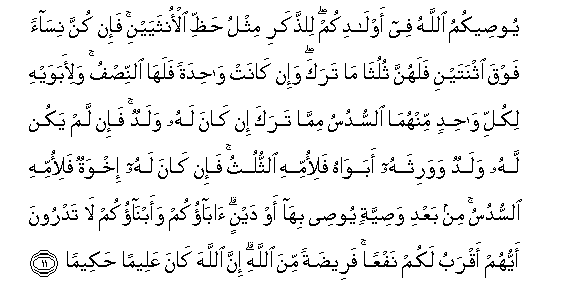
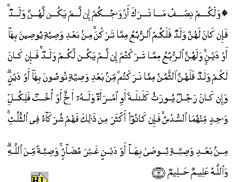
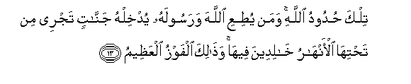
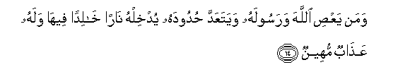

  
[Intangible Textual Heritage](../../index)  [Islam](../index) 
[Index](index)   
[Hypertext Qur'an](../htq/index)  [Unicode](../uq/004.htm#004_011) 
[Palmer](../sbe06/004)  [Pickthall](../pick/004.htm#004_011)  [Yusuf Ali
English](../yaq/yaq004)  [Rodwell](../qr/004)   
  
[Sūra IV.: Nisāa, or The Women. Index](004)  
  [Previous](00401)  [Next](00403) 

------------------------------------------------------------------------

  
*The Holy Quran*, tr. by Yusuf Ali, \[1934\], at Intangible Textual
Heritage

------------------------------------------------------------------------

# Sūra IV.: Nisāa, or The Women.

### Section 2

------------------------------------------------------------------------

11. Yoo<u>s</u>eekumu All<u>a</u>hu fee awl<u>a</u>dikum
li**l**<u>thth</u>akari mithlu <u>h</u>a*<u>thth</u>*i alonthayayni
fa-in kunna nis<u>a</u>an fawqa ithnatayni falahunna thuluth<u>a</u>
m<u>a</u> taraka wa-in k<u>a</u>nat w<u>ah</u>idatan falah<u>a</u>
a**l**nni<u>s</u>fu wali-abawayhi likulli w<u>ah</u>idin minhum<u>a</u>
a**l**ssudusu mimm<u>a</u> taraka in k<u>a</u>na lahu waladun fa-in lam
yakun lahu waladun wawarithahu abaw<u>a</u>hu fali-ommihi
a**l**ththuluthu fa-in k<u>a</u>na lahu ikhwatun fali-ommihi
a**l**ssudusu min baAAdi wa<u>s</u>iyyatin yoo<u>s</u>ee bih<u>a</u> aw
daynin <u>a</u>b<u>a</u>okum waabn<u>a</u>okum l<u>a</u> tadroona
ayyuhum aqrabu lakum nafAAan faree<u>d</u>atan mina All<u>a</u>hi inna
All<u>a</u>ha k<u>a</u>na AAaleeman <u>h</u>akeem<u>a</u>**n**

11\. God (thus) directs you  
As regards your children's  
(Inheritance): to the male,  
A portion equal to that  
Of two females: if only  
Daughters, two or more,  
Their share is two-thirds  
Of the inheritance;  
If only one, her share  
Is a half.  
For parents, a sixth share  
Of the inheritance to each,  
If the deceased left children;  
If no children, and the parents  
Are the (only) heirs, the mother  
Has a third; if the deceased  
Left brothers (or sisters)  
The mother has a sixth.  
(The distribution in all cases  
Is) after the payment  
Of legacies and debts.  
Ye know not whether  
Your parents or your children  
Are nearest to you  
In benefit. These are  
Settled portions ordained  
By God; and God is  
All-knowing, All-wise.

------------------------------------------------------------------------

12. Walakum ni<u>s</u>fu m<u>a</u> taraka azw<u>a</u>jukum in lam yakun
lahunna waladun fa-in k<u>a</u>na lahunna waladun falakumu
a**l**rrubuAAu mimm<u>a</u> tarakna min baAAdi wa<u>s</u>iyyatin
yoo<u>s</u>eena bih<u>a</u> aw daynin walahunna a**l**rrubuAAu
mimm<u>a</u> taraktum in lam yakun lakum waladun fa-in k<u>a</u>na lakum
waladun falahunna a**l**ththumunu mimm<u>a</u> taraktum min baAAdi
wa<u>s</u>iyyatin too<u>s</u>oona bih<u>a</u> aw daynin wa-in
k<u>a</u>na rajulun yoorathu kal<u>a</u>latan awi imraatun walahu akhun
aw okhtun falikulli w<u>ah</u>idin minhum<u>a</u> a**l**ssudusu fa-in
k<u>a</u>noo akthara min <u>tha</u>lika fahum shurak<u>a</u>o fee
a**l**ththuluthi min baAAdi wa<u>s</u>iyyatin yoo<u>sa</u> bih<u>a</u>
aw daynin ghayra mu<u>da</u>rrin wa<u>s</u>iyyatan mina All<u>a</u>hi
wa**A**ll<u>a</u>hu AAaleemun <u>h</u>aleem**un**

12\. In what your wives leave,  
Your share is a half,  
1f they leave no child;  
But if they leave a child,  
Ye get a fourth; after payment  
Of legacies and debts.  
In what ye leave,  
Their share is a fourth,  
If ye leave no child;  
But if ye leave a child,  
They get an eighth; after payment  
Of legacies and debts.  
If the man or woman  
Whose inheritance is in question,  
Has left neither ascendants nor descendants,  
But has left a brother  
Or a sister, each one of the two  
Gets a sixth; but if more  
Than two, they share in a third;  
After payment of legacies  
And debts; so that no loss  
Is caused (to any one).  
Thus is it ordained by God;  
And God is All-knowing,  
Most Forbearing.

------------------------------------------------------------------------

13. Tilka <u>h</u>udoodu All<u>a</u>hi waman yu<u>t</u>iAAi
All<u>a</u>ha warasoolahu yudkhilhu jann<u>a</u>tin tajree min
ta<u>h</u>tih<u>a</u> al-anh<u>a</u>ru kh<u>a</u>lideena feeh<u>a</u>
wa<u>tha</u>lika alfawzu alAAa*<u>th</u>*eem**u**

13\. Those are limits  
Set by God: those who  
Obey God and His Apostle  
Will be admitted to Gardens  
With rivers flowing beneath,  
To abide therein (for ever)  
And that will be  
The Supreme achievement.

------------------------------------------------------------------------

14. Waman yaAA<u>s</u>i All<u>a</u>ha warasoolahu wayataAAadda
<u>h</u>udoodahu yudkhilhu n<u>a</u>ran kh<u>a</u>lidan feeh<u>a</u>
walahu AAa<u>tha</u>bun muheen**un**

14\. But those who disobey  
God and His Apostle  
And transgress His limits  
Will be admitted  
To a Fire, to abide therein:  
And they shall have  
A humiliating punishment.

------------------------------------------------------------------------

[Next: Section 3 (15-22)](00403)

