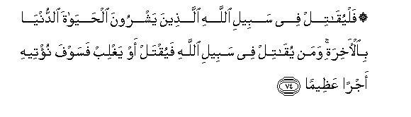

  
[Intangible Textual Heritage](../../index)  [Islam](../index) 
[Index](index)   
[Hypertext Qur'an](../htq/index)  [Unicode](../uq/004.htm#004_071) 
[Palmer](../sbe06/004)  [Pickthall](../pick/004.htm#004_071)  [Yusuf Ali
English](../yaq/yaq004)  [Rodwell](../qr/004)   
  
[Sūra IV.: Nisāa, or The Women. Index](004)  
  [Previous](00409)  [Next](00411) 

------------------------------------------------------------------------

  
*The Holy Quran*, tr. by Yusuf Ali, \[1934\], at Intangible Textual
Heritage

------------------------------------------------------------------------

# Sūra IV.: Nisāa, or The Women.

### Section 10

------------------------------------------------------------------------

71. Y<u>a</u> ayyuh<u>a</u> alla<u>th</u>eena <u>a</u>manoo
khu<u>th</u>oo <u>h</u>i<u>th</u>rakum fa**i**nfiroo thub<u>a</u>tin awi
infiroo jameeAA<u>a</u>**n**

71\. O ye who believe!  
Take your precautions,  
And either go forth in parties  
Or go forth all together.

------------------------------------------------------------------------

72. Wa-inna minkum laman layuba<u>tt</u>i-anna fa-in a<u>sa</u>batkum
mu<u>s</u>eebatun q<u>a</u>la qad anAAama All<u>a</u>hu AAalayya
i<u>th</u> lam akun maAAahum shaheed<u>a</u>**n**

72\. There are certainly among you  
Men who would tarry behind:  
If a misfortune befalls you,  
They say: "God did favour us  
In that we were not  
Present among them."

------------------------------------------------------------------------

73. Wala-in a<u>sa</u>bakum fa<u>d</u>lun mina All<u>a</u>hi
layaqoolanna kaan lam takun baynakum wabaynahu mawaddatun y<u>a</u>
laytanee kuntu maAAahum faafooza fawzan AAa*<u>th</u>*eem<u>a</u>**n**

73\. But if good fortune comes to you  
From God, they would be sure  
To say—as if there had never been  
Ties of affection between you and them—  
"Oh! I wish I had been with them;  
A fine thing should I then  
Have made of it!"

------------------------------------------------------------------------

74. Falyuq<u>a</u>til fee sabeeli All<u>a</u>hi alla<u>th</u>eena
yashroona al<u>h</u>ay<u>a</u>ta a**l**dduny<u>a</u>
bi**a**l-<u>a</u>khirati waman yuq<u>a</u>til fee sabeeli All<u>a</u>hi
fayuqtal aw yaghlib fasawfa nu/teehi ajran
AAa*<u>th</u>*eem<u>a</u>**n**

74\. Let those fight  
In the cause of God  
Who sell the life of this world  
For the Hereafter.  
To him who fighteth  
In the cause of God,—  
Whether he is slain  
Or gets victory  
Soon shall We give him  
A reward of great (value).

------------------------------------------------------------------------

75. Wam<u>a</u> lakum l<u>a</u> tuq<u>a</u>tiloona fee sabeeli
All<u>a</u>hi wa**a**lmusta<u>d</u>AAafeena mina a**l**rrij<u>a</u>li
wa**al**nnis<u>a</u>-i wa**a**lwild<u>a</u>ni alla<u>th</u>eena
yaqooloona rabban<u>a</u> akhrijn<u>a</u> min h<u>ath</u>ihi alqaryati
a**l***<u>thth</u>*<u>a</u>limi ahluh<u>a</u> wa**i**jAAal lan<u>a</u>
min ladunka waliyyan wa**i**jAAal lan<u>a</u> min ladunka
na<u>s</u>eer<u>a</u>**n**

75\. And why should ye not  
Fight in the cause of God  
And of those who, being weak,  
Are ill-treated (and oppressed)?—  
Men, women, and children,  
Whose cry is: "Our Lord!  
Rescue us from this town,  
Whose people are oppressors;  
And raise for us from Thee  
One who will protect;  
And raise for us from Thee  
One who will help!"

------------------------------------------------------------------------

76. Alla<u>th</u>eena <u>a</u>manoo yuq<u>a</u>tiloona fee sabeeli
All<u>a</u>hi wa**a**lla<u>th</u>eena kafaroo yuq<u>a</u>tiloona fee
sabeeli a**l**<u>tta</u>ghooti faq<u>a</u>tiloo awliy<u>a</u>a
a**l**shshay<u>ta</u>ni inna kayda a**l**shshay<u>ta</u>ni k<u>a</u>na
<u>d</u>aAAeef<u>a</u>**n**

76\. Those who believe  
Fight in the cause of God,  
And those who reject Faith  
Fight in the cause of Evil:  
So fight ye against the  
Friends of Satan: feeble indeed  
Is the cunning of Satan.

------------------------------------------------------------------------

[Next: Section 11 (77-87)](00411)

