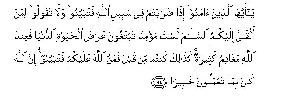

  
[Intangible Textual Heritage](../../index)  [Islam](../index) 
[Index](index)   
[Hypertext Qur'an](../htq/index)  [Unicode](../uq/004.htm#004_092) 
[Palmer](../sbe06/004)  [Pickthall](../pick/004.htm#004_092)  [Yusuf Ali
English](../yaq/yaq004)  [Rodwell](../qr/004)   
  
[Sūra IV.: Nisāa, or The Women. Index](004)  
  [Previous](00412)  [Next](00414) 

------------------------------------------------------------------------

  
*The Holy Quran*, tr. by Yusuf Ali, \[1934\], at Intangible Textual
Heritage

------------------------------------------------------------------------

# Sūra IV.: Nisāa, or The Women.

### Section 13

------------------------------------------------------------------------

92. Wam<u>a</u> k<u>a</u>na limu/minin an yaqtula mu/minan ill<u>a</u>
kha<u>t</u>aan waman qatala mu/minan kha<u>t</u>aan fata<u>h</u>reeru
raqabatin mu/minatin wadiyatun musallamatun il<u>a</u> ahlihi
ill<u>a</u> an ya<u>ss</u>addaqoo fa-in k<u>a</u>na min qawmin AAaduwwin
lakum wahuwa mu/minun fata<u>h</u>reeru raqabatin mu/minatin wa-in
k<u>a</u>na min qawmin baynakum wabaynahum meeth<u>a</u>qun fadiyatun
musallamatun il<u>a</u> ahlihi wata<u>h</u>reeru raqabatin mu/minatin
faman lam yajid fa<u>s</u>iy<u>a</u>mu shahrayni mutat<u>a</u>biAAayni
tawbatan mina All<u>a</u>hi wak<u>a</u>na All<u>a</u>hu AAaleeman
<u>h</u>akeem<u>a</u>**n**

92\. Never should a Believer  
Kill a Believer; but  
(If it so happens) by mistake,  
(Compensation is due):  
If one (so) kills a Believer,  
It is ordained that he  
Should free a believing slave,  
And pay compensation  
To the deceased's family,  
Unless they remit it freely.  
If the deceased belonged  
To a people at war with you,  
And he was a Believer,  
The freeing of a believing slave  
(Is enough). If he belonged  
To a people with whom  
Ye have a treaty of mutual  
Alliance, compensation should  
Be paid to his family,  
And a believing slave be freed.  
For those who find this  
Beyond their means, (is prescribed)  
A fast for two months  
Running: by way of repentance  
To God: for God hath  
All knowledge and all wisdom.

------------------------------------------------------------------------

93. Waman yaqtul mu/minan mutaAAammidan fajaz<u>a</u>ohu jahannamu
kh<u>a</u>lidan feeh<u>a</u> wagha<u>d</u>iba All<u>a</u>hu AAalayhi
walaAAanahu waaAAadda lahu AAa<u>tha</u>ban
AAa*<u>th</u>*eem<u>a</u>**n**

93\. 1f a man kills a Believer  
Intentionally, his recompense  
Is Hell, to abide therein  
(For ever): and the wrath  
And the curse of God  
Are upon him, and  
A dreadful penalty  
Is prepared for him.

------------------------------------------------------------------------

94. Y<u>a</u> ayyuh<u>a</u> alla<u>th</u>eena <u>a</u>manoo i<u>tha</u>
<u>d</u>arabtum fee sabeeli All<u>a</u>hi fatabayyanoo wal<u>a</u>
taqooloo liman alq<u>a</u> ilaykumu a**l**ssal<u>a</u>ma lasta mu/minan
tabtaghoona AAara<u>d</u>a al<u>h</u>ay<u>a</u>ti a**l**dduny<u>a</u>
faAAinda All<u>a</u>hi magh<u>a</u>nimu katheeratun ka<u>tha</u>lika
kuntum min qablu famanna All<u>a</u>hu AAalaykum fatabayyanoo inna
All<u>a</u>ha k<u>a</u>na bim<u>a</u> taAAmaloona khabeer<u>a</u>**n**

94\. O ye who believe!  
When ye go abroad  
In the cause of God,  
Investigate carefully,  
And say not to any one  
Who offers you a salutation:  
"Thou art none of a Believer!"  
Coveting the perishable goods  
Of this life: with God  
Are profits and spoils abundant.  
Even thus were ye yourselves  
Before, till God conferred  
On you His favours: therefore  
Carefully investigate.  
For God is well aware  
Of all that ye do.

------------------------------------------------------------------------

95. L<u>a</u> yastawee alq<u>a</u>AAidoona mina almu/mineena ghayru olee
a**l**<u>dd</u>arari wa**a**lmuj<u>a</u>hidoona fee sabeeli
All<u>a</u>hi bi-amw<u>a</u>lihim waanfusihim fa<u>dd</u>ala
All<u>a</u>hu almuj<u>a</u>hideena bi-amw<u>a</u>lihim waanfusihim
AAal<u>a</u> alq<u>a</u>AAideena darajatan wakullan waAAada
All<u>a</u>hu al<u>h</u>usn<u>a</u> wafa<u>dd</u>ala All<u>a</u>hu
almuj<u>a</u>hideena AAal<u>a</u> alq<u>a</u>AAideena ajran
AAa*<u>th</u>*eem<u>a</u>**n**

95\. Not equal are those  
Believers who sit (at home)  
And receive no hurt,  
And those who strive  
And fight in the cause  
Of God with their goods  
And their persons.  
God hath granted  
A grade higher to those  
Who strive and fight  
With their goods and persons  
Than to those who sit (at home).  
Unto all (in Faith)  
Hath God promised good:  
But those who strive and fight  
Hath He distinguished  
Above those who sit (at home)  
By a special reward,—

------------------------------------------------------------------------

96. Daraj<u>a</u>tin minhu wamaghfiratan wara<u>h</u>matan wak<u>a</u>na
All<u>a</u>hu ghafooran ra<u>h</u>eem<u>a</u>**n**

96\. Ranks specially bestowed  
By Him. And Forgiveness  
And Mercy. For God is  
Oft forgiving, Most Merciful.

------------------------------------------------------------------------

[Next: Section 14 (97-100)](00414)

