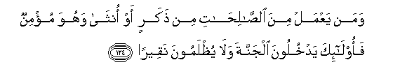

  
[Intangible Textual Heritage](../../index)  [Islam](../index) 
[Index](index)   
[Hypertext Qur'an](../htq/index)  [Unicode](../uq/004.htm#004_116) 
[Palmer](../sbe06/004)  [Pickthall](../pick/004.htm#004_116)  [Yusuf Ali
English](../yaq/yaq004)  [Rodwell](../qr/004)   
  
[Sūra IV.: Nisāa, or The Women. Index](004)  
  [Previous](00417)  [Next](00419) 

------------------------------------------------------------------------

  
*The Holy Quran*, tr. by Yusuf Ali, \[1934\], at Intangible Textual
Heritage

------------------------------------------------------------------------

# Sūra IV.: Nisāa, or The Women.

### Section 18

------------------------------------------------------------------------

116. Inna All<u>a</u>ha l<u>a</u> yaghfiru an yushraka bihi wayaghfiru
m<u>a</u> doona <u>tha</u>lika liman yash<u>a</u>o waman yushrik
bi**A**ll<u>a</u>hi faqad <u>d</u>alla <u>d</u>al<u>a</u>lan
baAAeed<u>a</u>**n**

116\. God forgiveth not  
(The sin of) joining other gods  
With Him; but He forgiveth  
Whom He pleaseth other sins  
Than this: one who joins  
Other gods with God,  
Hath strayed far, far away  
(From the Right).

------------------------------------------------------------------------

117. In yadAAoona min doonihi ill<u>a</u> in<u>a</u>than wa-in yadAAoona
ill<u>a</u> shay<u>ta</u>nan mareed<u>a</u>**n**

117\. (The Pagans), leaving Him,  
Call but upon female deities:  
They call but upon Satan  
The persistent rebel!

------------------------------------------------------------------------

118. LaAAanahu All<u>a</u>hu waq<u>a</u>la laattakhi<u>th</u>anna min
AAib<u>a</u>dika na<u>s</u>eeban mafroo<u>da</u>**n**

118\. God did curse him,  
But he said: "I will take  
Of Thy servants a portion  
Marked off;

------------------------------------------------------------------------

119. Walao<u>d</u>illannahum walaomanniyannahum wala<u>a</u>murannahum
falayubattikunna <u>atha</u>na al-anAA<u>a</u>mi wala<u>a</u>murannahum
falayughayyirunna khalqa All<u>a</u>hi waman yattakhi<u>th</u>i
a**l**shshay<u>ta</u>na waliyyan min dooni All<u>a</u>hi faqad khasira
khusr<u>a</u>nan mubeen<u>a</u>**n**

119\. "I will mislead them,  
And I will create  
In them false desires; I will  
Order them to slit the ears  
Of cattle, and to deface  
The (fair) nature created  
By God." Whoever,  
Forsaking God, takes Satan  
For a friend, hath  
Of a surety suffered  
A loss that is manifest.

------------------------------------------------------------------------

120. YaAAiduhum wayumanneehim wam<u>a</u> yaAAiduhumu
a**l**shshay<u>ta</u>nu ill<u>a</u> ghuroor<u>a</u>**n**

120\. Satan makes them promises,  
And creates in them false desires;  
But Satan's promises  
Are nothing but deception.

------------------------------------------------------------------------

121. Ol<u>a</u>-ika ma/w<u>a</u>hum jahannamu wal<u>a</u> yajidoona
AAanh<u>a</u> ma<u>h</u>ee<u>sa</u>**n**

121\. They (his dupes)  
Will have their dwelling  
In Hell, and from it  
They will find no way  
Of escape.

------------------------------------------------------------------------

122. Wa**a**lla<u>th</u>eena <u>a</u>manoo waAAamiloo
a**l**<u>ssa</u>li<u>ha</u>ti sanudkhiluhum jann<u>a</u>tin tajree min
ta<u>h</u>tih<u>a</u> al-anh<u>a</u>ru kh<u>a</u>lideena feeh<u>a</u>
abadan waAAda All<u>a</u>hi <u>h</u>aqqan waman a<u>s</u>daqu mina
All<u>a</u>hi qeel<u>a</u>**n**

122\. But those who believe  
And do deeds of righteousness,—  
We shall soon admit them  
To Gardens, with rivers  
Flowing beneath,—to dwell  
Therein for ever.  
God's promise is the truth,  
And whose word can be  
Truer than God's?

------------------------------------------------------------------------

123. Laysa bi-am<u>a</u>niyyikum wal<u>a</u> am<u>a</u>niyyi ahli
alkit<u>a</u>bi man yaAAmal soo-an yujza bihi wal<u>a</u> yajid lahu min
dooni All<u>a</u>hi waliyyan wal<u>a</u> na<u>s</u>eer<u>a</u>**n**

123\. Not your desires, nor those  
Of the People of the Book  
(Can prevail): whoever  
Works evil, will be  
Requited accordingly.  
Nor will he find, besides God,  
Any protector or helper.

------------------------------------------------------------------------

124. Waman yaAAmal mina a**l**<u>ssa</u>li<u>ha</u>ti min
<u>th</u>akarin aw onth<u>a</u> wahuwa mu/minun faol<u>a</u>-ika
yadkhuloona aljannata wal<u>a</u> yu*<u>th</u>*lamoona
naqeer<u>a</u>**n**

124\. If any do deeds  
Of righteousness,  
Be they male or female—  
And have faith,  
They will enter Heaven,  
And not the least injustice  
Will be done to them.

------------------------------------------------------------------------

125. Waman a<u>h</u>sanu deenan mimman aslama wajhahu lill<u>a</u>hi
wahuwa mu<u>h</u>sinun wa**i**ttabaAAa millata ibr<u>a</u>heema
<u>h</u>aneefan wa**i**ttakha<u>th</u>a All<u>a</u>hu ibr<u>a</u>heema
khaleel<u>a</u>**n**

125\. Who can be better  
In religion than one  
Who submits his whole self  
To God, does good,  
And follows the way  
Of Abraham the true in faith?  
For God did take  
Abraham for a friend.

------------------------------------------------------------------------

126. Walill<u>a</u>hi m<u>a</u> fee a**l**ssam<u>a</u>w<u>a</u>ti
wam<u>a</u> fee al-ar<u>d</u>i wak<u>a</u>na All<u>a</u>hu bikulli
shay-in mu<u>h</u>ee<u>ta</u>**n**

126\. But to God belong all things  
In the heavens and on earth:  
And He it is that  
Encompasseth all things.

------------------------------------------------------------------------

[Next: Section 19 (127-134)](00419)

