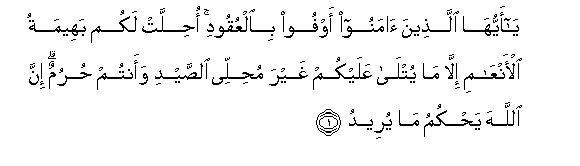

  
[Intangible Textual Heritage](../../index)  [Islam](../index) 
[Index](index)   
[Hypertext Qur'an](../htq/index)  [Unicode](../uq/005.htm#005_001) 
[Palmer](../sbe06/005)  [Pickthall](../pick/005.htm#005_001)  [Yusuf Ali
English](../yaq/yaq005)  [Rodwell](../qr/005)   
  
[Sūra V.: Māïda, or The Table Spread. Index](005)  
  [Previous](00424)  [Next](00502) 

------------------------------------------------------------------------

  
*The Holy Quran*, tr. by Yusuf Ali, \[1934\], at Intangible Textual
Heritage

------------------------------------------------------------------------

# Sūra V.: Māïda, or The Table Spread.

### Section 1

1. Y<u>a</u> ayyuh<u>a</u> alla<u>th</u>eena <u>a</u>manoo awfoo
bi**a**lAAuqoodi o<u>h</u>illat lakum baheematu al-anAA<u>a</u>mi
ill<u>a</u> m<u>a</u> yutl<u>a</u> AAalaykum ghayra mu<u>h</u>illee
a**l**<u>ss</u>aydi waantum <u>h</u>urumun inna All<u>a</u>ha
ya<u>h</u>kumu m<u>a</u> yureed**u**

1\. 1 O ye who believe!  
Fulfil (all) obligations  
2 Lawful unto you (for food)  
Are all four-footed animals,  
With the exceptions named:  
But animals of the chase  
Are forbidden while ye  
Are in the Sacred Precincts  
Or in pilgrim garb:  
For God doth command  
According to His Will and Plan

------------------------------------------------------------------------

2. Y<u>a</u> ayyuh<u>a</u> alla<u>th</u>eena <u>a</u>manoo l<u>a</u>
tu<u>h</u>illoo shaAA<u>a</u>-ira All<u>a</u>hi wal<u>a</u>
a**l**shshahra al<u>h</u>ar<u>a</u>ma wal<u>a</u> alhadya wal<u>a</u>
alqal<u>a</u>-ida wal<u>a</u> <u>a</u>mmeena albayta
al<u>h</u>ar<u>a</u>ma yabtaghoona fa<u>d</u>lan min rabbihim
wari<u>d</u>w<u>a</u>nan wa-i<u>tha</u> <u>h</u>alaltum
fa**i**<u>sta</u>doo wal<u>a</u> yajrimannakum shana<u>a</u>nu qawmin an
<u>s</u>addookum AAani almasjidi al<u>h</u>ar<u>a</u>mi an taAAtadoo
wataAA<u>a</u>wanoo AAal<u>a</u> albirri wa**al**ttaqw<u>a</u>
wal<u>a</u> taAA<u>a</u>wanoo AAal<u>a</u> al-ithmi
wa**a**lAAudw<u>a</u>ni wa**i**ttaqoo All<u>a</u>ha inna All<u>a</u>ha
shadeedu alAAiq<u>a</u>b**i**

2\. 3 O ye who believe!  
Violate not the sanctity  
Of the Symbols of God,  
Nor of the Sacred Month,  
Nor of the animals brought  
For sacrifice, nor the garlands  
That mark out such animals,  
Nor the people resorting  
To the Sacred House,  
Seeking of the bounty  
And good pleasure  
Of their Lord.  
But when ye are clear  
Of the Sacred Precincts  
And of pilgrim garb,  
Ye may hunt  
And let not the hatred  
Of some people  
In (once) shutting you out  
Of the Sacred Mosque  
Lead you to transgression  
(And hostility on your part).  
Help ye one another  
In righteousness and piety,  
But help ye not one another  
In sin and rancour:  
Fear God: for God  
Is strict in punishment.

------------------------------------------------------------------------

3. <u>H</u>urrimat AAalaykumu almaytatu wa**al**ddamu wala<u>h</u>mu
alkhinzeeri wam<u>a</u> ohilla lighayri All<u>a</u>hi bihi
wa**a**lmunkhaniqatu wa**a**lmawqoo<u>th</u>atu wa**a**lmutaraddiyatu
wa**al**nna<u>t</u>ee<u>h</u>atu wam<u>a</u> akala a**l**ssabuAAu
ill<u>a</u> m<u>a th</u>akkaytum wam<u>a</u> <u>th</u>ubi<u>h</u>a
AAal<u>a</u> a**l**nnu<u>s</u>ubi waan tastaqsimoo
bi**a**l-azl<u>a</u>mi <u>tha</u>likum fisqun alyawma ya-isa
alla<u>th</u>eena kafaroo min deenikum fal<u>a</u> takhshawhum
wa**i**khshawni alyawma akmaltu lakum deenakum waatmamtu AAalaykum
niAAmatee wara<u>d</u>eetu lakumu al-isl<u>a</u>ma deenan famani
i<u>dt</u>urra fee makhma<u>s</u>atin ghayra mutaj<u>a</u>nifin
li-ithmin fa-inna All<u>a</u>ha ghafoorun ra<u>h</u>eem**un**

3\. 4 Forbidden to you (for food)  
Are: dead meat, blood,  
The flesh of swine, and that  
On which hath been invoked  
The name of other than God;  
That which hath been  
Killed by strangling,  
Or by a violent blow,  
Or by a headlong fall,  
Or by being gored to death;  
That which hath been (partly)  
Eaten by a wild animal;  
Unless ye are able  
To slaughter it (in due form);  
That which is sacrificed  
On stone (altars);  
(Forbidden) also is the division  
(Of meat) by raffling  
With arrows: that is impiety.  
This day have those who  
Reject Faith given up  
All hope of your religion:  
Yet fear them not  
But fear Me.  
This day have I  
Perfected your religion  
For you, completed  
My favour upon you,  
And have chosen for you  
Islam as your religion.  
But if any is forced  
By hunger, with no inclination  
To transgression, God is  
Indeed Oft-forgiving,  
Most Merciful.

------------------------------------------------------------------------

4. Yas-aloonaka m<u>atha</u> o<u>h</u>illa lahum qul o<u>h</u>illa
lakumu a**l**<u>tt</u>ayyib<u>a</u>tu wam<u>a</u> AAallamtum mina
aljaw<u>a</u>ri<u>h</u>i mukallibeena tuAAallimoonahunna mimm<u>a</u>
AAallamakumu All<u>a</u>hu fakuloo mimm<u>a</u> amsakna AAalaykum
wa**o**<u>th</u>kuroo isma All<u>a</u>hi AAalayhi wa**i**ttaqoo
All<u>a</u>ha inna All<u>a</u>ha sareeAAu al<u>h</u>is<u>a</u>b**i**

4\. 5 They ask thee what is  
Lawful to them (as food)  
Say: Lawful unto you  
Are (all) things good and pure:  
And what ye have taught  
Your trained hunting animals  
(To catch) in the manner  
Directed to you by God:  
Eat what they catch for you,  
But pronounce the name  
Of God over it: and fear  
God; for God is swift  
In taking account.

------------------------------------------------------------------------

5. Alyawma o<u>h</u>illa lakumu a**l**<u>tt</u>ayyib<u>a</u>tu
wa<u>t</u>aAA<u>a</u>mu alla<u>th</u>eena ootoo alkit<u>a</u>ba
<u>h</u>illun lakum wa<u>t</u>aAA<u>a</u>mukum <u>h</u>illun lahum
wa**a**lmu<u>hs</u>an<u>a</u>tu mina almu/min<u>a</u>ti
wa**a**lmu<u>hs</u>an<u>a</u>tu mina alla<u>th</u>eena ootoo
alkit<u>a</u>ba min qablikum i<u>tha</u> <u>a</u>taytumoohunna
ojoorahunna mu<u>hs</u>ineena ghayra mus<u>a</u>fi<u>h</u>eena
wal<u>a</u> muttakhi<u>th</u>ee akhd<u>a</u>nin waman yakfur
bi**a**l-eem<u>a</u>ni faqad <u>h</u>abi<u>t</u>a AAamaluhu wahuwa fee
al-<u>a</u>khirati mina alkh<u>a</u>sireen**a**

5\. 6 This day are (all) things  
Good and pure made lawful  
Unto you. The food  
Of the People of the Book  
Is lawful unto you  
And yours is lawful  
Unto them.  
(Lawful unto you in marriage)  
Are (not only) chaste women  
Who are believers, but  
Chaste women among  
The People of the Book,  
Revealed before your time,—  
When ye give them  
Their due dowers, and desire  
Chastity, not lewdness,  
Nor secret intrigues.  
If any one rejects faith,  
Fruitless is his work,  
And in the Hereafter  
He will be in the ranks  
Of those who have lost  
(All spiritual good).

------------------------------------------------------------------------

[Next: Section 2 (6-11)](00502)

