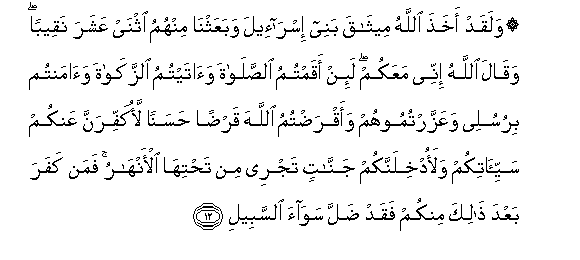
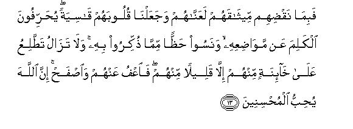
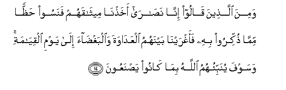
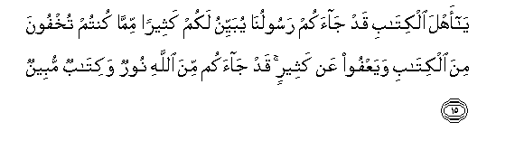
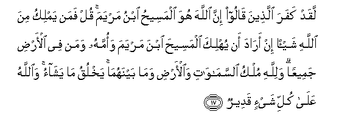
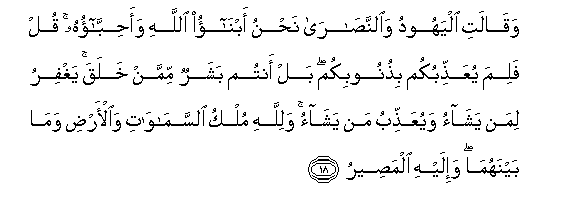
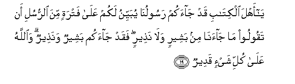

  
[Intangible Textual Heritage](../../index)  [Islam](../index) 
[Index](index)   
[Hypertext Qur'an](../htq/index)  [Unicode](../uq/005.htm#005_012) 
[Palmer](../sbe06/005)  [Pickthall](../pick/005.htm#005_012)  [Yusuf Ali
English](../yaq/yaq005)  [Rodwell](../qr/005)   
  
[Sūra V.: Māïda, or The Table Spread. Index](005)  
  [Previous](00502)  [Next](00504) 

------------------------------------------------------------------------

  
*The Holy Quran*, tr. by Yusuf Ali, \[1934\], at Intangible Textual
Heritage

------------------------------------------------------------------------

# Sūra V.: Māïda, or The Table Spread.

### Section 3

------------------------------------------------------------------------

12. Walaqad akha<u>th</u>a All<u>a</u>hu meeth<u>a</u>qa banee
isr<u>a</u>-eela wabaAAathn<u>a</u> minhumu ithnay AAashara naqeeban
waq<u>a</u>la All<u>a</u>hu innee maAAakum la-in aqamtumu
a**l**<u>ss</u>al<u>a</u>ta wa<u>a</u>taytumu a**l**zzak<u>a</u>ta
wa<u>a</u>mantum birusulee waAAazzartumoohum waaqra<u>d</u>tumu
All<u>a</u>ha qar<u>d</u>an <u>h</u>asanan laokaffiranna AAankum
sayyi-<u>a</u>tikum walaodkhilannakum jann<u>a</u>tin tajree min
ta<u>h</u>tih<u>a</u> al-anh<u>a</u>ru faman kafara baAAda
<u>tha</u>lika minkum faqad <u>d</u>alla saw<u>a</u>a a**l**ssabeel**i**

12\. 13 God did aforetime  
Take a Covenant from  
The Children of Israel,  
And We appointed twelve  
Captains among them.  
And God said: "I am  
With you: if ye (but)  
Establish regular Prayers,  
Practise regular Charity,  
Believe in My apostles,  
Honour and assist them,  
And loan to God  
A beautiful loan,  
Verily I will wipe out  
From you your evils,  
And admit you to Gardens  
With rivers flowing beneath;  
But if any of you, after this,  
Resisteth faith, he hath truly  
Wandered from the path  
Of rectitude."

------------------------------------------------------------------------

13. Fabim<u>a</u> naq<u>d</u>ihim meeth<u>a</u>qahum laAAann<u>a</u>hum
wajaAAaln<u>a</u> quloobahum q<u>a</u>siyatan yu<u>h</u>arrifoona
alkalima AAan maw<u>ad</u>iAAihi wanasoo <u>h</u>a*<u>thth</u>*an
mimm<u>a</u> <u>th</u>ukkiroo bihi wal<u>a</u> taz<u>a</u>lu
ta<u>tt</u>aliAAu AAal<u>a</u> kh<u>a</u>-inatin minhum ill<u>a</u>
qaleelan minhum fa**o**AAfu AAanhum wa**i**<u>s</u>fa<u>h</u> inna
All<u>a</u>ha yu<u>h</u>ibbu almu<u>h</u>sineen**a**

13\. 14 But because of their breach  
Of their Covenant, We  
Cursed them, and made  
Their hearts grow hard:  
They change the words  
From their (right) places  
And forget a good part  
Of the Message that was  
Sent them, nor wilt thou  
Cease to find them  
Barring a few—ever  
Bent on (new) deceits:  
But forgive them, and overlook  
(Their misdeeds): for God  
Loveth those who are kind.

------------------------------------------------------------------------

14. Wamina alla<u>th</u>eena q<u>a</u>loo inn<u>a</u>
na<u>sa</u>r<u>a</u> akha<u>th</u>n<u>a</u> meeth<u>a</u>qahum fanasoo
<u>h</u>a*<u>thth</u>*an mimm<u>a</u> <u>th</u>ukkiroo bihi
faaghrayn<u>a</u> baynahumu alAAad<u>a</u>wata wa**a**lbagh<u>da</u>a
il<u>a</u> yawmi alqiy<u>a</u>mati wasawfa yunabbi-ohumu All<u>a</u>hu
bim<u>a</u> k<u>a</u>noo ya<u>s</u>naAAoon**a**

14\. 15 From those, too, who call  
Themselves Christians,  
We did take a Covenant,  
But they forgot a good part  
Of the Message that was  
Sent them: so We estranged  
Them, with enmity and hatred  
Between the one and the other,  
To the Day of Judgment.  
And soon will God show  
Them what it is  
They have done.

------------------------------------------------------------------------

15. Y<u>a</u> ahla alkit<u>a</u>bi qad j<u>a</u>akum rasoolun<u>a</u>
yubayyinu lakum katheeran mimm<u>a</u> kuntum tukhfoona mina
alkit<u>a</u>bi wayaAAfoo AAan katheerin qad j<u>a</u>akum mina
All<u>a</u>hi noorun wakit<u>a</u>bun mubeen**un**

15\. 16 O People of the Book!  
There hath come to you  
Our Apostle, revealing  
To you much that ye  
Used to hide in the Book,  
And passing over much  
(That is now unnecessary):  
17 There hath come to you  
From God a (new) light  
And a perspicuous Book,—

------------------------------------------------------------------------

16. Yahdee bihi All<u>a</u>hu mani ittabaAAa ri<u>d</u>w<u>a</u>nahu
subula a**l**ssal<u>a</u>mi wayukhrijuhum mina
a**l***<u>thth</u>*ulum<u>a</u>ti il<u>a</u> a**l**nnoori
bi-i<u>th</u>nihi wayahdeehim il<u>a</u> <u>s</u>ir<u>at</u>in
mustaqeem**in**

16\. 18 Wherewith God guideth all  
Who seek His good pleasure  
To ways of peace and safety,  
And leadeth them out  
Of darkness, by His Will,  
Unto the light,—guideth them  
To a Path that is Straight.

------------------------------------------------------------------------

17. Laqad kafara alla<u>th</u>eena q<u>a</u>loo inna All<u>a</u>ha huwa
almasee<u>h</u>u ibnu maryama qul faman yamliku mina All<u>a</u>hi
shay-an in ar<u>a</u>da an yuhlika almasee<u>h</u>a ibna maryama
waommahu waman fee al-ar<u>d</u>i jameeAAan walill<u>a</u>hi mulku
a**l**ssam<u>a</u>w<u>a</u>ti wa**a**l-ar<u>d</u>i wam<u>a</u>
baynahum<u>a</u> yakhluqu m<u>a</u> yash<u>a</u>o wa**A**ll<u>a</u>hu
AAal<u>a</u> kulli shay-in qadeer**un**

17\. 19 In blasphemy indeed  
Are those that say  
That God is Christ  
The son of Mary.  
Say: "Who then  
Hath the least power  
Against God, if His Will  
Were to destroy Christ  
The son of Mary, his mother,  
And all—every one  
That is on the earth?  
For to God belongeth  
The dominion of the heavens  
And the earth, and all  
That is between. He createth  
What He pleaseth. For God  
Hath power over all things."

------------------------------------------------------------------------

18. Waq<u>a</u>lati alyahoodu wa**al**nna<u>sa</u>r<u>a</u> na<u>h</u>nu
abn<u>a</u>o All<u>a</u>hi waa<u>h</u>ibb<u>a</u>ohu qul falima
yuAAa<u>thth</u>ibukum bi<u>th</u>unoobikum bal antum basharun mimman
khalaqa yaghfiru liman yash<u>a</u>o wayuAAa<u>thth</u>ibu man
yash<u>a</u>o walill<u>a</u>hi mulku a**l**ssam<u>a</u>w<u>a</u>ti
wa**a**l-ar<u>d</u>i wam<u>a</u> baynahum<u>a</u> wa-ilayhi
alma<u>s</u>eer**u**

18\. 20 (Both) the Jews and the
Christians  
Say: "We are sons  
Of God, and His beloved."  
Say: "Why then doth He  
Punish you for your sins?  
Nay, ye are but men,  
Of the men He hath created:  
He forgiveth whom He pleaseth,  
And He punisheth whom He pleaseth:  
And to God belongeth  
The dominion of the heavens  
And the earth, and all  
That is between:  
And unto Him  
Is the final goal (of all)"

------------------------------------------------------------------------

19. Y<u>a</u> ahla alkit<u>a</u>bi qad j<u>a</u>akum rasoolun<u>a</u>
yubayyinu lakum AAal<u>a</u> fatratin mina a**l**rrusuli an taqooloo
m<u>a</u> j<u>a</u>an<u>a</u> min basheerin wal<u>a</u> na<u>th</u>eerin
faqad j<u>a</u>akum basheerun wana<u>th</u>eerun wa**A**ll<u>a</u>hu
AAal<u>a</u> kulli shay-in qadeer**un**

19\. 21 O People of the Book!  
Now hath come unto you,  
Making (things) clear unto you,  
Our Apostle, after the break  
In (the series of) our apostles,  
Lest ye should say:  
"There came unto us  
No bringer of glad tidings  
And no warner (from evil)":  
But now hath come  
Unto you a bringer  
Of glad tidings  
And a warner (from evil).  
And God hath power  
Over all things.

------------------------------------------------------------------------

[Next: Section 4 (20-26)](00504)

