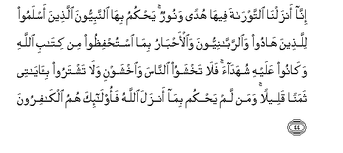

  
[Intangible Textual Heritage](../../index)  [Islam](../index) 
[Index](index)   
[Hypertext Qur'an](../htq/index)  [Unicode](../uq/005.htm#005_044) 
[Palmer](../sbe06/005)  [Pickthall](../pick/005.htm#005_044)  [Yusuf Ali
English](../yaq/yaq005)  [Rodwell](../qr/005)   
  
[Sūra V.: Māïda, or The Table Spread. Index](005)  
  [Previous](00506)  [Next](00508) 

------------------------------------------------------------------------

  
*The Holy Quran*, tr. by Yusuf Ali, \[1934\], at Intangible Textual
Heritage

------------------------------------------------------------------------

# Sūra V.: Māïda, or The Table Spread.

### Section 7

------------------------------------------------------------------------

44. Inn<u>a</u> anzaln<u>a</u> a**l**ttawr<u>a</u>ta feeh<u>a</u> hudan
wanoorun ya<u>h</u>kumu bih<u>a</u> a**l**nnabiyyoona alla<u>th</u>eena
aslamoo lilla<u>th</u>eena h<u>a</u>doo wa**al**rrabb<u>a</u>niyyoona
wa**a**l-a<u>h</u>b<u>a</u>ru bim<u>a</u> istu<u>h</u>fi*<u>th</u>*oo
min kit<u>a</u>bi All<u>a</u>hi wak<u>a</u>noo AAalayhi shuhad<u>a</u>a
fal<u>a</u> takhshawoo a**l**nn<u>a</u>sa wa**i**khshawni wal<u>a</u>
tashtaroo bi-<u>a</u>y<u>a</u>tee thamanan qaleelan waman lam
ya<u>h</u>kum bim<u>a</u> anzala All<u>a</u>hu faol<u>a</u>-ika humu
alk<u>a</u>firoon**a**

44\. 47 It was We who revealed  
The Law (to Moses): therein  
Was guidance and light.'  
By its standard have been judged  
The Jews, by the Prophets  
Who bowed (as in Islam)  
To God's Will, by the Rabbis  
And the Doctors of Law:  
For to them was entrusted  
The protection of God's Book,  
And they were witnesses thereto:  
Therefore fear not men,  
But fear Me, and sell not  
My Signs for a miserable price.  
If any do fail to judge  
By (the light of) what God  
Hath revealed, they are  
(No better than) Unbelievers.

------------------------------------------------------------------------

45. Wakatabn<u>a</u> AAalayhim feeh<u>a</u> anna a**l**nnafsa
bi**al**nnafsi wa**a**lAAayna bi**a**lAAayni wa**a**l-anfa bi**a**l-anfi
wa**a**lo<u>th</u>una bi**a**lo<u>th</u>uni wa**al**ssinna
bi**al**ssinni wa**a**ljuroo<u>h</u>a qi<u>sas</u>un faman
ta<u>s</u>addaqa bihi fahuwa kaff<u>a</u>ratun lahu waman lam
ya<u>h</u>kum bim<u>a</u> anzala All<u>a</u>hu faol<u>a</u>-ika humu
a**l***<u>thth</u>*<u>a</u>limoon**a**

45\. 48 We ordained therein for them:  
"Life for life, eye for eye,  
Nose for nose, ear for ear,  
Tooth for tooth, and wounds  
Equal for equal." But if  
Any one remits the retaliation  
Byway of charity, it is  
An act of atonement for himself.  
And if any fail to judge  
By (the light of) what God  
Hath revealed, they are  
(No better than) wrong-doers.

------------------------------------------------------------------------

46. Waqaffayn<u>a</u> AAal<u>a</u> <u>a</u>th<u>a</u>rihim
biAAees<u>a</u> ibni maryama mu<u>s</u>addiqan lim<u>a</u> bayna yadayhi
mina a**l**ttawr<u>a</u>ti wa<u>a</u>tayn<u>a</u>hu al-injeela feehi
hudan wanoorun wamu<u>s</u>addiqan lim<u>a</u> bayna yadayhi mina
a**l**ttawr<u>a</u>ti wahudan wamawAAi*<u>th</u>*atan lilmuttaqeen**a**

46\. 49 And in their footsteps  
We sent Jesus the son  
Of Mary, confirming  
The Law that had come  
Before him: We sent him  
The Gospel: therein  
Was guidance and light,  
And confirmation of the Law  
That had come before him:  
A guidance and an admonition  
To those who fear God.

------------------------------------------------------------------------

47. Walya<u>h</u>kum ahlu al-injeeli bim<u>a</u> anzala All<u>a</u>hu
feehi waman lam ya<u>h</u>kum bim<u>a</u> anzala All<u>a</u>hu
faol<u>a</u>-ika humu alf<u>a</u>siqoon**a**

47\. 50 Let the People of the Gospel  
Judge by what God hath revealed  
Therein. If any do fail  
To judge by (the light of)  
What God hath revealed,  
They are (no better than)  
Those who rebel.

------------------------------------------------------------------------

48. Waanzaln<u>a</u> ilayka alkit<u>a</u>ba bi**a**l<u>h</u>aqqi
mu<u>s</u>addiqan lim<u>a</u> bayna yadayhi mina alkit<u>a</u>bi
wamuhayminan AAalayhi fa**o**<u>h</u>kum baynahum bim<u>a</u> anzala
All<u>a</u>hu wal<u>a</u> tattabiAA ahw<u>a</u>ahum AAamm<u>a</u>
j<u>a</u>aka mina al<u>h</u>aqqi likullin jaAAaln<u>a</u> minkum
shirAAatan waminh<u>a</u>jan walaw sh<u>a</u>a All<u>a</u>hu
lajaAAalakum ommatan w<u>ah</u>idatan wal<u>a</u>kin liyabluwakum
feem<u>a</u> <u>a</u>t<u>a</u>kum fa**i**stabiqoo alkhayr<u>a</u>ti
il<u>a</u> All<u>a</u>hi marjiAAukum jameeAAan fayunabbi-okum
bim<u>a</u> kuntum feehi takhtalifoon**a**

48\. 51 To thee We sent the Scripture  
In truth, confirming  
The scripture that came  
Before it, and guarding it's  
In safety: so judge  
Between them by what  
God hath revealed,  
And follow not their vain  
Desires, diverging  
From the Truth that hath come  
To thee. To each among you  
Have We prescribed a Law  
And an Open Way.  
If God had so willed.  
He would have made you  
A single People, but (His  
Plan is) to test you in what  
He hath given you: so strive  
As in a race in all virtues.  
The goal of you all is to God;  
It is He that will show you  
The truth of the matters  
In which ye dispute;

------------------------------------------------------------------------

49. Waani o<u>h</u>kum baynahum bim<u>a</u> anzala All<u>a</u>hu
wal<u>a</u> tattabiAA ahw<u>a</u>ahum wa**i**<u>hth</u>arhum an
yaftinooka AAan baAA<u>d</u>i m<u>a</u> anzala All<u>a</u>hu ilayka
fa-in tawallaw fa**i**AAlam annam<u>a</u> yureedu All<u>a</u>hu an
yu<u>s</u>eebahum bibaAA<u>d</u>i <u>th</u>unoobihim wa-inna katheeran
mina a**l**nn<u>a</u>si laf<u>a</u>siqoon**a**

49\. 52 And this (He commands):  
Judge thou between them  
By what God hath revealed,  
And follow not their vain  
Desires, but beware of them  
Lest they beguile thee  
From any of that (teaching)  
Which God hath sent down  
To thee. And if they turn  
Away, be assured that  
For some of their crimes  
It is God's purpose to punish  
Them. And truly most men  
Are rebellious.

------------------------------------------------------------------------

50. Afa<u>h</u>ukma alj<u>a</u>hiliyyati yabghoona waman a<u>h</u>sanu
mina All<u>a</u>hu <u>h</u>ukman liqawmin yooqinoon**a**

50\. 53 Do they then seek after  
A judgment of (the Days  
Of) Ignorance? But who,  
For a people whose faith  
Is assured, can give  
Better judgment than God?

------------------------------------------------------------------------

[Next: Section 8 (51-56)](00508)

