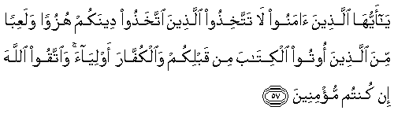
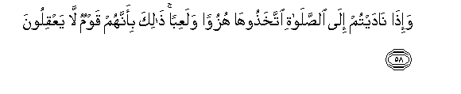
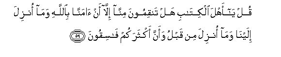
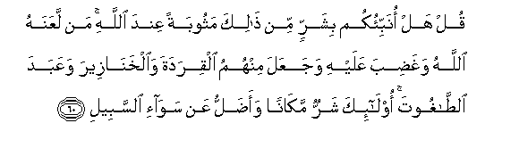
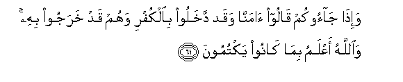
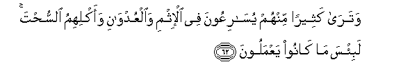
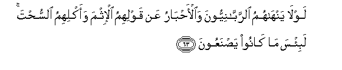
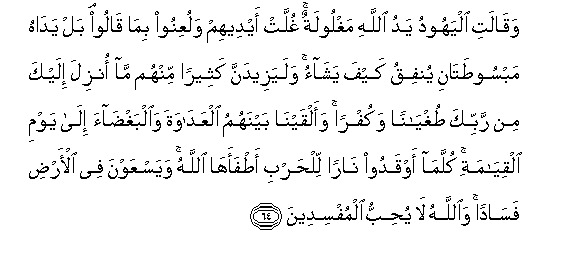
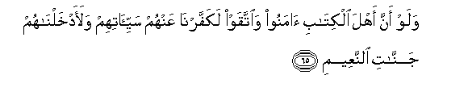
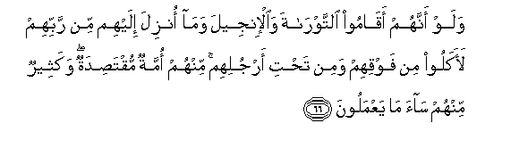

  
[Intangible Textual Heritage](../../index)  [Islam](../index) 
[Index](index)   
[Hypertext Qur'an](../htq/index)  [Unicode](../uq/005.htm#005_057) 
[Palmer](../sbe06/005)  [Pickthall](../pick/005.htm#005_057)  [Yusuf Ali
English](../yaq/yaq005)  [Rodwell](../qr/005)   
  
[Sūra V.: Māïda, or The Table Spread. Index](005)  
  [Previous](00508)  [Next](00510) 

------------------------------------------------------------------------

  
*The Holy Quran*, tr. by Yusuf Ali, \[1934\], at Intangible Textual
Heritage

------------------------------------------------------------------------

# Sūra V.: Māïda, or The Table Spread.

### Section 9

------------------------------------------------------------------------

57. Y<u>a</u> ayyuh<u>a</u> alla<u>th</u>eena <u>a</u>manoo l<u>a</u>
tattakhi<u>th</u>oo alla<u>th</u>eena ittakha<u>th</u>oo deenakum
huzuwan walaAAiban mina alla<u>th</u>eena ootoo alkit<u>a</u>ba min
qablikum wa**a**lkuff<u>a</u>ra awliy<u>a</u>a wa**i**ttaqoo
All<u>a</u>ha in kuntum mu/mineen**a**

57\. 60 O ye who believe!  
Take not for friends  
And protectors those  
Who take your religion  
For a mockery or sport,—  
Whether among those  
Who received the Scripture  
Before you, or among those  
Who reject Faith;  
But fear ye God,  
If ye have Faith (indeed).

------------------------------------------------------------------------

58. Wa-i<u>tha</u> n<u>a</u>daytum il<u>a</u>
a**l**<u>ss</u>al<u>a</u>ti ittakha<u>th</u>ooh<u>a</u> huzuwan
walaAAiban <u>tha</u>lika bi-annahum qawmun l<u>a</u> yaAAqiloon**a**

58\. 61 When ye proclaim  
Your call to prayer,  
They take it (but)  
As mockery and sport;  
That is because they are  
A people without understanding.

------------------------------------------------------------------------

59. Qul y<u>a</u> ahla alkit<u>a</u>bi hal tanqimoona minn<u>a</u>
ill<u>a</u> an <u>a</u>mann<u>a</u> bi**A**ll<u>a</u>hi wam<u>a</u>
onzila ilayn<u>a</u> wam<u>a</u> onzila min qablu waanna aktharakum
f<u>a</u>siqoon**a**

59\. 62 Say: "O People of the Book!  
Do ye disapprove of us  
For no other reason than  
That we believe in God,  
And the revelation  
That hath come to us  
And that which came  
Before (us), and (perhaps)  
That most of you  
Are rebellious and disobedient?

------------------------------------------------------------------------

60. Qul hal onabbi-okum bisharrin min <u>tha</u>lika mathoobatan AAinda
All<u>a</u>hi man laAAanahu All<u>a</u>hu wagha<u>d</u>iba AAalayhi
wajaAAala minhumu alqiradata wa**a**lkhan<u>a</u>zeera waAAabada
a**l**<u>tta</u>ghooti ol<u>a</u>-ika sharrun mak<u>a</u>nan
waa<u>d</u>allu AAan saw<u>a</u>-i a**l**ssabeel**i**

60\. 63 Say: "Shall I point out  
To you something much worse  
Than this, (as judged)  
By the treatment it received  
From God? Those who  
Incurred the curse of God  
And His wrath, those of whom some  
He transformed into apes and swine,  
Those who worshipped Evil;—  
These are (many times) worse  
In rank, and far more astray  
From the even Path!"

------------------------------------------------------------------------

61. Wa-i<u>tha</u> j<u>a</u>ookum q<u>a</u>loo <u>a</u>mann<u>a</u>
waqad dakhaloo bi**a**lkufri wahum qad kharajoo bihi wa**A**ll<u>a</u>hu
aAAlamu bim<u>a</u> k<u>a</u>noo yaktumoon**a**

61\. 64 When they come to thee,  
They say: "We believe":  
But in fact they enter  
With a mind against Faith,  
And they go out  
With the same.  
But God knoweth fully  
All that they hide.

------------------------------------------------------------------------

62. Watar<u>a</u> katheeran minhum yus<u>a</u>riAAoona fee al-ithmi
wa**a**lAAudw<u>a</u>ni waaklihimu a**l**ssu<u>h</u>ta labi/sa m<u>a</u>
k<u>a</u>noo yaAAmaloon**a**

62\. 65 Many of them dost thou  
See, racing each other  
In sin and rancour,  
And their eating of things  
Forbidden. Evil indeed  
Are the things that they do.

------------------------------------------------------------------------

63. Lawl<u>a</u> yanh<u>a</u>humu a**l**rrabb<u>a</u>niyyoona
wa**a**l-a<u>h</u>b<u>a</u>ru AAan qawlihimu al-ithma waaklihimu
a**l**ssu<u>h</u>ta labi/sa m<u>a</u> k<u>a</u>noo
ya<u>s</u>naAAoon**a**

63\. 66 Why do not the Rabbis  
And the doctors of law forbid  
Them from their (habit  
Of) uttering sinful words  
And eating things forbidden?  
Evil indeed are their works.

------------------------------------------------------------------------

64. Waq<u>a</u>lati alyahoodu yadu All<u>a</u>hi maghloolatun ghullat
aydeehim waluAAinoo bim<u>a</u> q<u>a</u>loo bal yad<u>a</u>hu
mabsoo<u>t</u>at<u>a</u>ni yunfiqu kayfa yash<u>a</u>o walayazeedanna
katheeran minhum m<u>a</u> onzila ilayka min rabbika
<u>t</u>ughy<u>a</u>nan wakufran waalqayn<u>a</u> baynahumu
alAAad<u>a</u>wata wa**a**lbagh<u>da</u>a il<u>a</u> yawmi
alqiy<u>a</u>mati kullam<u>a</u> awqadoo n<u>a</u>ran lil<u>h</u>arbi
a<u>t</u>faah<u>a</u> All<u>a</u>hu wayasAAawna fee al-ar<u>d</u>i
fas<u>a</u>dan wa**A**ll<u>a</u>hu l<u>a</u> yu<u>h</u>ibbu
almufsideen**a**

64\. 67 The Jews say: "God's hand  
Is tied up." Be their hands  
Tied up and be they accursed  
For the (blasphemy) they utter.  
Nay, both His hands  
Are widely outstretched:  
He giveth and spendeth  
(Of His bounty) as He pleaseth.  
But the revelation that  
Cometh to thee from God  
Increaseth in most of them  
Their obstinate rebellion  
And blasphemy. Amongst them  
We have placed enmity  
And hatred till the Day  
Of Judgment. Every time  
They kindle the fire of war,  
God doth extinguish it;  
But they (ever) strive  
To do mischief on earth.  
And God loveth not  
Those who do mischief.

------------------------------------------------------------------------

65. Walaw anna ahla alkit<u>a</u>bi <u>a</u>manoo wa**i**ttaqaw
lakaffarn<u>a</u> AAanhum sayyi-<u>a</u>tihim walaadkhaln<u>a</u>hum
jann<u>a</u>ti a**l**nnaAAeem**i**

65\. 68 If only the People of the Book  
Had believed and been righteous,  
We should indeed have  
Blotted out their iniquities  
And admitted them  
To Gardens of Bliss.

------------------------------------------------------------------------

66. Walaw annahum aq<u>a</u>moo a**l**ttawr<u>a</u>ta wa**a**l-injeela
wam<u>a</u> onzila ilayhim min rabbihim laakaloo min fawqihim wamin
ta<u>h</u>ti arjulihim minhum ommatun muqta<u>s</u>idatun wakatheerun
minhum s<u>a</u>a m<u>a</u> yaAAmaloon**a**

66\. 69 If only they had stood fast  
By the Law, the Gospel,  
And all the revelation that was sent  
To them from their Lord,  
They would have enjoyed  
Happiness from every side.'  
There is from among them  
A party on the right course:  
But many of them  
Follow a course that is evil.

------------------------------------------------------------------------

[Next: Section 10 (67-77)](00510)

