

  
[Intangible Textual Heritage](../../index)  [Islam](../index) 
[Index](index)   
[Hypertext Qur'an](../htq/index)  [Unicode](../uq/005.htm#005_067) 
[Palmer](../sbe06/005)  [Pickthall](../pick/005.htm#005_067)  [Yusuf Ali
English](../yaq/yaq005)  [Rodwell](../qr/005)   
  
[Sūra V.: Māïda, or The Table Spread. Index](005)  
  [Previous](00509)  [Next](00511) 

------------------------------------------------------------------------

  
*The Holy Quran*, tr. by Yusuf Ali, \[1934\], at Intangible Textual
Heritage

------------------------------------------------------------------------

# Sūra V.: Māïda, or The Table Spread.

### Section 10

------------------------------------------------------------------------

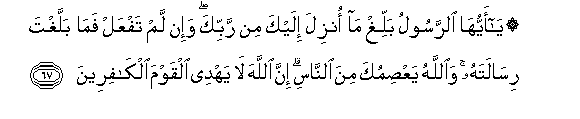

67. Y<u>a</u> ayyuh<u>a</u> a**l**rrasoolu balligh m<u>a</u> onzila
ilayka min rabbika wa-in lam tafAAal fam<u>a</u> ballaghta
ris<u>a</u>latahu wa**A**ll<u>a</u>hu yaAA<u>s</u>imuka mina
a**l**nn<u>a</u>si inna All<u>a</u>ha l<u>a</u> yahdee alqawma
alk<u>a</u>fireen**a**

67\. 70 O Apostle! proclaim  
The (Message) which hath been  
Sent to thee from thy Lord.  
If thou didst not, thou  
Wouldst not have fulfilled  
And proclaimed His Mission.  
And God will defend thee  
From men (who mean mischief).  
For God guideth not  
Those who reject Faith.

------------------------------------------------------------------------

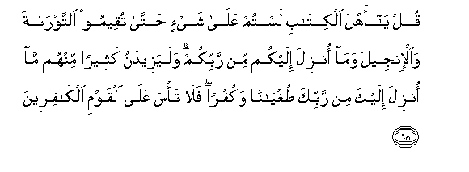

68. Qul y<u>a</u> ahla alkit<u>a</u>bi lastum AAal<u>a</u> shay-in
<u>h</u>att<u>a</u> tuqeemoo a**l**ttawr<u>a</u>ta wa**a**l-injeela
wam<u>a</u> onzila ilaykum min rabbikum walayazeedanna katheeran minhum
m<u>a</u> onzila ilayka min rabbika <u>t</u>ughy<u>a</u>nan wakufran
fal<u>a</u> ta/sa AAal<u>a</u> alqawmi alk<u>a</u>fireen**a**

68\. 71 Say: "O People of the Book!  
Ye have no ground  
To stand upon unless  
Ye stand fast by the Law,  
The Gospel, and all the revelation  
That has come to you from  
Your Lord." It is the revelation  
That cometh to thee from  
Thy Lord, that increaseth in most  
Of them their obstinate  
Rebellion and blasphemy.  
But sorrow thou not  
Over (these) people without Faith.

------------------------------------------------------------------------

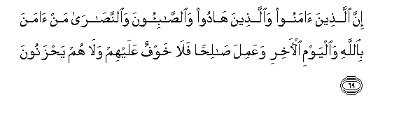

69. Inna alla<u>th</u>eena <u>a</u>manoo wa**a**lla<u>th</u>eena
h<u>a</u>doo wa**al**<u>ssa</u>bi-oona wa**al**nna<u>sa</u>r<u>a</u> man
<u>a</u>mana bi**A**ll<u>a</u>hi wa**a**lyawmi al-<u>a</u>khiri
waAAamila <u>sa</u>li<u>h</u>an fal<u>a</u> khawfun AAalayhim
wal<u>a</u> hum ya<u>h</u>zanoon**a**

69\. 72 Those who believe (in the
Qur-ān),  
Those who follow the Jewish (scriptures),  
And the Sabians and the Christians,—  
Any who believe in God  
And the Last Day,  
And work righteousness,—  
On them shall be no fear,  
Nor shall they grieve.

------------------------------------------------------------------------

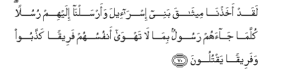

70. Laqad akha<u>th</u>n<u>a</u> meeth<u>a</u>qa banee isr<u>a</u>-eela
waarsaln<u>a</u> ilayhim rusulan kullam<u>a</u> j<u>a</u>ahum rasoolun
bim<u>a</u> l<u>a</u> tahw<u>a</u> anfusuhum fareeqan ka<u>thth</u>aboo
wafareeqan yaqtuloon**a**

70\. 73 We took the Covenant  
Of the Children of Israel  
And sent them apostles.  
Every time there came  
To them an apostle  
With what they themselves  
Desired not—some  
(Of these) they called  
Impostors, and some they  
(Go so far as to) slay.

------------------------------------------------------------------------

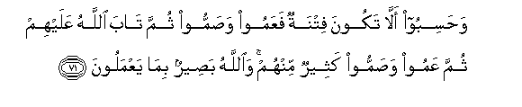

71. Wa<u>h</u>asiboo all<u>a</u> takoona fitnatun faAAamoo
wa<u>s</u>ammoo thumma t<u>a</u>ba All<u>a</u>hu AAalayhim thumma AAamoo
wa<u>s</u>ammoo katheerun minhum wa**A**ll<u>a</u>hu ba<u>s</u>eerun
bim<u>a</u> yaAAmaloon**a**

71\. 74 They thought there would be  
No trial (or punishment);  
So they became blind and deaf;  
Yet God (in mercy) turned  
To them; yet again many  
Of them became blind and deaf.  
But God sees well  
All that they do.

------------------------------------------------------------------------

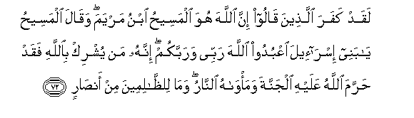

72. Laqad kafara alla<u>th</u>eena q<u>a</u>loo inna All<u>a</u>ha huwa
almasee<u>h</u>u ibnu maryama waq<u>a</u>la almasee<u>h</u>u y<u>a</u>
banee isr<u>a</u>-eela oAAbudoo All<u>a</u>ha rabbee warabbakum innahu
man yushrik bi**A**ll<u>a</u>hi faqad <u>h</u>arrama All<u>a</u>hu
AAalayhi aljannata wama/w<u>a</u>hu a**l**nn<u>a</u>ru wam<u>a</u>
li**l***<u>thth</u>*<u>a</u>limeena min an<u>sa</u>r**in**

72\. 75 They do blaspheme who say:  
"God is Christ the son  
Of Mary" But said Christ:  
"O Children of Israel!  
Worship God, my Lord  
And your Lord." Whoever  
Joins other gods with God,—  
God will forbid him  
The Garden, and the Fire  
Will be his abode. There will  
For the wrong-doers  
Be no one to help.

------------------------------------------------------------------------

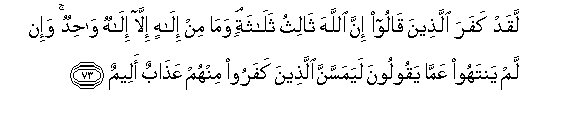

73. Laqad kafara alla<u>th</u>eena q<u>a</u>loo inna All<u>a</u>ha
th<u>a</u>lithu thal<u>a</u>thatin wam<u>a</u> min il<u>a</u>hin
ill<u>a</u> il<u>a</u>hun w<u>ah</u>idun wa-in lam yantahoo
AAamm<u>a</u> yaqooloona layamassanna alla<u>th</u>eena kafaroo minhum
AAa<u>tha</u>bun aleem**un**

73\. 76 They do blaspheme who say:  
God is one of three  
In a Trinity: for there is  
No god except One God.  
If they desist not  
From their word (of blasphemy),  
Verily a grievous penalty  
Will befall the blasphemers  
Among them.

------------------------------------------------------------------------

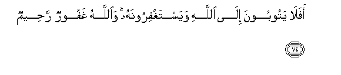

74. Afal<u>a</u> yatooboona il<u>a</u> All<u>a</u>hi wayastaghfiroonahu
wa**A**ll<u>a</u>hu ghafoorun ra<u>h</u>eem**un**

74\. 77 Why turn they not to God,  
And seek His forgiveness?  
For God is Oft-forgiving,  
Most Merciful.

------------------------------------------------------------------------

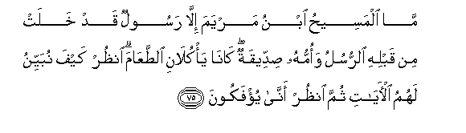

75. M<u>a</u> almasee<u>h</u>u ibnu maryama ill<u>a</u> rasoolun qad
khalat min qablihi a**l**rrusulu waommuhu <u>s</u>iddeeqatun
k<u>a</u>n<u>a</u> ya/kul<u>a</u>ni a**l**<u>tt</u>aAA<u>a</u>ma
on*<u>th</u>*ur kayfa nubayyinu lahumu al-<u>a</u>y<u>a</u>ti thumma
on*<u>th</u>*ur ann<u>a</u> yu/fakoon**a**

75\. 78 Christ the son of Mary  
Was no more than  
An Apostle; many were  
The apostles that passed away  
Before him. His mother  
Was a woman of truth.  
They had both to eat  
Their (daily) food.  
See how God doth make  
His Signs clear to them;  
Yet see in what ways  
They are deluded  
Away from the truth!

------------------------------------------------------------------------

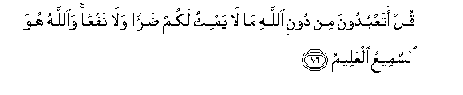

76. Qul ataAAbudoona min dooni All<u>a</u>hi m<u>a</u> l<u>a</u> yamliku
lakum <u>d</u>arran wal<u>a</u> nafAAan wa**A**ll<u>a</u>hu huwa
a**l**ssameeAAu alAAaleem**u**

76\. 79 Say: "Will ye worship,  
Besides God, something  
Which hath no power either  
To harm or benefit you?  
But God,—He it is  
That heareth and knoweth  
All things."

------------------------------------------------------------------------

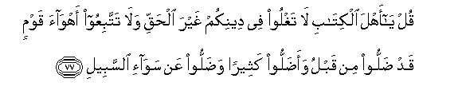

77. Qul y<u>a</u> ahla alkit<u>a</u>bi l<u>a</u> taghloo fee deenikum
ghayra al<u>h</u>aqqi wal<u>a</u> tattabiAAoo ahw<u>a</u>a qawmin qad
<u>d</u>alloo min qablu waa<u>d</u>alloo katheeran wa<u>d</u>alloo AAan
saw<u>a</u>-i a**l**ssabeel**i**

77\. 80 Say: "O People of the Book!  
Exceed not in your religion  
The bounds (of what is proper),  
Trespassing beyond the truth,  
Nor follow the vain desires  
Of people who went wrong  
In times gone by,—who misled  
Many, and strayed (themselves)  
From the even Way.

------------------------------------------------------------------------

[Next: Section 11 (78-86)](00511)

