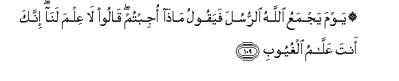
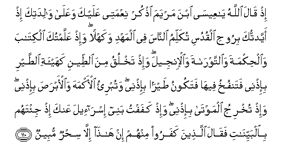
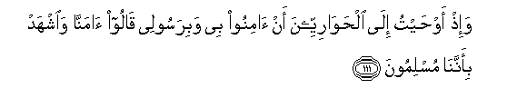
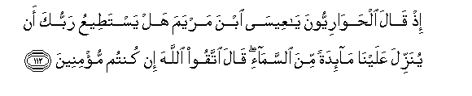
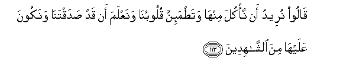
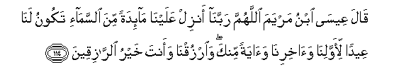
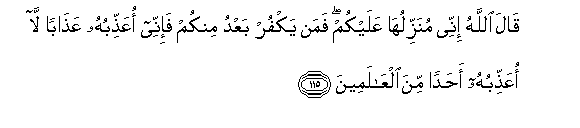

  
[Intangible Textual Heritage](../../index)  [Islam](../index) 
[Index](index)   
[Hypertext Qur'an](../htq/index)  [Unicode](../uq/005.htm#005_109) 
[Palmer](../sbe06/005)  [Pickthall](../pick/005.htm#005_109)  [Yusuf Ali
English](../yaq/yaq005)  [Rodwell](../qr/005)   
  
[Sūra V.: Māïda, or The Table Spread. Index](005)  
  [Previous](00514)  [Next](00516) 

------------------------------------------------------------------------

  
*The Holy Quran*, tr. by Yusuf Ali, \[1934\], at Intangible Textual
Heritage

------------------------------------------------------------------------

# Sūra V.: Māïda, or The Table Spread.

### Section 15

------------------------------------------------------------------------

109. Yawma yajmaAAu All<u>a</u>hu a**l**rrusula fayaqoolu m<u>atha</u>
ojibtum q<u>a</u>loo l<u>a</u> AAilma lan<u>a</u> innaka anta
AAall<u>a</u>mu alghuyoob**i**

109\. 112 One day will God  
Gather the apostles together,  
And ask: "What was  
The response ye received  
(From men to your teaching)?"  
They will say: "We  
Have no knowledge: it is Thou  
Who knowest in full  
All that is hidden."

------------------------------------------------------------------------

110. I<u>th</u> q<u>a</u>la All<u>a</u>hu y<u>a</u> AAees<u>a</u> ibna
maryama o<u>th</u>kur niAAmatee AAalayka waAAal<u>a</u>
w<u>a</u>lidatika i<u>th</u> ayyadtuka biroo<u>h</u>i alqudusi tukallimu
a**l**nn<u>a</u>sa fee almahdi wakahlan wa-i<u>th</u> AAallamtuka
alkit<u>a</u>ba wa**a**l<u>h</u>ikmata wa**al**ttawr<u>a</u>ta
wa**a**l-injeela wa-i<u>th</u> takhluqu mina a**l**<u>tt</u>eeni
kahay-ati a**l**<u>tt</u>ayri bi-i<u>th</u>nee fatanfukhu feeh<u>a</u>
fatakoonu <u>t</u>ayran bi-i<u>th</u>nee watubri-o al-akmaha
wa**a**l-abra<u>s</u>a bi-i<u>th</u>nee wa-i<u>th</u> tukhriju
almawt<u>a</u> bi-i<u>th</u>nee wa-i<u>th</u> kafaftu banee
isr<u>a</u>-eela AAanka i<u>th</u> ji/tahum bi**a**lbayyin<u>a</u>ti
faq<u>a</u>la alla<u>th</u>eena kafaroo minhum in h<u>atha</u>
ill<u>a</u> si<u>h</u>run mubeen**un**

110\. 113 When will God say:  
"O Jesus the son of Mary!  
Recount My favour"'  
To thee and to thy mother.  
Behold! I strengthened thee  
With the holy spirit,  
So that thou didst speak  
To the people in childhood  
And in maturity.  
Behold! I taught thee  
The Book and Wisdom,  
The Law and the Gospel.  
And behold! thou makest  
Out of clay, as it were,  
The figure of a bird,  
By My leave,  
And thou breathest into it,  
And it becometh a bird  
By My leave,  
And thou healest those  
Born blind, and the lepers,  
By My leave.  
And behold! thou  
Bringest forth the dead  
By My leave ego  
And behold! I did  
Restrain the Children of Israel  
From (violence to) thee  
When thou didst show them  
The Clear Signs,  
And the unbelievers among them  
Said: 'This is nothing  
But evident magic.

------------------------------------------------------------------------

111. Wa-i<u>th</u> aw<u>h</u>aytu il<u>a</u>
al<u>h</u>aw<u>a</u>riyyeena an <u>a</u>minoo bee wabirasoolee
q<u>a</u>loo <u>a</u>mann<u>a</u> wa**i**shhad bi-annan<u>a</u>
muslimoon**a**

111\. 114 "And behold! I inspired  
The Disciples to have faith  
In Me and Mine Apostle:  
They said, 'We have faith,  
And do thou bear witness  
That we bow to God  
As Muslims'."

------------------------------------------------------------------------

112. I<u>th</u> q<u>a</u>la al<u>h</u>aw<u>a</u>riyyoona y<u>a</u>
AAees<u>a</u> ibna maryama hal yasta<u>t</u>eeAAu rabbuka an yunazzila
AAalayn<u>a</u> m<u>a</u>-idatan mina a**l**ssam<u>a</u>-i q<u>a</u>la
ittaqoo All<u>a</u>ha in kuntum mu/mineen**a**

112\. 115 Behold! the Disciples said:  
"O Jesus the son of Mary!  
Can thy Lord send down to us  
A Table set (with viands)  
From heaven?" Said Jesus:  
"Fear God, if ye have faith."

------------------------------------------------------------------------

113. Q<u>a</u>loo nureedu an na/kula minh<u>a</u> wata<u>t</u>ma-inna
quloobun<u>a</u> wanaAAlama an qad <u>s</u>adaqtan<u>a</u> wanakoona
AAalayh<u>a</u> mina a**l**shsh<u>a</u>hideen**a**

113\. 116 They said: "We only wish  
To eat thereof and satisfy  
Our hearts, and to know  
That thou hast indeed  
Told us the truth; and  
That we ourselves may be  
Witnesses to the miracle."

------------------------------------------------------------------------

114. Q<u>a</u>la AAees<u>a</u> ibnu maryama all<u>a</u>humma
rabban<u>a</u> anzil AAalayn<u>a</u> m<u>a</u>-idatan mina
a**l**ssam<u>a</u>-i takoonu lan<u>a</u> AAeedan li-awwalin<u>a</u>
wa<u>a</u>khirin<u>a</u> wa<u>a</u>yatan minka wa**o**rzuqn<u>a</u>
waanta khayru a**l**rr<u>a</u>ziqeen**a**

114\. 117 Said Jesus the son of Mary:  
"O God our Lord!  
Send us from heaven  
A Table set (with viands),  
That there may be for us  
For the first and the last of us—  
A solemn festival  
And a. Sign from Thee;  
And provide for our sustenance,  
For Thou art the best  
Sustainer (of our needs)."

------------------------------------------------------------------------

115. Q<u>a</u>la All<u>a</u>hu innee munazziluh<u>a</u> AAalaykum faman
yakfur baAAdu minkum fa-innee oAAa<u>thth</u>ibuhu AAa<u>tha</u>ban
l<u>a</u> oAAa<u>thth</u>ibuhu a<u>h</u>adan mina
alAA<u>a</u>lameen**a**

115\. 118 God said: "I will  
Send it down unto you:  
But if any of you  
After that resisteth faith,  
I will punish him  
With a penalty such  
As I have not inflicted  
On any one among  
All the peoples."

------------------------------------------------------------------------

[Next: Section 16 (116-120)](00516)

