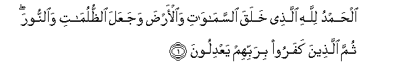
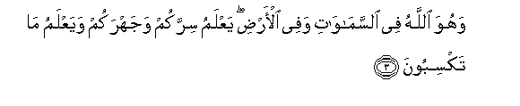
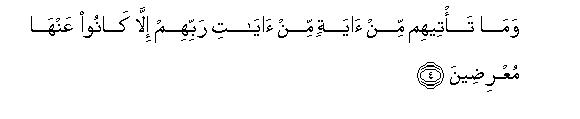
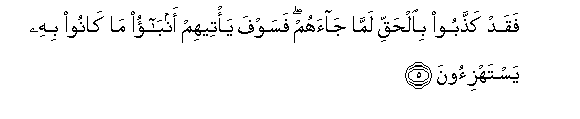
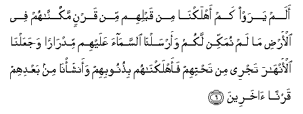
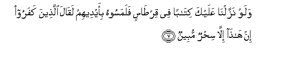
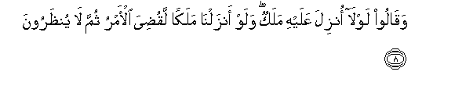
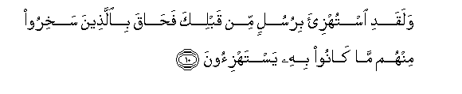

  
[Intangible Textual Heritage](../../index)  [Islam](../index) 
[Index](index)   
[Hypertext Qur'an](../htq/index)  [Unicode](../uq/006.htm#006_001) 
[Palmer](../sbe06/006)  [Pickthall](../pick/006.htm#006_001)  [Yusuf Ali
English](../yaq/yaq006)  [Rodwell](../qr/006)   
  
[Sūra VI.: An’ām, or Cattle. Index](006)  
  [Previous](00516)  [Next](00602) 

------------------------------------------------------------------------

  
*The Holy Quran*, tr. by Yusuf Ali, \[1934\], at Intangible Textual
Heritage

------------------------------------------------------------------------

# Sūra VI.: An’ām, or Cattle.

### Section 1

1. Al<u>h</u>amdu lill<u>a</u>hi alla<u>th</u>ee khalaqa
a**l**ssam<u>a</u>w<u>a</u>ti wa**a**l-ar<u>d</u>a wajaAAala
a**l***<u>thth</u>*ulum<u>a</u>ti wa**al**nnoora thumma
alla<u>th</u>eena kafaroo birabbihim yaAAdiloon**a**

1\. Praise be to God,  
Who created the heavens  
And the earth,  
And made the Darkness  
And the Light.  
Yet those who reject Faith  
Hold (others) as equal.  
With their Guardian-Lord.

------------------------------------------------------------------------

2. Huwa alla<u>th</u>ee khalaqakum min <u>t</u>eenin thumma qa<u>da</u>
ajalan waajalun musamman AAindahu thumma antum tamtaroon**a**

2\. He it is Who created  
You from clay, and then  
Decreed a stated term  
(For you). And there is  
In His Presence another  
Determined term; yet  
Ye doubt within yourselves!

------------------------------------------------------------------------

3. Wahuwa All<u>a</u>hu fee a**l**ssam<u>a</u>w<u>a</u>ti wafee
al-ar<u>d</u>i yaAAlamu sirrakum wajahrakum wayaAAlamu m<u>a</u>
taksiboon**a**

3\. And He is God  
In the heavens  
And on earth.  
He knoweth what ye  
Hide, and what ye reveal,  
And He knoweth  
The (recompense) which  
Ye earn (by your deeds)

------------------------------------------------------------------------

4. Wam<u>a</u> ta/teehim min <u>a</u>yatin min <u>a</u>y<u>a</u>ti
rabbihim ill<u>a</u> k<u>a</u>noo AAanh<u>a</u> muAAri<u>d</u>een**a**

4\. But never did a single  
One of the Signs  
Of their Lord reach them,  
But they turned  
Away therefrom.

------------------------------------------------------------------------

5. Faqad ka<u>thth</u>aboo bi**a**l<u>h</u>aqqi lamm<u>a</u>
j<u>a</u>ahum fasawfa ya/teehim anb<u>a</u>o m<u>a</u> k<u>a</u>noo bihi
yastahzi-oon**a**

5\. And now they reject  
The truth when it reaches  
Them: but soon shall they  
Learn the reality of what  
They used to mock at.

------------------------------------------------------------------------

6. Alam yaraw kam ahlakn<u>a</u> min qablihim min qarnin
makkann<u>a</u>hum fee al-ar<u>d</u>i m<u>a</u> lam numakkin lakum
waarsaln<u>a</u> a**l**ssam<u>a</u>a AAalayhim midr<u>a</u>ran
wajaAAaln<u>a</u> al-anh<u>a</u>ra tajree min ta<u>h</u>tihim
faahlakn<u>a</u>hum bi<u>th</u>unoobihim waansha/n<u>a</u> min baAAdihim
qarnan <u>a</u>khareen**a**

6\. See they not how many  
Of those before them  
We did destroy?—  
Generations We had established  
On the earth, in strength  
Such as We have not given  
To you—for whom  
We poured out rain  
From the skies in abundance,  
And gave (fertile) streams  
Flowing beneath their (feet):  
Yet for their sins  
We destroyed them,  
And raised in their wake  
Fresh generations  
(To succeed them).

------------------------------------------------------------------------

7. Walaw nazzaln<u>a</u> AAalayka kit<u>a</u>ban fee qir<u>ta</u>sin
falamasoohu bi-aydeehim laq<u>a</u>la alla<u>th</u>eena kafaroo in
h<u>atha</u> ill<u>a</u> si<u>h</u>run mubeen**un**

7\. If We had sent  
Unto thee a written  
(Message) on parchment,  
So that they could  
Touch it with their hands,  
The Unbelievers would  
Have been sure to say:  
"This is nothing but  
Obvious magic!"

------------------------------------------------------------------------

8. Waq<u>a</u>loo lawl<u>a</u> onzila AAalayhi malakun walaw
anzaln<u>a</u> malakan laqu<u>d</u>iya al-amru thumma l<u>a</u>
yun*<u>th</u>*aroon**a**

8\. They say: "Why is not  
An angel sent down to him?"  
If We did send down  
An angel, the matter  
Would be settled at once,  
And no respite  
Would be granted them.

------------------------------------------------------------------------

9. Walaw jaAAaln<u>a</u>hu malakan lajaAAaln<u>a</u>hu rajulan
walalabasn<u>a</u> AAalayhim m<u>a</u> yalbisoon**a**

9\. If We had made it  
An angel, We should  
Have sent him as a man,  
And We should certainly  
Have caused them confusion  
In a matter which they have  
Already covered with confusion.

------------------------------------------------------------------------

10. Walaqadi istuhzi-a birusulin min qablika fa<u>ha</u>qa
bi**a**lla<u>th</u>eena sakhiroo minhum m<u>a</u> k<u>a</u>noo bihi
yastahzi-oon**a**

10\. Mocked were (many)  
Apostles before thee;  
But their scoffers  
Were hemmed in  
By the thing that they mocked.

------------------------------------------------------------------------

[Next: Section 2 (11-20)](00602)

