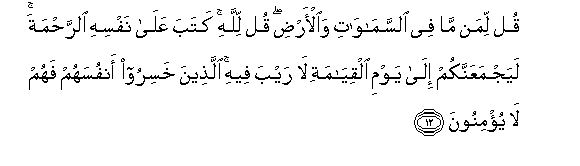
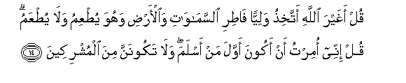
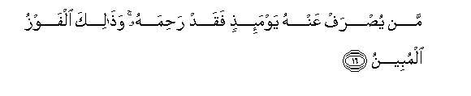
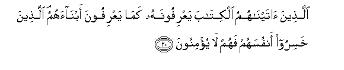

  
[Intangible Textual Heritage](../../index)  [Islam](../index) 
[Index](index)   
[Hypertext Qur'an](../htq/index)  [Unicode](../uq/006.htm#006_011) 
[Palmer](../sbe06/006)  [Pickthall](../pick/006.htm#006_011)  [Yusuf Ali
English](../yaq/yaq006)  [Rodwell](../qr/006)   
  
[Sūra VI.: An’ām, or Cattle. Index](006)  
  [Previous](00601)  [Next](00603) 

------------------------------------------------------------------------

  
*The Holy Quran*, tr. by Yusuf Ali, \[1934\], at Intangible Textual
Heritage

------------------------------------------------------------------------

# Sūra VI.: An’ām, or Cattle.

### Section 2

------------------------------------------------------------------------

11. Qul seeroo fee al-ar<u>d</u>i thumma on*<u>th</u>*uroo kayfa
k<u>a</u>na AA<u>a</u>qibatu almuka<u>thth</u>ibeen**a**

11\. Say: "Travel through the earth  
And see what was the end  
Of those who rejected Truth".

------------------------------------------------------------------------

12. Qul liman m<u>a</u> fee a**l**ssam<u>a</u>w<u>a</u>ti
wa**a**l-ar<u>d</u>i qul lill<u>a</u>hi kataba AAal<u>a</u> nafsihi
a**l**rra<u>h</u>mata layajmaAAannakum il<u>a</u> yawmi
alqiy<u>a</u>mati l<u>a</u> rayba feehi alla<u>th</u>eena khasiroo
anfusahum fahum l<u>a</u> yu/minoon**a**

12\. Say: "To whom I elongeth  
All that is in the heavens  
And on earth?" Say:  
"To God. He hath inscribed  
For Himself (the rule of) Mercy.  
That He will gather you  
Together for the Day of Judgment,  
There is no doubt whatever.  
It is they who have lost  
Their own souls, that will  
Not believe.

------------------------------------------------------------------------

13. Walahu m<u>a</u> sakana fee allayli wa**al**nnah<u>a</u>ri wahuwa
a**l**ssameeAAu alAAaleem**u**

13\. To him belongeth all  
That dwelleth (or lurketh)  
In the Night and the Day.  
For He is the One  
Who heareth and knoweth  
All things."

------------------------------------------------------------------------

14. Qul aghayra All<u>a</u>hi attakhi<u>th</u>u waliyyan f<u>at</u>iri
a**l**ssam<u>a</u>w<u>a</u>ti wa**a**l-ar<u>d</u>i wahuwa
yu<u>t</u>AAimu wal<u>a</u> yu<u>t</u>AAamu qul innee omirtu an akoona
awwala man aslama wal<u>a</u> takoonanna mina almushrikeen**a**

14\. Say: "Shall I take  
For my protector  
Any other than God,  
The Maker of the heavens  
And the earth?  
And He it is that  
Feedeth but is not fed."  
Say: "Nay! but I am  
Commanded to be the first  
Of those who bow  
To God (in Islam),  
And be not thou  
Of the company of those  
Who join gods with God."

------------------------------------------------------------------------

15. Qul innee akh<u>a</u>fu in AAa<u>s</u>aytu rabbee AAa<u>tha</u>ba
yawmin AAa*<u>th</u>*eem**in**

15\. Say: "I would, if I  
Disobeyed my Lord,  
Indeed have fear  
Of the Penalty  
Of a Mighty Day.

------------------------------------------------------------------------

16. Man yu<u>s</u>raf AAanhu yawma-i<u>th</u>in faqad ra<u>h</u>imahu
wa<u>tha</u>lika alfawzu almubeen**u**

16\. "On that day, if the Penalty  
Is averted from any,  
It is due to God's Mercy;  
And that would be (Salvation),  
The obvious fulfilment  
Of all desire.

------------------------------------------------------------------------

17. Wa-in yamsaska All<u>a</u>hu bi<u>d</u>urrin fal<u>a</u>
k<u>a</u>shifa lahu ill<u>a</u> huwa wa-in yamsaska bikhayrin fahuwa
AAal<u>a</u> kulli shay-in qadeer**un**

17\. "If God touch thee  
With affliction, none  
Can remove it but He;  
If He touch thee with happiness,  
He hath power over all things.

------------------------------------------------------------------------

18. Wahuwa alq<u>a</u>hiru fawqa AAib<u>a</u>dihi wahuwa
al<u>h</u>akeemu alkhabeer**u**

18\. "He is the Irresistible, (watching)  
From above over His worshippers;  
And He is the Wise,  
Acquainted with all things."

------------------------------------------------------------------------

19. Qul ayyu shay-in akbaru shah<u>a</u>datan quli All<u>a</u>hu
shaheedun baynee wabaynakum waoo<u>h</u>iya ilayya h<u>atha</u>
alqur-<u>a</u>nu li-on<u>th</u>irakum bihi waman balagha a-innakum
latashhadoona anna maAAa All<u>a</u>hi <u>a</u>lihatan okhr<u>a</u> qul
l<u>a</u> ashhadu qul innam<u>a</u> huwa il<u>a</u>hun w<u>ah</u>idun
wa-innanee baree-on mimm<u>a</u> tushrikoon**a**

19\. Say: "What thing is most  
Weighty in evidence?"  
Say: "God is witness  
Between me and you;  
This Qur-ān hath been  
Revealed to me by inspiration,  
That I may warn you  
And all whom it reaches.  
Can ye possibly bear witness  
That besides God there is  
Another God?" Say:  
"Nay! I cannot bear witness!"  
Say: But in truth  
He is the One God,  
And I truly am innocent  
Of (your blasphemy of) joining  
Others with Him."

------------------------------------------------------------------------

20. Alla<u>th</u>eena <u>a</u>tayn<u>a</u>humu alkit<u>a</u>ba
yaAArifoonahu kam<u>a</u> yaAArifoona abn<u>a</u>ahum alla<u>th</u>eena
khasiroo anfusahum fahum l<u>a</u> yu/minoon**a**

20\. Those to whom  
We have given the Book  
Know this as they know  
Their own sons.  
Those who have lost  
Their own souls  
Refuse therefore to believe.

------------------------------------------------------------------------

[Next: Section 3 (21-30)](00603)

