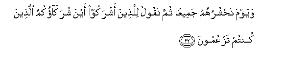
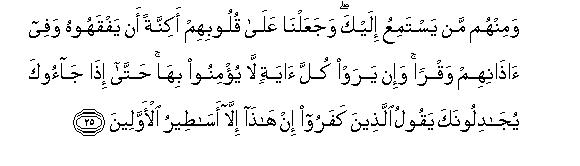
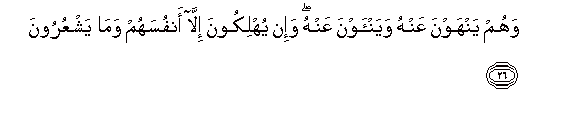

  
[Intangible Textual Heritage](../../index)  [Islam](../index) 
[Index](index)   
[Hypertext Qur'an](../htq/index)  [Unicode](../uq/006.htm#006_021) 
[Palmer](../sbe06/006)  [Pickthall](../pick/006.htm#006_021)  [Yusuf Ali
English](../yaq/yaq006)  [Rodwell](../qr/006)   
  
[Sūra VI.: An’ām, or Cattle. Index](006)  
  [Previous](00602)  [Next](00604) 

------------------------------------------------------------------------

  
*The Holy Quran*, tr. by Yusuf Ali, \[1934\], at Intangible Textual
Heritage

------------------------------------------------------------------------

# Sūra VI.: An’ām, or Cattle.

### Section 3

------------------------------------------------------------------------

21. Waman a*<u>th</u>*lamu mimmani iftar<u>a</u> AAal<u>a</u>
All<u>a</u>hi ka<u>th</u>iban aw ka<u>thth</u>aba
bi-<u>a</u>y<u>a</u>tihi innahu l<u>a</u> yufli<u>h</u>u
a**l***<u>thth</u>*<u>a</u>limoon**a**

21\. Who doth more wrong  
Than he who inventeth  
A lie against God  
Or rejecteth His Signs?  
But verily the wrong-doers  
Never shall prosper.

------------------------------------------------------------------------

22. Wayawma na<u>h</u>shuruhum jameeAAan thumma naqoolu
lilla<u>th</u>eena ashrakoo ayna shurak<u>a</u>okumu alla<u>th</u>eena
kuntum tazAAumoon**a**

22\. One day shall We gather  
Them all together: We  
Shall say to those  
Who ascribed partners (to Us):  
"Where are the partners  
Whom ye (invented  
And) talked about?"

------------------------------------------------------------------------

23. Thumma lam takun fitnatuhum ill<u>a</u> an q<u>a</u>loo
wa**A**ll<u>a</u>hi rabbin<u>a</u> m<u>a</u> kunn<u>a</u>
mushrikeen**a**

23\. There will then be (left)  
No subterfuge for them  
But to say: "By God  
Our Lord, we were not  
Those who joined gods  
With God."

------------------------------------------------------------------------

24. On*<u>th</u>*ur kayfa ka<u>th</u>aboo AAal<u>a</u> anfusihim
wa<u>d</u>alla AAanhum m<u>a</u> k<u>a</u>noo yaftaroon**a**

24\. Behold! how they lie  
Against their own souls!  
But the (lie) which they  
Invented will leave themes:  
In the lurch.

------------------------------------------------------------------------

25. Waminhum man yastamiAAu ilayka wajaAAaln<u>a</u> AAal<u>a</u>
quloobihim akinnatan an yafqahoohu wafee <u>atha</u>nihim waqran wa-in
yaraw kulla <u>a</u>yatin l<u>a</u> yu/minoo bih<u>a</u>
<u>h</u>att<u>a</u> i<u>tha</u> j<u>a</u>ooka yuj<u>a</u>diloonaka
yaqoolu alla<u>th</u>eena kafaroo in h<u>atha</u> ill<u>a</u>
as<u>at</u>eeru al-awwaleen**a**

25\. Of them there are some  
Who (pretend to) listen to thee;  
But We have thrown  
Veils on their hearts,  
So they understand it not,  
And deafness in their ears;  
If they saw every one  
Of the Signs, not they  
Will believe in them;  
In so much that  
When they come to thee,  
They (but) dispute with thee;  
The Unbelievers say:  
"These are nothing  
But tales of the ancients."

------------------------------------------------------------------------

26. Wahum yanhawna AAanhu wayan-awna AAanhu wa-in yuhlikoona ill<u>a</u>
anfusahum wam<u>a</u> yashAAuroon**a**

26\. Others they keep away from it,  
And themselves they keep away;  
But they only destroy  
Their own souls,  
And they perceive it not.

------------------------------------------------------------------------

27. Walaw tar<u>a</u> i<u>th</u> wuqifoo AAal<u>a</u> a**l**nn<u>a</u>ri
faq<u>a</u>loo y<u>a</u> laytan<u>a</u> nuraddu wal<u>a</u>
nuka<u>thth</u>iba bi-<u>a</u>y<u>a</u>ti rabbin<u>a</u> wanakoona mina
almu/mineen**a**

27\. If thou couldst but see  
When they are confronted  
With the Fire!  
They will say:  
"Would that we were  
But sent back!  
Then would we not reject  
The Signs of our Lord,  
But would be amongst those  
Who believe!"

------------------------------------------------------------------------

28. Bal bad<u>a</u> lahum m<u>a</u> k<u>a</u>noo yukhfoona min qablu
walaw ruddoo laAA<u>a</u>doo lim<u>a</u> nuhoo AAanhu wa-innahum
lak<u>ath</u>iboon**a**

28\. Yea, in their own (eyes)  
Will become manifest  
What before they concealed.  
But if they were returned,  
They would certainly relapse  
To the things they were forbidden,  
For they are indeed liars.

------------------------------------------------------------------------

29. Waq<u>a</u>loo in hiya ill<u>a</u> <u>h</u>ay<u>a</u>tun<u>a</u>
a**l**dduny<u>a</u> wam<u>a</u> na<u>h</u>nu bimabAAootheen**a**

29\. And they (sometimes) say:  
"There is nothing except  
Our life on this earth,  
And never shall we be  
Raised up again."

------------------------------------------------------------------------

30. Walaw tar<u>a</u> i<u>th</u> wuqifoo AAal<u>a</u> rabbihim
q<u>a</u>la alaysa h<u>atha</u> bi**a**l<u>h</u>aqqi q<u>a</u>loo
bal<u>a</u> warabbin<u>a</u> q<u>a</u>la fa<u>th</u>ooqoo
alAAa<u>tha</u>ba bim<u>a</u> kuntum takfuroon**a**

30\. If thou couldst but see  
When they are confronted  
With their Lord!  
He will say:  
"Is not this the truth?"  
They will say:  
"Yea, by our Lord!"  
He will say:  
"Taste ye then the Penalty,  
Because ye rejected Faith."

------------------------------------------------------------------------

[Next: Section 4 (31-41)](00604)

