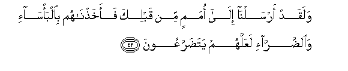
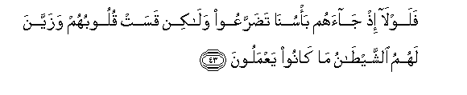
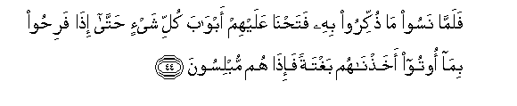
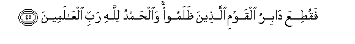
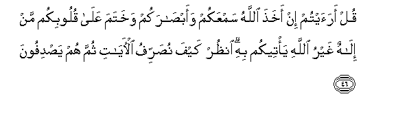
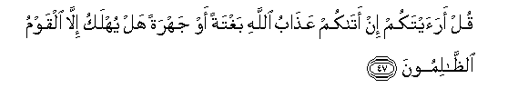
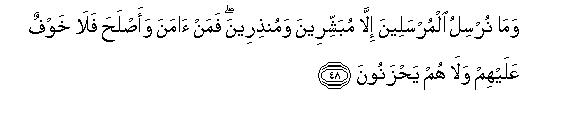
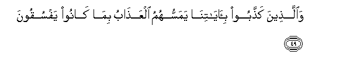
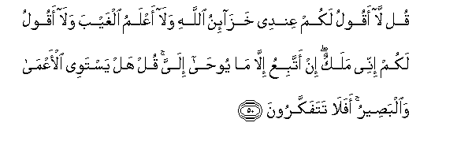

  
[Intangible Textual Heritage](../../index)  [Islam](../index) 
[Index](index)   
[Hypertext Qur'an](../htq/index)  [Unicode](../uq/006.htm#006_042) 
[Palmer](../sbe06/006)  [Pickthall](../pick/006.htm#006_042)  [Yusuf Ali
English](../yaq/yaq006)  [Rodwell](../qr/006)   
  
[Sūra VI.: An’ām, or Cattle. Index](006)  
  [Previous](00604)  [Next](00606) 

------------------------------------------------------------------------

  
*The Holy Quran*, tr. by Yusuf Ali, \[1934\], at Intangible Textual
Heritage

------------------------------------------------------------------------

# Sūra VI.: An’ām, or Cattle.

### Section 5

------------------------------------------------------------------------

42. Walaqad arsaln<u>a</u> il<u>a</u> omamin min qablika
faakha<u>th</u>n<u>a</u>hum bi**a**lba/s<u>a</u>-i
wa**al**<u>dd</u>arr<u>a</u>-i laAAallahum yata<u>d</u>arraAAoon**a**

42\. Before thee We sent  
(Apostles) to many nations,  
And We afflicted the nations  
With suffering and adversity,  
That they might learn humility.

------------------------------------------------------------------------

43. Falawl<u>a</u> i<u>th</u> j<u>a</u>ahum ba/sun<u>a</u>
ta<u>d</u>arraAAoo wal<u>a</u>kin qasat quloobuhum wazayyana lahumu
a**l**shshay<u>ta</u>nu m<u>a</u> k<u>a</u>noo yaAAmaloon**a**

43\. When the suffering reached  
Them from Us, why then  
Did they not learn humility?  
On the contrary their hearts  
Became hardened, and Satan  
Made their (sinful) acts  
Seem alluring to them.

------------------------------------------------------------------------

44. Falamm<u>a</u> nasoo m<u>a</u> <u>th</u>ukkiroo bihi
fata<u>h</u>n<u>a</u> AAalayhim abw<u>a</u>ba kulli shay-in
<u>h</u>att<u>a</u> i<u>tha</u> fari<u>h</u>oo bim<u>a</u> ootoo
akha<u>th</u>n<u>a</u>hum baghtatan fa-i<u>tha</u> hum mublisoon**a**

44\. But when they forgot  
The warning they had received,  
We opened to them the gates  
Of all (good) things,  
Until, in the midst  
Of their enjoyment  
Of our gifts,  
On a sudden, We called  
Them to account, when lo!  
They were plunged in despair!

------------------------------------------------------------------------

45. Faqu<u>t</u>iAAa d<u>a</u>biru alqawmi alla<u>th</u>eena
*<u>th</u>*alamoo wa**a**l<u>h</u>amdu lill<u>a</u>hi rabbi
alAA<u>a</u>lameen**a**

45\. Of the wrong-doers the last  
Remnant was cut off.  
Praise be to God,  
The Cherisher of the Worlds.

------------------------------------------------------------------------

46. Qul araaytum in akha<u>th</u>a All<u>a</u>hu samAAakum
waab<u>sa</u>rakum wakhatama AAal<u>a</u> quloobikum man il<u>a</u>hun
ghayru All<u>a</u>hi ya/teekum bihi on*<u>th</u>*ur kayfa
nu<u>s</u>arrifu al-<u>a</u>y<u>a</u>ti thumma hum ya<u>s</u>difoon**a**

46\. Say:"Think ye, if God  
Took away your hearing  
And your sight, and sealed up  
Your hearts, who—a god  
Other than God—could  
Restore them to you?"  
See how We explain  
The Signs by various (symbols);  
Yet they turn aside.

------------------------------------------------------------------------

47. Qul araaytakum in at<u>a</u>kum AAa<u>tha</u>bu All<u>a</u>hi
baghtatan aw jahratan hal yuhlaku ill<u>a</u> alqawmu
a**l***<u>thth</u>*<u>a</u>limoon**a**

47\. Say:"Think ye, if  
The Punishment of God  
Comes to you,  
Whether suddenly or openly,  
Will any be destroyed  
Except those who do wrong?

------------------------------------------------------------------------

48. Wam<u>a</u> nursilu almursaleena ill<u>a</u> mubashshireena
wamun<u>th</u>ireena faman <u>a</u>mana waa<u>s</u>la<u>h</u>a
fal<u>a</u> khawfun AAalayhim wal<u>a</u> hum ya<u>h</u>zanoon**a**

48\. We send the apostles  
Only to give good news  
And to warn: so those  
Who believe and mend  
(Their lives),—upon them  
Shall be no fear,  
Nor shall they grieve.

------------------------------------------------------------------------

49. Wa**a**lla<u>th</u>eena ka<u>thth</u>aboo
bi-<u>a</u>y<u>a</u>tin<u>a</u> yamassuhumu alAAa<u>tha</u>bu
bim<u>a</u> k<u>a</u>noo yafsuqoon**a**

49\. But those who reject  
Our Signs,—them  
Shall punishment touch,  
For that they ceased not  
From transgressing.

------------------------------------------------------------------------

50. Qul l<u>a</u> aqoolu lakum AAindee khaz<u>a</u>-inu All<u>a</u>hi
wal<u>a</u> aAAlamu alghayba wal<u>a</u> aqoolu lakum innee malakun in
attabiAAu ill<u>a</u> m<u>a</u> yoo<u>ha</u> ilayya qul hal yastawee
al-aAAm<u>a</u> wa**a**lba<u>s</u>eeru afal<u>a</u> tatafakkaroon**a**

50\. Say:"I tell you not  
That with me  
Are the Treasures of God,  
Nor do I know  
What is hidden,  
Nor do I tell you I am  
An angel. I but follow  
What is revealed to me."  
Say:"Can the blind  
Be held equal to the seeing?"  
Will ye then consider not?

------------------------------------------------------------------------

[Next: Section 6 (51-55)](00606)

