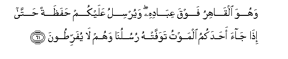
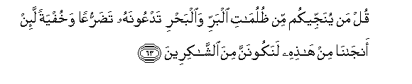
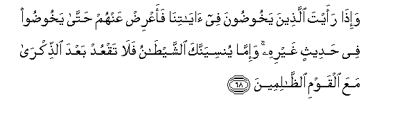
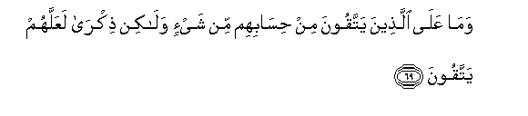

  
[Intangible Textual Heritage](../../index)  [Islam](../index) 
[Index](index)   
[Hypertext Qur'an](../htq/index)  [Unicode](../uq/006.htm#006_061) 
[Palmer](../sbe06/006)  [Pickthall](../pick/006.htm#006_061)  [Yusuf Ali
English](../yaq/yaq006)  [Rodwell](../qr/006)   
  
[Sūra VI.: An’ām, or Cattle. Index](006)  
  [Previous](00607)  [Next](00609) 

------------------------------------------------------------------------

  
*The Holy Quran*, tr. by Yusuf Ali, \[1934\], at Intangible Textual
Heritage

------------------------------------------------------------------------

# Sūra VI.: An’ām, or Cattle.

### Section 8

------------------------------------------------------------------------

61. Wahuwa alq<u>a</u>hiru fawqa AAib<u>a</u>dihi wayursilu AAalaykum
<u>h</u>afa*<u>th</u>*atan <u>h</u>att<u>a</u> i<u>tha</u> j<u>a</u>a
a<u>h</u>adakumu almawtu tawaffat-hu rusulun<u>a</u> wahum l<u>a</u>
yufarri<u>t</u>oon**a**

61\. He is the Irresistible, (watching)  
From above over His worshippers,  
And He sets guardians  
Over you. At length,  
When death approaches  
One of you, Our angels  
Take his soul, and they  
Never fail in their duty.

------------------------------------------------------------------------

62. Thumma ruddoo il<u>a</u> All<u>a</u>hi mawl<u>a</u>humu
al<u>h</u>aqqi al<u>a</u> lahu al<u>h</u>ukmu wahuwa asraAAu
al<u>ha</u>sibeen**a**

62\. Then are men returned  
Unto God, their Protector,  
The (only) Reality:  
Is not His the Command?  
And He is the Swiftest  
In taking account.

------------------------------------------------------------------------

63. Qul man yunajjeekum min *<u>th</u>*ulum<u>a</u>ti albarri
wa**a**lba<u>h</u>ri tadAAoonahu ta<u>d</u>arruAAan wakhufyatan la-in
anj<u>a</u>n<u>a</u> min h<u>ath</u>ihi lanakoonanna mina
a**l**shsh<u>a</u>kireen**a**

63\. Say: "Who is it  
That delivereth you  
From the dark recesses  
Of land and sea,  
When ye call upon Him  
In humility  
And silent terror:  
If He only delivers us  
From these (dangers),  
(We vow) we shall truly  
Show our gratitude?"

------------------------------------------------------------------------

64. Quli All<u>a</u>hu yunajjeekum minh<u>a</u> wamin kulli karbin
thumma antum tushrikoon**a**

64\. Say: "It is God  
That delivereth you  
From these and all (other)  
Distresses: and yet  
Ye worship false gods!"

------------------------------------------------------------------------

65. Qul huwa alq<u>a</u>diru AAal<u>a</u> an yabAAatha AAalaykum
AAa<u>tha</u>ban min fawqikum aw min ta<u>h</u>ti arjulikum aw
yalbisakum shiyaAAan wayu<u>th</u>eeqa baAA<u>d</u>akum ba/sa
baAA<u>d</u>in on*<u>th</u>*ur kayfa nu<u>s</u>arrifu
al-<u>a</u>y<u>a</u>ti laAAallahum yafqahoon**a**

65\. Say: "He hath power  
To send calamities  
On you, from above  
And below, or to cover  
You with confusion  
In party strife,  
Giving you a taste  
Of mutual vengeance—  
Each from the other."  
See how We explain  
The Signs by various (symbols);  
That they may understand.

------------------------------------------------------------------------

66. Waka<u>thth</u>aba bihi qawmuka wahuwa al<u>h</u>aqqu qul lastu
AAalaykum biwakeel**in**

66\. But thy people reject  
This, though it is  
The Truth. Say: "Not mine  
Is the responsibility  
For arranging your affairs;

------------------------------------------------------------------------

67. Likulli naba-in mustaqarrun wasawfa taAAlamoon**a**

67\. For every Message  
Is a limit of time,  
And soon shall ye  
Know it."

------------------------------------------------------------------------

68. Wa-i<u>tha</u> raayta alla<u>th</u>eena yakhoo<u>d</u>oona fee
<u>a</u>y<u>a</u>tin<u>a</u> faaAAri<u>d</u> AAanhum <u>h</u>att<u>a</u>
yakhoo<u>d</u>oo fee <u>h</u>adeethin ghayrihi wa-imm<u>a</u>
yunsiyannaka a**l**shshay<u>ta</u>nu fal<u>a</u> taqAAud baAAda
a**l**<u>thth</u>ikr<u>a</u> maAAa alqawmi
a**l***<u>thth</u>*<u>a</u>limeen**a**

68\. When thou seest men  
Engaged in vain discourse  
About Our Signs, turn  
Away from them unless  
They turn to a different  
Theme. If Satan ever  
Makes thee forget, then  
After recollection, sit not  
Thou in the company  
Of those who do wrong.

------------------------------------------------------------------------

69. Wam<u>a</u> AAal<u>a</u> alla<u>th</u>eena yattaqoona min
<u>h</u>is<u>a</u>bihim min shay-in wal<u>a</u>kin <u>th</u>ikr<u>a</u>
laAAallahum yattaqoon**a**

69\. On their account  
No responsibility  
Falls on the righteous,  
But (their duty)  
Is to remind them,  
That they may (learn  
To) fear God.

------------------------------------------------------------------------

70. Wa<u>th</u>ari alla<u>th</u>eena ittakha<u>th</u>oo deenahum
laAAiban walahwan wagharrat-humu al<u>h</u>ay<u>a</u>tu
a**l**dduny<u>a</u> wa<u>th</u>akkir bihi an tubsala nafsun bim<u>a</u>
kasabat laysa lah<u>a</u> min dooni All<u>a</u>hi waliyyun wal<u>a</u>
shafeeAAun wa-in taAAdil kulla AAadlin l<u>a</u> yu/kha<u>th</u>
minh<u>a</u> ol<u>a</u>-ika alla<u>th</u>eena obsiloo bim<u>a</u>
kasaboo lahum shar<u>a</u>bun min <u>h</u>ameemin waAAa<u>tha</u>bun
aleemun bim<u>a</u> k<u>a</u>noo yakfuroon**a**

70\. Leave alone those  
Who take their religion  
To be mere play  
And amusement,  
And are deceived  
By the life of this world.  
But proclaim (to them)  
This (truth): that every soul  
Delivers itself to ruin  
By its own acts:  
It will find for itself  
No protector or intercessor  
Except God: if it offered  
Every ransom, (or  
Reparation), none  
Will be accepted: such is  
(The end of) those who  
Deliver themselves to ruin  
By their own acts:  
They will have for drink  
(Only) boiling water,  
And for punishment,  
One most grievous:  
For they persisted  
In rejecting God.

------------------------------------------------------------------------

[Next: Section 9 (71-82)](00609)

