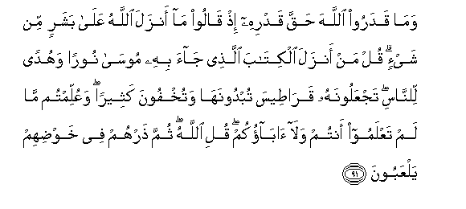
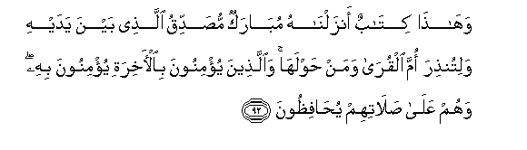
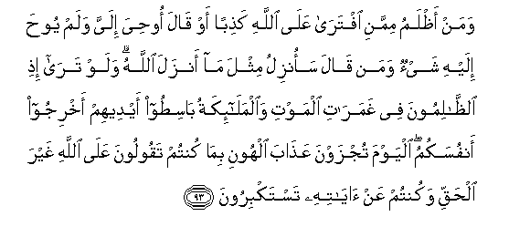
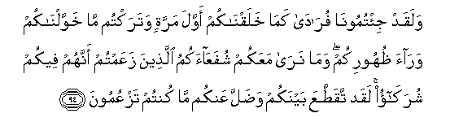

  
[Intangible Textual Heritage](../../index)  [Islam](../index) 
[Index](index)   
[Hypertext Qur'an](../htq/index)  [Unicode](../uq/006.htm#006_091) 
[Palmer](../sbe06/006)  [Pickthall](../pick/006.htm#006_091)  [Yusuf Ali
English](../yaq/yaq006)  [Rodwell](../qr/006)   
  
[Sūra VI.: An’ām, or Cattle. Index](006)  
  [Previous](00610)  [Next](00612) 

------------------------------------------------------------------------

  
*The Holy Quran*, tr. by Yusuf Ali, \[1934\], at Intangible Textual
Heritage

------------------------------------------------------------------------

# Sūra VI.: An’ām, or Cattle.

### Section 11

------------------------------------------------------------------------

91. Wam<u>a</u> qadaroo All<u>a</u>ha <u>h</u>aqqa qadrihi i<u>th</u>
q<u>a</u>loo m<u>a</u> anzala All<u>a</u>hu AAal<u>a</u> basharin min
shay-in qul man anzala alkit<u>a</u>ba alla<u>th</u>ee j<u>a</u>a bihi
moos<u>a</u> nooran wahudan li**l**nn<u>a</u>si tajAAaloonahu
qar<u>at</u>eesa tubdoonah<u>a</u> watukhfoona katheeran waAAullimtum
m<u>a</u> lam taAAlamoo antum wal<u>a</u> <u>a</u>b<u>a</u>okum quli
All<u>a</u>hu thumma <u>th</u>arhum fee khaw<u>d</u>ihim yalAAaboon**a**

91\. No just estimate of God  
Do they make when they say:  
"Nothing doth God send down  
To man (by way of revelation)":  
Say: "Who then sent down  
The Book which Moses brought?—  
A light and guidance to man:  
But ye make it into  
(Separate) sheets for show,  
While ye conceal much  
(Of its contents): therein  
Were ye taught that  
Which ye knew not  
Neither ye nor your fathers."  
Say: "God (sent it down)":  
Then leave them to plunge  
In vain discourse and trifling.

------------------------------------------------------------------------

92. Wah<u>atha</u> kit<u>a</u>bun anzaln<u>a</u>hu mub<u>a</u>rakun
mu<u>s</u>addiqu alla<u>th</u>ee bayna yadayhi walitun<u>th</u>ira omma
alqur<u>a</u> waman <u>h</u>awlah<u>a</u> wa**a**lla<u>th</u>eena
yu/minoona bi**a**l-<u>a</u>khirati yu/minoona bihi wahum AAal<u>a</u>
<u>s</u>al<u>a</u>tihim yu<u>ha</u>fi*<u>th</u>*oon**a**

92\. And this is a Book  
Which We have sent down,  
Bringing blessings, and confirming  
(The revelations) which came  
Before it: that thou  
Mayest warn the Mother  
Of Cities and all around her.  
Those who believe  
In the Hereafter  
Believe in this (Book),  
And they are constant  
In guarding their Prayers.

------------------------------------------------------------------------

93. Waman a*<u>th</u>*lamu mimmani iftar<u>a</u> AAal<u>a</u>
All<u>a</u>hi ka<u>th</u>iban aw q<u>a</u>la oo<u>h</u>iya ilayya walam
yoo<u>h</u>a ilayhi shay-on waman q<u>a</u>la saonzilu mithla m<u>a</u>
anzala All<u>a</u>hu walaw tar<u>a</u> i<u>th</u>i
a**l***<u>thth</u>*<u>a</u>limoona fee ghamar<u>a</u>ti almawti
wa**a**lmal<u>a</u>-ikatu b<u>a</u>si<u>t</u>oo aydeehim akhrijoo
anfusakumu alyawma tujzawna AAa<u>tha</u>ba alhooni bim<u>a</u> kuntum
taqooloona AAal<u>a</u> All<u>a</u>hi ghayra al<u>h</u>aqqi wakuntum
AAan <u>a</u>y<u>a</u>tihi tastakbiroon**a**

93\. Who can be more wicked  
Than one who inventeth  
A lie against God,  
Or saith, "I have  
Received inspiration,"  
When he hath received  
None, or (again) who saith,  
"I can reveal the like  
Of what God hath revealed"?  
If thou couldst but see  
How the wicked (do fare)  
In the flood of confusion  
At death!—the angels  
Stretch forth their hands,  
(Saying), "Yield up your souls:  
This day shall ye receive  
Your reward,—a penalty  
Of shame, for that ye used  
To tell lies against God,  
And scornfully to reject  
Of His Signs!"

------------------------------------------------------------------------

94. Walaqad ji/tumoon<u>a</u> fur<u>a</u>d<u>a</u> kam<u>a</u>
khalaqn<u>a</u>kum awwala marratin wataraktum m<u>a</u>
khawwaln<u>a</u>kum war<u>a</u>a *<u>th</u>*uhoorikum wam<u>a</u>
nar<u>a</u> maAAakum shufaAA<u>a</u>akumu alla<u>th</u>eena zaAAamtum
annahum feekum shurak<u>a</u>o laqad taqa<u>tt</u>aAAa baynakum
wa<u>d</u>alla AAankum m<u>a</u> kuntum tazAAumoon**a**

94\. "And behold! ye come  
To Us bare and alone  
As We created you  
For the first time:  
Ye have left behind you  
All (the favours) which  
We bestowed on you:  
We see not with you  
Your intercessors  
Whom ye thought to be  
Partners in your affairs:  
So now all relations  
Between you have been  
Cut off, and your (pet) fancies  
Have left you in the lurch!

------------------------------------------------------------------------

[Next: Section 12 (95-100)](00612)

