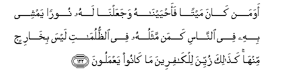
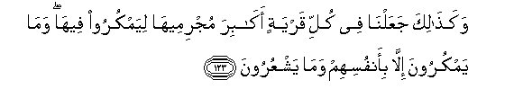
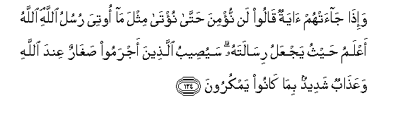
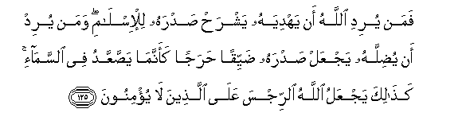
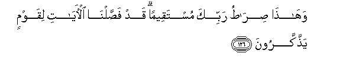
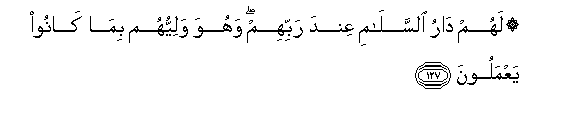
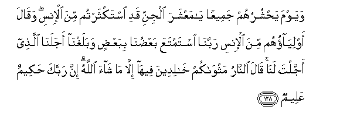

  
[Intangible Textual Heritage](../../index)  [Islam](../index) 
[Index](index)   
[Hypertext Qur'an](../htq/index)  [Unicode](../uq/006.htm#006_122) 
[Palmer](../sbe06/006)  [Pickthall](../pick/006.htm#006_122)  [Yusuf Ali
English](../yaq/yaq006)  [Rodwell](../qr/006)   
  
[Sūra VI.: An’ām, or Cattle. Index](006)  
  [Previous](00614)  [Next](00616) 

------------------------------------------------------------------------

  
*The Holy Quran*, tr. by Yusuf Ali, \[1934\], at Intangible Textual
Heritage

------------------------------------------------------------------------

# Sūra VI.: An’ām, or Cattle.

### Section 15

------------------------------------------------------------------------

122. Awa man k<u>a</u>na maytan faa<u>h</u>yayn<u>a</u>hu
wajaAAaln<u>a</u> lahu nooran yamshee bihi fee a**l**nn<u>a</u>si kaman
mathaluhu fee a**l***<u>thth</u>*ulum<u>a</u>ti laysa bikh<u>a</u>rijin
minh<u>a</u> ka<u>tha</u>lika zuyyina lilk<u>a</u>fireena m<u>a</u>
k<u>a</u>noo yaAAmaloon**a**

122\. Can he who was dead,  
To whom We gave life,  
And a Light whereby  
He can walk amongst men,  
Be like him who is  
In the depths of darkness,  
From which he can  
Never come out?  
Thus to those without Faith  
Their own deeds seem pleasing.

------------------------------------------------------------------------

123. Waka<u>tha</u>lika jaAAaln<u>a</u> fee kulli qaryatin
ak<u>a</u>bira mujrimeeh<u>a</u> liyamkuroo feeh<u>a</u> wam<u>a</u>
yamkuroona ill<u>a</u> bi-anfusihim wam<u>a</u> yashAAuroon**a**

123\. Thus have We placed  
Leaders in every town,  
Its wicked men, to plot  
(And burrow) therein:  
But they only plot  
Against their own souls,  
And they perceive it not.

------------------------------------------------------------------------

124. Wa-i<u>tha</u> j<u>a</u>at-hum <u>a</u>yatun q<u>a</u>loo lan
nu/mina <u>h</u>att<u>a</u> nu/t<u>a</u> mithla m<u>a</u> ootiya rusulu
All<u>a</u>hi All<u>a</u>hu aAAlamu <u>h</u>aythu yajAAalu
ris<u>a</u>latahu sayu<u>s</u>eebu alla<u>th</u>eena ajramoo
<u>s</u>agh<u>a</u>run AAinda All<u>a</u>hi waAAa<u>tha</u>bun shadeedun
bim<u>a</u> k<u>a</u>noo yamkuroon**a**

124\. When there comes to them  
A Sign (from God),  
They say: "We shall not  
Believe until we receive  
One (exactly) like those  
Received by God's apostles."  
God knoweth best where  
(And how) to carry out  
His mission. Soon  
Will the wicked  
Be overtaken by  
Humiliation before God,  
And a severe punishment,  
For all their plots.

------------------------------------------------------------------------

125. Faman yuridi All<u>a</u>hu an yahdiyahu yashra<u>h</u>
<u>s</u>adrahu lil-isl<u>a</u>mi waman yurid an yu<u>d</u>illahu yajAAal
<u>s</u>adrahu <u>d</u>ayyiqan <u>h</u>arajan kaannam<u>a</u>
ya<u>ss</u>aAAAAadu fee a**l**ssam<u>a</u>-i ka<u>tha</u>lika yajAAalu
All<u>a</u>hu a**l**rrijsa AAal<u>a</u> alla<u>th</u>eena l<u>a</u>
yu/minoon**a**

125\. Those whom God (in His Plan)  
Willeth to guide,—He openeth  
Their breast to Islam;  
Those whom He willeth  
To leave straying,—He maketh  
Their breast close and constricted,  
As if they had to climb  
Up to the skies: thus  
Doth God (heap) the penalty  
On those who refuse to believe.

------------------------------------------------------------------------

126. Wah<u>atha</u> <u>s</u>ir<u>at</u>u rabbika mustaqeeman qad
fa<u>ss</u>aln<u>a</u> al-<u>a</u>y<u>a</u>ti liqawmin
ya<u>thth</u>akkaroon**a**

126\. This is the Way  
Of thy Lord, leading straight:  
We have detailed the Signs  
For those who  
Receive admonition.

------------------------------------------------------------------------

127. Lahum d<u>a</u>ru a**l**ssal<u>a</u>mi AAinda rabbihim wahuwa
waliyyuhum bim<u>a</u> k<u>a</u>noo yaAAmaloon**a**

127\. For them will be a Home  
Of Peace in the presence  
Of their Lord: He will be  
Their Friend, because  
They practised (righteousness).

------------------------------------------------------------------------

128. Wayawma ya<u>h</u>shuruhum jameeAAan y<u>a</u> maAAshara aljinni
qadi istakthartum mina al-insi waq<u>a</u>la awliy<u>a</u>ohum mina
al-insi rabban<u>a</u> istamtaAAa baAA<u>d</u>un<u>a</u>
bibaAA<u>d</u>in wabalaghn<u>a</u> ajalan<u>a</u> alla<u>th</u>ee
ajjalta lan<u>a</u> q<u>a</u>la a**l**nn<u>a</u>ru mathw<u>a</u>kum
kh<u>a</u>lideena feeh<u>a</u> ill<u>a</u> m<u>a</u> sh<u>a</u>a
All<u>a</u>hu inna rabbaka <u>h</u>akeemun AAaleem**un**

128\. One day will He gather  
Them all together, (and say):  
"O ye assembly of Jinns!  
Much (toll) did ye take  
Of men." Their friends  
Amongst men will say:  
"Our Lord! we made profit no  
From each other: but (alas!)  
We reached our term—  
Which Thou didst appoint  
For us." He will say:  
"The Fire be your dwelling-place:  
You will dwell therein for ever,  
Except as God willeth."  
For thy Lord is full  
Of wisdom and knowledge.

------------------------------------------------------------------------

129. Waka<u>tha</u>lika nuwallee baAA<u>d</u>a
a**l***<u>thth</u>*<u>a</u>limeena baAA<u>d</u>an bim<u>a</u>
k<u>a</u>noo yaksiboon**a**

129\. Thus do We make  
The wrong-doers turn  
To each other, because  
Of what they earn.

------------------------------------------------------------------------

[Next: Section 16 (130-140)](00616)

