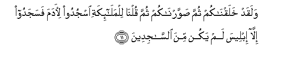
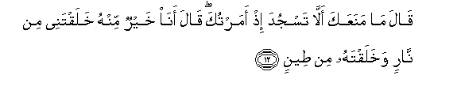
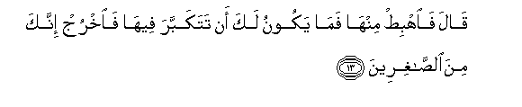
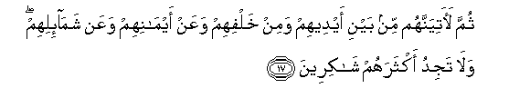
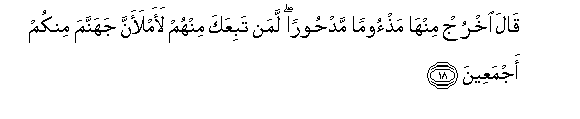
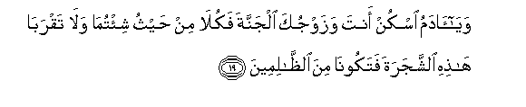
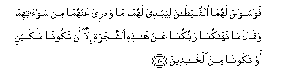
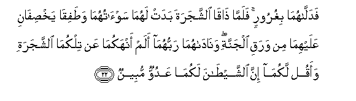
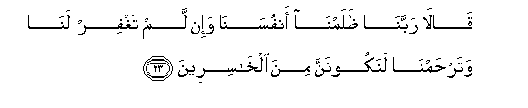
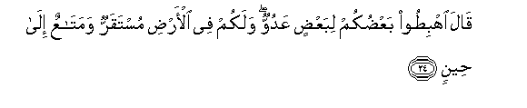

  
[Intangible Textual Heritage](../../index)  [Islam](../index) 
[Index](index)   
[Hypertext Qur'an](../htq/index)  [Unicode](../uq/007.htm#007_011) 
[Palmer](../sbe06/007)  [Pickthall](../pick/007.htm#007_011)  [Yusuf Ali
English](../yaq/yaq007)  [Rodwell](../qr/007)   
  
[Sūra VII.: A’rāf, or the Heights Index](007)  
  [Previous](00701)  [Next](00703) 

------------------------------------------------------------------------

  
*The Holy Quran*, tr. by Yusuf Ali, \[1934\], at Intangible Textual
Heritage

------------------------------------------------------------------------

# Sūra VII.: A’rāf, or the Heights

### Section 2

------------------------------------------------------------------------

11. Walaqad khalaqn<u>a</u>kum thumma <u>s</u>awwarn<u>a</u>kum thumma
quln<u>a</u> lilmal<u>a</u>-ikati osjudoo li-<u>a</u>dama fasajadoo
ill<u>a</u> ibleesa lam yakun mina a**l**ss<u>a</u>jideen**a**

11\. It is We Who created you  
And gave you shape;  
Then We bade the angels  
Bow down to Adam, and they  
Bowed down; not so Iblīs;  
He refused to be of those  
Who bow down.

------------------------------------------------------------------------

12. Q<u>a</u>la m<u>a</u> manaAAaka all<u>a</u> tasjuda i<u>th</u>
amartuka q<u>a</u>la an<u>a</u> khayrun minhu khalaqtanee min
n<u>a</u>rin wakhalaqtahu min <u>t</u>een**in**

12\. (God) said: "What prevented  
Thee from bowing down  
When I commanded thee?"  
He said: "I am better  
Than he: Thou didst create  
Me from fire, and him from clay."

------------------------------------------------------------------------

13. Q<u>a</u>la fa**i**hbi<u>t</u> minh<u>a</u> fam<u>a</u> yakoonu laka
an tatakabbara feeh<u>a</u> fa**o**khruj innaka mina
a**l**<u>ssa</u>ghireen**a**

13\. (God) said: "Get thee down  
From this: it is not  
For thee to be arrogant  
Here: get out, for thou  
Art of the meanest (of creatures)."

------------------------------------------------------------------------

14. Q<u>a</u>la an*<u>th</u>*irnee il<u>a</u> yawmi yubAAathoon**a**

14\. He said: "Give me respite  
Till the day they are  
Raised up."

------------------------------------------------------------------------

15. Q<u>a</u>la innaka mina almun*<u>th</u>*areen**a**

15\. (God) said: "Be thou  
Among those who have respite."

------------------------------------------------------------------------

16. Q<u>a</u>la fabim<u>a</u> aghwaytanee laaqAAudanna lahum
<u>s</u>ir<u>at</u>aka almustaqeem**a**

16\. He said: "Because thou  
Hast thrown me out  
Of the Way, lo! I will  
Lie in wait for them  
On Thy Straight Way:

------------------------------------------------------------------------

17. Thumma la<u>a</u>tiyannahum min bayni aydeehim wamin khalfihim
waAAan aym<u>a</u>nihim waAAan sham<u>a</u>-ilihim wal<u>a</u> tajidu
aktharahum sh<u>a</u>kireen**a**

17\. "Then will I assault them  
From before them and behind them,  
From their right and their left:  
Nor wilt Thou find,  
In most of them,  
Gratitude (for Thy mercies).

------------------------------------------------------------------------

18. Q<u>a</u>la okhruj minh<u>a</u> ma<u>th</u>ooman mad<u>h</u>ooran
laman tabiAAaka minhum laamlaanna jahannama minkum ajmaAAeen**a**

18\. (God) said: "Get out  
From this, disgraced  
And expelled. If any  
Of them follow thee,—  
Hell will I fill  
With you all.

------------------------------------------------------------------------

19. Way<u>a</u> <u>a</u>damu oskun anta wazawjuka aljannata
fakul<u>a</u> min <u>h</u>aythu shi/tum<u>a</u> wal<u>a</u>
taqrab<u>a</u> h<u>ath</u>ihi a**l**shshajarata fatakoon<u>a</u> mina
a**l***<u>thth</u>*<u>a</u>limeen**a**

19\. "O Adam! dwell thou  
And thy wife in the Garden,  
And enjoy (its good things)  
As ye wish: but approach not  
This tree, or ye run  
Into harm and transgression."

------------------------------------------------------------------------

20. Fawaswasa lahum<u>a</u> a**l**shshay<u>ta</u>nu liyubdiya
lahum<u>a</u> m<u>a</u> wooriya AAanhum<u>a</u> min
saw-<u>a</u>tihim<u>a</u> waq<u>a</u>la m<u>a</u> nah<u>a</u>kum<u>a</u>
rabbukum<u>a</u> AAan h<u>ath</u>ihi a**l**shshajarati ill<u>a</u> an
takoon<u>a</u> malakayni aw takoon<u>a</u> mina alkh<u>a</u>lideen**a**

20\. Then began Satan to whisper  
Suggestions to them, bringing  
Openly before their minds  
All their shame  
That was hidden from them  
(Before): he said: "Your Lord  
Only forbade you this tree,  
Lest ye should become angels  
Or such beings as live for ever."

------------------------------------------------------------------------

21. Waq<u>a</u>samahum<u>a</u> innee lakum<u>a</u> lamina
a**l**nn<u>as</u>i<u>h</u>een**a**

21\. And he swore to them  
Both, that he was  
Their sincere adviser.

------------------------------------------------------------------------

22. Fadall<u>a</u>hum<u>a</u> bighuroorin falamm<u>a</u>
<u>tha</u>q<u>a</u> a**l**shshajarata badat lahum<u>a</u>
saw-<u>a</u>tuhum<u>a</u> wa<u>t</u>afiq<u>a</u>
yakh<u>s</u>if<u>a</u>ni AAalayhim<u>a</u> min waraqi aljannati
wan<u>a</u>d<u>a</u>hum<u>a</u> rabbuhum<u>a</u> alam anhakum<u>a</u>
AAan tilkum<u>a</u> a**l**shshajarati waaqul lakum<u>a</u> inna
a**l**shshay<u>ta</u>na lakum<u>a</u> AAaduwwun mubeen**un**

22\. So by deceit he brought about  
Their fall: when they  
Tasted of the tree,  
Their shame became manifest  
To them, and they began  
To sew together the leaves  
Of the Garden over their bodies.  
And their Lord called  
Unto them: "Did I not  
Forbid you that tree,  
And tell you that Satan  
Was an avowed  
Enemy unto you?"

------------------------------------------------------------------------

23. Q<u>a</u>l<u>a</u> rabban<u>a</u> *<u>th</u>*alamn<u>a</u>
anfusan<u>a</u> wa-in lam taghfir lan<u>a</u> watar<u>h</u>amn<u>a</u>
lanakoonanna mina alkh<u>a</u>sireen**a**

23\. They said: "Our Lord!  
We have wronged our own souls:  
If Thou forgive us not  
And bestow not upon us  
Thy Mercy, we shall  
Certainly be lost."

------------------------------------------------------------------------

24. Q<u>a</u>la ihbi<u>t</u>oo baAA<u>d</u>ukum libaAA<u>d</u>in
AAaduwwun walakum fee al-ar<u>d</u>i mustaqarrun wamat<u>a</u>AAun
il<u>a</u> <u>h</u>een**in**

24\. (God) said: "Get ye down,  
With enmity between yourselves.  
On earth will be your dwelling-place  
And your means of livelihood,—  
For a time."

------------------------------------------------------------------------

25. Q<u>a</u>la feeh<u>a</u> ta<u>h</u>yawna wafeeh<u>a</u> tamootoona
waminh<u>a</u> tukhrajoon**a**

25\. He said: "Therein shall ye  
Live, and therein shall ye  
Die; but from it shall ye  
Be taken out (at last)."

------------------------------------------------------------------------

[Next: Section 3 (26-31)](00703)

