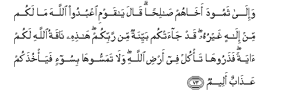
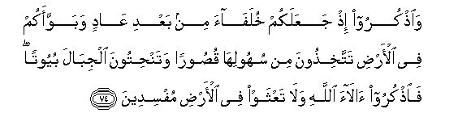
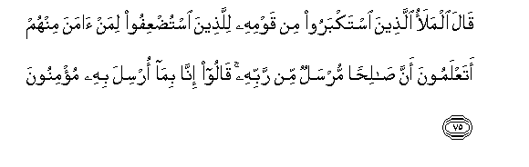
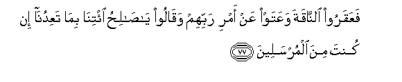
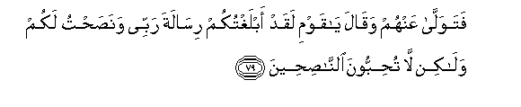
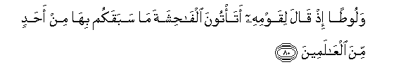
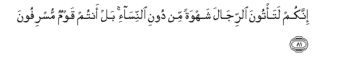
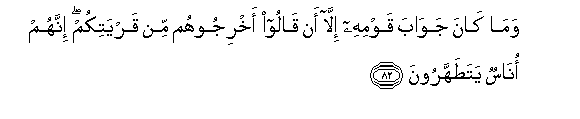
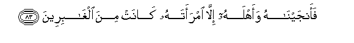

  
[Intangible Textual Heritage](../../index)  [Islam](../index) 
[Index](index)   
[Hypertext Qur'an](../htq/index)  [Unicode](../uq/007.htm#007_073) 
[Palmer](../sbe06/007)  [Pickthall](../pick/007.htm#007_073)  [Yusuf Ali
English](../yaq/yaq007)  [Rodwell](../qr/007)   
  
[Sūra VII.: A’rāf, or the Heights Index](007)  
  [Previous](00709)  [Next](00711) 

------------------------------------------------------------------------

  
*The Holy Quran*, tr. by Yusuf Ali, \[1934\], at Intangible Textual
Heritage

------------------------------------------------------------------------

# Sūra VII.: A’rāf, or the Heights

### Section 10

------------------------------------------------------------------------

73. Wa-il<u>a</u> thamooda akh<u>a</u>hum <u>sa</u>li<u>h</u>an
q<u>a</u>la y<u>a</u> qawmi oAAbudoo All<u>a</u>ha m<u>a</u> lakum min
il<u>a</u>hin ghayruhu qad j<u>a</u>atkum bayyinatun min rabbikum
h<u>ath</u>ihi n<u>a</u>qatu All<u>a</u>hi lakum <u>a</u>yatan
fa<u>th</u>arooh<u>a</u> ta/kul fee ar<u>d</u>i All<u>a</u>hi
wal<u>a</u> tamassooh<u>a</u> bisoo-in faya/khu<u>th</u>akum
AAa<u>tha</u>bun aleem**un**

73\. To the Thamūd people  
(We sent) Ṣaliḥ, one  
Of their own brethren:  
He said: "O my people!  
Worship God; ye have  
No other god but Him.  
Now hath come unto you  
A clear (Sign) from your Lord!  
This she-camel of God  
Is a Sign unto you:  
So leave her to graze  
In God's earth, and let her  
Come to no harm,  
Or ye shall be seized  
With a grievous punishment.

------------------------------------------------------------------------

74. Wa**o**<u>th</u>kuroo i<u>th</u> jaAAalakum khulaf<u>a</u>a min
baAAdi AA<u>a</u>din wabawwaakum fee al-ar<u>d</u>i
tattakhi<u>th</u>oona min suhoolih<u>a</u> qu<u>s</u>ooran
watan<u>h</u>itoona aljib<u>a</u>la buyootan fa**o**<u>th</u>kuroo
<u>a</u>l<u>a</u>a All<u>a</u>hi wal<u>a</u> taAAthaw fee al-ar<u>d</u>i
mufsideen**a**

74\. "And remember how He  
Made you inheritors  
After the ’Ad people  
And gave you habitations  
In the land: ye build  
For yourselves palaces and castles  
In (open) plains, and carve out  
Homes in the mountains;  
So bring to remembrance  
The benefits (ye have received)  
From God, and refrain  
From evil and mischief  
On the earth."

------------------------------------------------------------------------

75. Q<u>a</u>la almalao alla<u>th</u>eena istakbaroo min qawmihi
lilla<u>th</u>eena istu<u>d</u>AAifoo liman <u>a</u>mana minhum
ataAAlamoona anna <u>sa</u>li<u>h</u>an mursalun min rabbihi
q<u>a</u>loo inn<u>a</u> bim<u>a</u> orsila bihi mu/minoon**a**

75\. The leaders of the arrogant  
Party among his people said  
To those who were reckoned  
Powerless—those among them  
Who believed: "Know ye  
Indeed that Ṣaliḥ is  
An apostle from his Lord?"  
They said: "We do indeed  
Believe in the revelation  
Which hath been sent  
Through him."

------------------------------------------------------------------------

76. Q<u>a</u>la alla<u>th</u>eena istakbaroo inn<u>a</u>
bi**a**lla<u>th</u>ee <u>a</u>mantum bihi k<u>a</u>firoon**a**

76\. The arrogant party said:  
"For our part, we reject  
What ye believe in."

------------------------------------------------------------------------

77. FaAAaqaroo a**l**nn<u>a</u>qata waAAataw AAan amri rabbihim
waq<u>a</u>loo y<u>a</u> <u>sa</u>li<u>h</u>u i/tin<u>a</u> bim<u>a</u>
taAAidun<u>a</u> in kunta mina almursaleen**a**

77\. Then they ham-strung  
The she-camel, and insolently  
Defied the order of their Lord,  
Saying: "O Ṣaliḥ! bring about  
Thy threats, if thou art  
An apostle (of God)!"

------------------------------------------------------------------------

78. Faakha<u>th</u>at-humu a**l**rrajfatu faa<u>s</u>ba<u>h</u>oo fee
d<u>a</u>rihim j<u>a</u>thimeen**a**

78\. So the earthquake took them  
Unawares, and they lay  
Prostrate in their homes  
In the morning!

------------------------------------------------------------------------

79. Fatawall<u>a</u> AAanhum waq<u>a</u>la y<u>a</u> qawmi laqad
ablaghtukum ris<u>a</u>lata rabbee wana<u>s</u>a<u>h</u>tu lakum
wal<u>a</u>kin l<u>a</u> tu<u>h</u>ibboona
a**l**nn<u>as</u>i<u>h</u>een**a**

79\. So Ṣaliḥ left them,  
Saying: "O my people!  
I did indeed convey to you  
The message for which  
I was sent by my Lord:  
I gave you good counsel,  
But ye love not good counsellors!"

------------------------------------------------------------------------

80. Waloo<u>t</u>an i<u>th</u> q<u>a</u>la liqawmihi ata/toona
alf<u>ah</u>ishata m<u>a</u> sabaqakum bih<u>a</u> min a<u>h</u>adin
mina alAA<u>a</u>lameen**a**

80\. We also (sent) Lūṭ:  
He said to his people:  
"Do ye commit lewdness  
Such as no people  
In creation (ever) committed  
Before you?

------------------------------------------------------------------------

81. Innakum lata/toona a**l**rrij<u>a</u>la shahwatan min dooni
a**l**nnis<u>a</u>-i bal antum qawmun musrifoon**a**

81\. "For ye practise your lusts  
On men in preference  
To women: ye are indeed  
A people transgressing  
Beyond bounds."

------------------------------------------------------------------------

82. Wam<u>a</u> k<u>a</u>na jaw<u>a</u>ba qawmihi ill<u>a</u> an
q<u>a</u>loo akhrijoohum min qaryatikum innahum on<u>a</u>sun
yata<u>t</u>ahharoon**a**

82\. And his people gave  
No answer but this:  
They said, "Drive them out  
Of your city: these are  
Indeed men who want  
To be clean and pure!"

------------------------------------------------------------------------

83. Faanjayn<u>a</u>hu waahlahu ill<u>a</u> imraatahu k<u>a</u>nat mina
algh<u>a</u>bireen**a**

83\. But we saved him  
And his family, except  
His wife: she was  
Of those who lagged behind

------------------------------------------------------------------------

84. Waam<u>t</u>arn<u>a</u> AAalayhim ma<u>t</u>aran
fa**o**n*<u>th</u>*ur kayfa k<u>a</u>na AA<u>a</u>qibatu
almujrimeen**a**

84\. And we rained down on them  
A shower (of brimstone):  
Then see what was the end  
Of those who indulged  
In sin and crime!

------------------------------------------------------------------------

[Next: Section 11 (85-93)](00711)

