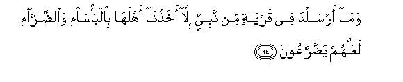
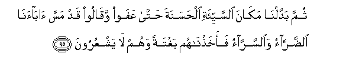
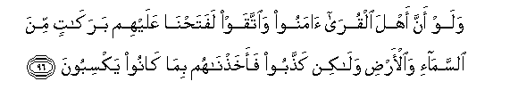

  
[Intangible Textual Heritage](../../index)  [Islam](../index) 
[Index](index)   
[Hypertext Qur'an](../htq/index)  [Unicode](../uq/007.htm#007_094) 
[Palmer](../sbe06/007)  [Pickthall](../pick/007.htm#007_094)  [Yusuf Ali
English](../yaq/yaq007)  [Rodwell](../qr/007)   
  
[Sūra VII.: A’rāf, or the Heights Index](007)  
  [Previous](00711)  [Next](00713) 

------------------------------------------------------------------------

  
*The Holy Quran*, tr. by Yusuf Ali, \[1934\], at Intangible Textual
Heritage

------------------------------------------------------------------------

# Sūra VII.: A’rāf, or the Heights

### Section 12

------------------------------------------------------------------------

94. Wam<u>a</u> arsaln<u>a</u> fee qaryatin min nabiyyin ill<u>a</u>
akha<u>th</u>n<u>a</u> ahlah<u>a</u> bi**a**lba/s<u>a</u>-i
wa**al**<u>dd</u>arr<u>a</u>-i laAAallahum ya<u>dd</u>arraAAoon**a**

94\. Whenever We sent a prophet  
To a town, We took up  
Its people in suffering  
And adversity, in order  
That they might learn humility.

------------------------------------------------------------------------

95. Thumma baddaln<u>a</u> mak<u>a</u>na a**l**ssayyi-ati
al<u>h</u>asanata <u>h</u>att<u>a</u> AAafaw waq<u>a</u>loo qad massa
<u>a</u>b<u>a</u>an<u>a</u> a**l**<u>dd</u>arr<u>a</u>o
wa**al**ssarr<u>a</u>o faakha<u>th</u>n<u>a</u>hum baghtatan wahum
l<u>a</u> yashAAuroon**a**

95\. Then We changed their suffering  
Into prosperity, until they grew  
And multiplied, and began  
To say: "Our fathers (too)  
Were touched by suffering  
And affluence"… Behold!  
We called them to account  
Of a sudden, while they  
Realised not (their peril).

------------------------------------------------------------------------

96. Walaw anna ahla alqur<u>a</u> <u>a</u>manoo wa**i**ttaqaw
lafata<u>h</u>n<u>a</u> AAalayhim barak<u>a</u>tin mina
a**l**ssam<u>a</u>-i wa**a**l-ar<u>d</u>i wal<u>a</u>kin
ka<u>thth</u>aboo faakha<u>th</u>n<u>a</u>hum bim<u>a</u> k<u>a</u>noo
yaksiboon**a**

96\. If the people of the towns  
Had but believed and feared  
God, We should indeed  
Have opened out to them  
(All kinds of) blessings  
From heaven and earth;  
But they rejected (the truth),  
And We brought them  
To book for their misdeeds.

------------------------------------------------------------------------

97. Afaamina ahlu alqur<u>a</u> an ya/tiyahum ba/sun<u>a</u>
bay<u>a</u>tan wahum n<u>a</u>-imoon**a**

97\. Did the people of the towns  
Feel secure against the coming  
Of Our wrath by night  
While they were asleep?

------------------------------------------------------------------------

98. Awa amina ahlu alqur<u>a</u> an ya/tiyahum ba/sun<u>a</u>
<u>d</u>u<u>h</u>an wahum yalAAaboon**a**

98\. Or else did they feel  
Secure against its coming  
In broad daylight while they  
Played about (care-free)?

------------------------------------------------------------------------

99. Afaaminoo makra All<u>a</u>hi fal<u>a</u> ya/manu makra
All<u>a</u>hi ill<u>a</u> alqawmu alkh<u>a</u>siroon**a**

99\. Did they then feel secure  
Against the Plan of God?—  
But no one can feel  
Secure from the Plan  
Of God, except those  
(Doomed) to ruin!

------------------------------------------------------------------------

[Next: Section 13 (100-108)](00713)

