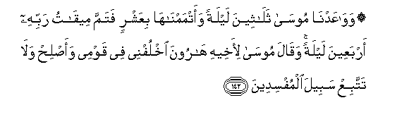
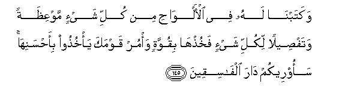
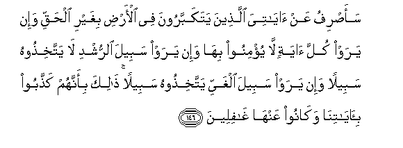

  
[Intangible Textual Heritage](../../index)  [Islam](../index) 
[Index](index)   
[Hypertext Qur'an](../htq/index)  [Unicode](../uq/007.htm#007_142) 
[Palmer](../sbe06/007)  [Pickthall](../pick/007.htm#007_142)  [Yusuf Ali
English](../yaq/yaq007)  [Rodwell](../qr/007)   
  
[Sūra VII.: A’rāf, or the Heights Index](007)  
  [Previous](00716)  [Next](00718) 

------------------------------------------------------------------------

  
*The Holy Quran*, tr. by Yusuf Ali, \[1934\], at Intangible Textual
Heritage

------------------------------------------------------------------------

# Sūra VII.: A’rāf, or the Heights

### Section 17

------------------------------------------------------------------------

142. Waw<u>a</u>AAadn<u>a</u> moos<u>a</u> thal<u>a</u>theena laylatan
waatmamn<u>a</u>h<u>a</u> biAAashrin fatamma meeq<u>a</u>tu rabbihi
arbaAAeena laylatan waq<u>a</u>la moos<u>a</u> li-akheehi h<u>a</u>roona
okhlufnee fee qawmee waa<u>s</u>li<u>h</u> wal<u>a</u> tattabiAA sabeela
almufsideen**a**

142\. We appointed for Moses  
Thirty nights, and completed  
(The period) with ten (more):  
Thus was completed the term  
(Of communion) with his Lord,  
Forty nights. And Moses  
Had charged his brother Aaron  
(Before he went up):  
"Act for me amongst my people:  
Do right, and follow not  
The way of those  
Who do mischief."

------------------------------------------------------------------------

143. Walamm<u>a</u> j<u>a</u>a moos<u>a</u> limeeq<u>a</u>tin<u>a</u>
wakallamahu rabbuhu q<u>a</u>la rabbi arinee an*<u>th</u>*ur ilayka
q<u>a</u>la lan tar<u>a</u>nee wal<u>a</u>kini on*<u>th</u>*ur
il<u>a</u> aljabali fa-ini istaqarra mak<u>a</u>nahu fasawfa
tar<u>a</u>nee falamm<u>a</u> tajall<u>a</u> rabbuhu liljabali jaAAalahu
dakkan wakharra moos<u>a</u> <u>s</u>aAAiqan falamm<u>a</u> af<u>a</u>qa
q<u>a</u>la sub<u>ha</u>naka tubtu ilayka waan<u>a</u> awwalu
almu/mineen**a**

143\. When Moses came  
To the place appointed by Us,  
And his Lord addressed him,  
He said: "O my Lord!  
Show (Thyself) to me,  
That I may look upon Thee."  
God said, "By no means  
Canst thou see Me (direct);  
But look upon the mount;  
If it abide  
In its place, then  
Shalt thou see Me."  
When his Lord manifested  
His glory on the Mount,  
He made it as dust,  
And Moses fell down  
In a swoon. When he  
Recovered his senses he said:  
"Glory be to Thee! To Thee  
I turn in repentance, and I  
Am the first to believe."

------------------------------------------------------------------------

144. Q<u>a</u>la y<u>a</u> moos<u>a</u> innee i<u>st</u>afaytuka
AAal<u>a</u> a**l**nn<u>a</u>si biris<u>a</u>l<u>a</u>tee
wabikal<u>a</u>mee fakhu<u>th</u> m<u>a</u> <u>a</u>taytuka wakun mina
a**l**shsh<u>a</u>kireen**a**

144\. (God) said: "O Moses!  
I have chosen thee  
Above (other) men,  
By the mission I (have  
Given thee) and the words  
I (have spoken to thee):  
Take then the (revelation)  
Which I give thee,  
And be of those  
Who give thanks."

------------------------------------------------------------------------

145. Wakatabn<u>a</u> lahu fee al-alw<u>ah</u>i min kulli shay-in
mawAAi*<u>th</u>*atan wataf<u>s</u>eelan likulli shay-in
fakhu<u>th</u>h<u>a</u> biquwwatin wa/mur qawmaka ya/khu<u>th</u>oo
bi-a<u>h</u>sanih<u>a</u> saoreekum d<u>a</u>ra alf<u>a</u>siqeen**a**

145\. And We ordained laws  
For him in the Tablets  
In all matters, both  
Commanding and explaining  
All things, (and said):  
"Take and hold these  
With firmness, and enjoin  
Thy people to hold fast  
By the best in the precepts:  
Soon shall I show you  
The homes of the wicked,—  
(How they lie desolate)."

------------------------------------------------------------------------

146. Saa<u>s</u>rifu AAan <u>a</u>y<u>a</u>tiya alla<u>th</u>eena
yatakabbaroona fee al-ar<u>d</u>i bighayri al<u>h</u>aqqi wa-in yaraw
kulla <u>a</u>yatin l<u>a</u> yu/minoo bih<u>a</u> wa-in yaraw sabeela
a**l**rrushdi l<u>a</u> yattakhi<u>th</u>oohu sabeelan wa-in yaraw
sabeela alghayyi yattakhi<u>th</u>oohu sabeelan <u>tha</u>lika
bi-annahum ka<u>thth</u>aboo bi-<u>a</u>y<u>a</u>tin<u>a</u>
wak<u>a</u>noo AAanh<u>a</u> gh<u>a</u>fileen**a**

146\. Those who behave arrogantly  
On the earth in defiance  
Of right—them will I  
Turn away from My Signs:  
Even if they see all the Signs,  
They will not believe in them;  
And if they see the way  
Of right conduct, they will  
Not adopt it as the Way;  
But if they see the way  
Of error, that is  
The Way they will adopt.  
For they have rejected  
Our Signs, and failed  
To take warning from them.

------------------------------------------------------------------------

147. Wa**a**lla<u>th</u>eena ka<u>thth</u>aboo
bi-<u>a</u>y<u>a</u>tin<u>a</u> waliq<u>a</u>-i al-<u>a</u>khirati
<u>h</u>abi<u>t</u>at aAAm<u>a</u>luhum hal yujzawna ill<u>a</u>
m<u>a</u> k<u>a</u>noo yaAAmaloon**a**

147\. Those who reject Our Signs  
And the Meeting in the Hereafter,—  
Vain are their deeds:  
Can they expect to be rewarded  
Except as they have wrought?

------------------------------------------------------------------------

[Next: Section 18 (148-151)](00718)

