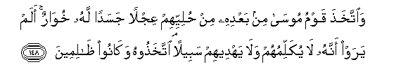
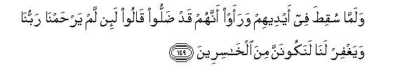
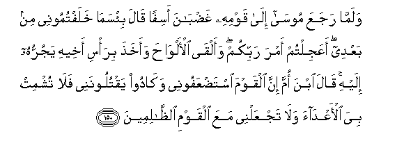
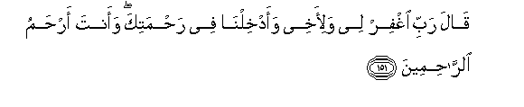

  
[Intangible Textual Heritage](../../index)  [Islam](../index) 
[Index](index)   
[Hypertext Qur'an](../htq/index)  [Unicode](../uq/007.htm#007_148) 
[Palmer](../sbe06/007)  [Pickthall](../pick/007.htm#007_148)  [Yusuf Ali
English](../yaq/yaq007)  [Rodwell](../qr/007)   
  
[Sūra VII.: A’rāf, or the Heights Index](007)  
  [Previous](00717)  [Next](00719) 

------------------------------------------------------------------------

  
*The Holy Quran*, tr. by Yusuf Ali, \[1934\], at Intangible Textual
Heritage

------------------------------------------------------------------------

# Sūra VII.: A’rāf, or the Heights

### Section 18

------------------------------------------------------------------------

148. Wa**i**ttakha<u>th</u>a qawmu moos<u>a</u> min baAAdihi min
<u>h</u>uliyyihim AAijlan jasadan lahu khuw<u>a</u>run alam yaraw annahu
l<u>a</u> yukallimuhum wal<u>a</u> yahdeehim sabeelan
ittakha<u>th</u>oohu wak<u>a</u>noo *<u>th</u>*<u>a</u>limeen**a**

148\. The people of Moses made,  
In his absence, out of their ornaments,  
The image of a calf,  
(for worship):  
It seemed to low: did they  
Not see that it could  
Neither speak to them, nor  
Show them the Way?  
They took it for worship  
And they did wrong.

------------------------------------------------------------------------

149. Walamm<u>a</u> suqi<u>t</u>a fee aydeehim waraaw annahum qad
<u>d</u>alloo q<u>a</u>loo la-in lam yar<u>h</u>amn<u>a</u>
rabbun<u>a</u> wayaghfir lan<u>a</u> lanakoonanna mina
alkh<u>a</u>sireen**a**

149\. When they repented, and saw  
That they had erred,  
They said: "if our Lord  
Have not mercy upon us  
And forgive us, we shall  
Indeed be of those who perish."

------------------------------------------------------------------------

150. Walamm<u>a</u> rajaAAa moos<u>a</u> il<u>a</u> qawmihi
gha<u>d</u>b<u>a</u>na asifan q<u>a</u>la bi/sam<u>a</u> khalaftumoonee
min baAAdee aAAajiltum amra rabbikum waalq<u>a</u> al-alw<u>ah</u>a
waakha<u>th</u>a bira/si akheehi yajurruhu ilayhi q<u>a</u>la ibna omma
inna alqawma ista<u>d</u>AAafoonee wak<u>a</u>doo yaqtuloonanee
fal<u>a</u> tushmit biya al-aAAd<u>a</u>a wal<u>a</u> tajAAalnee maAAa
alqawmi a**l***<u>thth</u>*<u>a</u>limeen**a**

150\. When Moses came back  
To his people, angry and grieved,  
He said: "Evil it is that ye  
Have done in my place  
In my absence: did ye  
Make haste to bring on  
The judgment of your Lord?"  
He put down the Tablets,  
Seized his brother by (the hair  
Of) his head, and dragged him  
To him. Aaron said:  
"Son of my mother! The people  
Did indeed reckon me  
As naught, and went near  
To slaying me! Make not  
The enemies rejoice over  
My misfortune, nor count thou  
Me amongst the people  
Of sin."

------------------------------------------------------------------------

151. Q<u>a</u>la rabbi ighfir lee wali-akhee waadkhiln<u>a</u> fee
ra<u>h</u>matika waanta ar<u>h</u>amu a**l**rr<u>ah</u>imeen**a**

151\. Moses prayed: "O my Lord!  
Forgive me and my brother!  
Admit us to Thy mercy!  
For Thou art the Most Merciful  
Of those who show mercy!"

------------------------------------------------------------------------

[Next: Section 19 (152-157)](00719)

