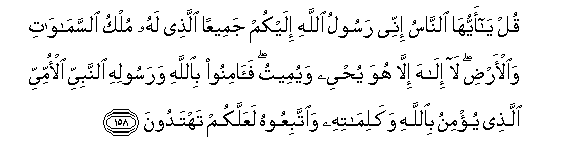
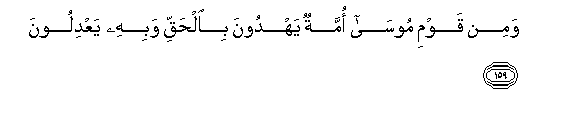
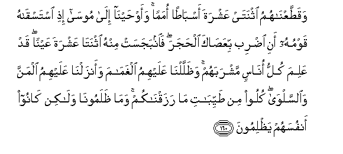
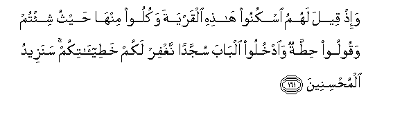
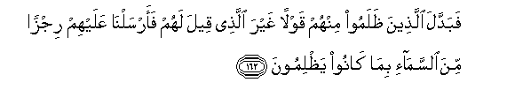

  
[Intangible Textual Heritage](../../index)  [Islam](../index) 
[Index](index)   
[Hypertext Qur'an](../htq/index)  [Unicode](../uq/007.htm#007_158) 
[Palmer](../sbe06/007)  [Pickthall](../pick/007.htm#007_158)  [Yusuf Ali
English](../yaq/yaq007)  [Rodwell](../qr/007)   
  
[Sūra VII.: A’rāf, or the Heights Index](007)  
  [Previous](00719)  [Next](00721) 

------------------------------------------------------------------------

  
*The Holy Quran*, tr. by Yusuf Ali, \[1934\], at Intangible Textual
Heritage

------------------------------------------------------------------------

# Sūra VII.: A’rāf, or the Heights

### Section 20

------------------------------------------------------------------------

158. Qul y<u>a</u> ayyuh<u>a</u> a**l**nn<u>a</u>su innee rasoolu
All<u>a</u>hi ilaykum jameeAAan alla<u>th</u>ee lahu mulku
a**l**ssam<u>a</u>w<u>a</u>ti wa**a**l-ar<u>d</u>i l<u>a</u>
il<u>a</u>ha ill<u>a</u> huwa yu<u>h</u>yee wayumeetu fa<u>a</u>minoo
bi**A**ll<u>a</u>hi warasoolihi a**l**nnabiyyi al-ommiyyi
alla<u>th</u>ee yu/minu bi**A**ll<u>a</u>hi wakalim<u>a</u>tihi
wa**i**ttabiAAoohu laAAallakum tahtadoon**a**

158\. Say: "O men! I am sent  
Unto you all, as the Apostle  
Of God, to Whom belongeth  
The dominion of the heavens  
And the earth: there is no god  
But He: it is He that giveth  
Both life and death. So believe  
In God and His Apostle,  
The unlettered Prophet,  
Who believeth in God  
And His Words: follow him  
That (so) ye may be guided."

------------------------------------------------------------------------

159. Wamin qawmi moos<u>a</u> ommatun yahdoona bi**a**l<u>h</u>aqqi
wabihi yaAAdiloon**a**

159\. Of the people of Moses  
There is a section  
Who guide and do justice  
In the light of truth.

------------------------------------------------------------------------

160. Waqa<u>tt</u>aAAn<u>a</u>humu ithnatay AAashrata asb<u>at</u>an
omaman waaw<u>h</u>ayn<u>a</u> il<u>a</u> moos<u>a</u> i<u>th</u>i
istasq<u>a</u>hu qawmuhu ani i<u>d</u>rib biAAa<u>sa</u>ka
al<u>h</u>ajara fa**i**nbajasat minhu ithnat<u>a</u> AAashrata AAaynan
qad AAalima kullu on<u>a</u>sin mashrabahum wa*<u>th</u>*allaln<u>a</u>
AAalayhimu algham<u>a</u>ma waanzaln<u>a</u> AAalayhimu almanna
wa**al**ssalw<u>a</u> kuloo min <u>t</u>ayyib<u>a</u>ti m<u>a</u>
razaqn<u>a</u>kum wam<u>a</u> *<u>th</u>*alamoon<u>a</u> wal<u>a</u>kin
k<u>a</u>noo anfusahum ya*<u>th</u>*limoon**a**

160\. We divided them into twelve Tribes  
Or nations. We directed  
Moses by inspiration,  
When his (thirsty) people asked  
Him for water: "Strike the rock  
With thy staff": out of it  
There gushed forth twelve springs:  
Each group knew its own place  
For water. We gave them  
The shade of clouds, and sent  
Down to them manna and quails,  
(Saying): "Eat of the good things  
We have provided for you":  
(But they rebelled); to Us  
They did no harm, but  
They harmed their own souls.

------------------------------------------------------------------------

161. Wa-i<u>th</u> qeela lahumu oskunoo h<u>ath</u>ihi alqaryata wakuloo
minh<u>a</u> <u>h</u>aythu shi/tum waqooloo <u>h</u>i<u>tt</u>atun
wa**o**dkhuloo alb<u>a</u>ba sujjadan naghfir lakum
kha<u>t</u>ee-<u>a</u>tikum sanazeedu almu<u>h</u>sineen**a**

161\. And remember it was  
Said to them:  
"Dwell in this town  
And eat therein as ye wish,  
But say the word of humility  
And enter the gate  
In a posture of humility:  
We shall forgive you  
Your faults; We shall increase  
(The portion of) those who do good."

------------------------------------------------------------------------

162. Fabaddala alla<u>th</u>eena *<u>th</u>*alamoo minhum qawlan ghayra
alla<u>th</u>ee qeela lahum faarsaln<u>a</u> AAalayhim rijzan mina
a**l**ssam<u>a</u>-i bim<u>a</u> k<u>a</u>noo ya*<u>th</u>*limoon**a**

162\. But the transgressors among them  
Changed the word from that  
Which had been given them  
So we sent on them  
A plague from heaven.  
For that they repeatedly transgressed.

------------------------------------------------------------------------

[Next: Section 21 (163-171)](00721)

