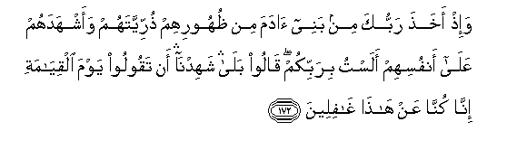
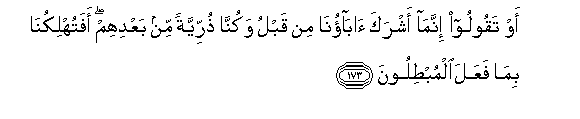
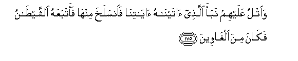
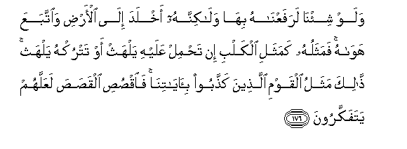
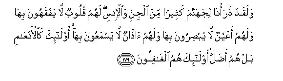
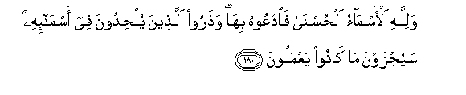

  
[Intangible Textual Heritage](../../index)  [Islam](../index) 
[Index](index)   
[Hypertext Qur'an](../htq/index)  [Unicode](../uq/007.htm#007_172) 
[Palmer](../sbe06/007)  [Pickthall](../pick/007.htm#007_172)  [Yusuf Ali
English](../yaq/yaq007)  [Rodwell](../qr/007)   
  
[Sūra VII.: A’rāf, or the Heights Index](007)  
  [Previous](00721)  [Next](00723) 

------------------------------------------------------------------------

  
*The Holy Quran*, tr. by Yusuf Ali, \[1934\], at Intangible Textual
Heritage

------------------------------------------------------------------------

# Sūra VII.: A’rāf, or the Heights

### Section 22

------------------------------------------------------------------------

172. Wa-i<u>th</u> akha<u>th</u>a rabbuka min banee <u>a</u>dama min
*<u>th</u>*uhoorihim <u>th</u>urriyyatahum waashhadahum AAal<u>a</u>
anfusihim alastu birabbikum q<u>a</u>loo bal<u>a</u> shahidn<u>a</u> an
taqooloo yawma alqiy<u>a</u>mati inn<u>a</u> kunn<u>a</u> AAan
h<u>atha</u> gh<u>a</u>fileen**a**

172\. When thy Lord drew forth  
From the Children of Adam—  
From their loins—  
Their descendants, and made them  
Testify concerning themselves, (saying):  
"Am I not your Lord  
(Who cherishes and sustains you)?"—  
They said: "Yea!  
We do testify!" (This), lest  
Ye should say on the Day  
Of Judgment: "Of this we  
Were never mindful":

------------------------------------------------------------------------

173. Aw taqooloo innam<u>a</u> ashraka <u>a</u>b<u>a</u>on<u>a</u> min
qablu wakunn<u>a</u> <u>th</u>urriyyatan min baAAdihim
afatuhlikun<u>a</u> bim<u>a</u> faAAala almub<u>t</u>iloon**a**

173\. Or lest ye should say:  
"Our fathers before us  
May have taken false gods,  
But we are (their) descendants  
After them: wilt Thou then  
Destroy us because of the deeds  
Of men who were futile?"

------------------------------------------------------------------------

174. Waka<u>tha</u>lika nufa<u>ss</u>ilu al-<u>a</u>y<u>a</u>ti
walaAAallahum yarjiAAoon**a**

174\. Thus do We explain  
The Signs in detail;  
And perchance they may turn  
(Unto Us).

------------------------------------------------------------------------

175. Wa**o**tlu AAalayhim nabaa alla<u>th</u>ee <u>a</u>tayn<u>a</u>hu
<u>a</u>y<u>a</u>tin<u>a</u> fa**i**nsalakha minh<u>a</u> faatbaAAahu
a**l**shshay<u>ta</u>nu fak<u>a</u>na mina algh<u>a</u>ween**a**

175\. Relate to them the story  
Of the man to whom  
We sent Our Signs,  
But he passed them by:  
So Satan followed him up,  
And he went astray.

------------------------------------------------------------------------

176. Walaw shi/n<u>a</u> larafaAAn<u>a</u>hu bih<u>a</u>
wal<u>a</u>kinnahu akhlada il<u>a</u> al-ar<u>d</u>i wa**i**ttabaAAa
haw<u>a</u>hu famathaluhu kamathali alkalbi in ta<u>h</u>mil AAalayhi
yalhath aw tatruk-hu yalhath <u>tha</u>lika mathalu alqawmi
alla<u>th</u>eena ka<u>thth</u>aboo bi-<u>a</u>y<u>a</u>tin<u>a</u>
fa**o**q<u>s</u>u<u>s</u>i alqa<u>s</u>a<u>s</u>a laAAallahum
yatafakkaroon**a**

176\. If it had been Our Will,  
We should have elevated him  
With Our Signs; but he  
Inclined to the earth,  
And followed his own vain desires.  
His similitude is that  
Of a dog: if you attack  
Him, he lolls out his tongue,  
Or if you leave him alone,  
He (still) lolls out his tongue.  
That is the similitude  
Of those who reject Our Signs;  
So relate the story;  
Perchance they may reflect.

------------------------------------------------------------------------

177. S<u>a</u>a mathalan alqawmu alla<u>th</u>eena ka<u>thth</u>aboo
bi-<u>a</u>y<u>a</u>tin<u>a</u> waanfusahum k<u>a</u>noo
ya*<u>th</u>*limoon**a**

177\. Evil as an example are  
People who reject Our Signs  
And wrong their own souls.

------------------------------------------------------------------------

178. Man yahdi All<u>a</u>hu fahuwa almuhtadee waman yu<u>d</u>lil
faol<u>a</u>-ika humu alkh<u>a</u>siroon**a**

178\. Whom God doth guide,  
He is on the right path:  
Whom He rejects from His guidance,—  
Such are the persons who perish.

------------------------------------------------------------------------

179. Walaqad <u>th</u>ara/n<u>a</u> lijahannama katheeran mina aljinni
wa**a**l-insi lahum quloobun l<u>a</u> yafqahoona bih<u>a</u> walahum
aAAyunun l<u>a</u> yub<u>s</u>iroona bih<u>a</u> walahum <u>atha</u>nun
l<u>a</u> yasmaAAoona bih<u>a</u> ol<u>a</u>-ika ka**a**l-anAA<u>a</u>mi
bal hum a<u>d</u>allu ol<u>a</u>-ika humu algh<u>a</u>filoon**a**

179\. Many are the Jinns and men  
We have made for Hell:  
They have hearts wherewith they  
Understand not, eyes wherewith  
They see not, and ears wherewith  
They hear not. They are  
Like cattle,—nay more  
Misguided: for they  
Are heedless (of warning).

------------------------------------------------------------------------

180. Walill<u>a</u>hi al-asm<u>a</u>o al<u>h</u>usn<u>a</u>
fa**o**dAAoohu bih<u>a</u> wa<u>th</u>aroo alla<u>th</u>eena
yul<u>h</u>idoona fee asm<u>a</u>-ihi sayujzawna m<u>a</u> k<u>a</u>noo
yaAAmaloon**a**

180\. The most beautiful names  
Belong to God:  
So call on him by them;  
But shun such men as  
Use profanity in His names:  
For what they do, they will  
Soon be requited.

------------------------------------------------------------------------

181. Wamimman khalaqn<u>a</u> ommatun yahdoona bi**a**l<u>h</u>aqqi
wabihi yaAAdiloon**a**

181\. Of those We have created  
Are people who direct  
(Others) with truth.  
And dispense justice therewith,

------------------------------------------------------------------------

[Next: Section 23 (182-188)](00723)

