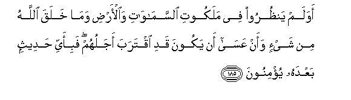
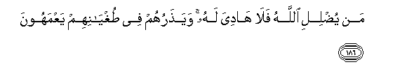
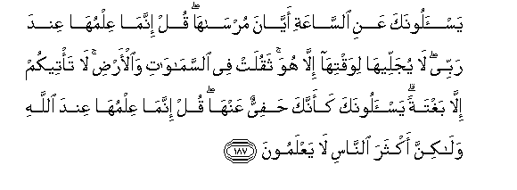
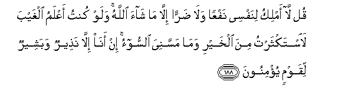

  
[Intangible Textual Heritage](../../index)  [Islam](../index) 
[Index](index)   
[Hypertext Qur'an](../htq/index)  [Unicode](../uq/007.htm#007_182) 
[Palmer](../sbe06/007)  [Pickthall](../pick/007.htm#007_182)  [Yusuf Ali
English](../yaq/yaq007)  [Rodwell](../qr/007)   
  
[Sūra VII.: A’rāf, or the Heights Index](007)  
  [Previous](00722)  [Next](00724) 

------------------------------------------------------------------------

  
*The Holy Quran*, tr. by Yusuf Ali, \[1934\], at Intangible Textual
Heritage

------------------------------------------------------------------------

# Sūra VII.: A’rāf, or the Heights

### Section 23

------------------------------------------------------------------------

182. Wa**a**lla<u>th</u>eena ka<u>thth</u>aboo
bi-<u>a</u>y<u>a</u>tin<u>a</u> sanastadrijuhum min <u>h</u>aythu
l<u>a</u> yaAAlamoon**a**

182\. Those who reject Our Signs,  
We shall gradually visit  
With punishment, in ways  
They perceive not;

------------------------------------------------------------------------

183. Waomlee lahum inna kaydee mateen**un**

183\. Respite will I grant  
Unto them: for My scheme  
Is strong (and unfailing).

------------------------------------------------------------------------

184. Awa lam yatafakkaroo m<u>a</u> bi<u>sah</u>ibihim min jinnatin in
huwa ill<u>a</u> na<u>th</u>eerun mubeen**un**

184\. Do they not reflect?  
Their Companion is not seized  
With madness: he is but  
A perspicuous warner.

------------------------------------------------------------------------

185. Awalam yan*<u>th</u>*uroo fee malakooti
a**l**ssam<u>a</u>w<u>a</u>ti wa**a**l-ar<u>d</u>i wam<u>a</u> khalaqa
All<u>a</u>hu min shay-in waan AAas<u>a</u> an yakoona qadi iqtaraba
ajaluhum fabi-ayyi <u>h</u>adeethin baAAdahu yu/minoon**a**

185\. Do they see nothing  
In the government of the heavens  
And the earth and all  
That God hath created?  
(Do they not see) that  
It may well be that  
Their term is nigh  
Drawing to an end?  
In what Message after this  
Will they then believe?

------------------------------------------------------------------------

186. Man yu<u>d</u>lili All<u>a</u>hu fal<u>a</u> h<u>a</u>diya lahu
waya<u>th</u>aruhum fee <u>t</u>ughy<u>a</u>nihim yaAAmahoon**a**

186\. To such as God rejects  
From His guidance, there can be  
No guide: He will  
Leave them in their trespasses,  
Wandering in distraction.

------------------------------------------------------------------------

187. Yas-aloonaka AAani a**l**ss<u>a</u>AAati ayy<u>a</u>na
murs<u>a</u>h<u>a</u> qul innam<u>a</u> AAilmuh<u>a</u> AAinda rabbee
l<u>a</u> yujalleeh<u>a</u> liwaqtih<u>a</u> ill<u>a</u> huwa thaqulat
fee a**l**ssam<u>a</u>w<u>a</u>ti wa**a**l-ar<u>d</u>i l<u>a</u>
ta/teekum ill<u>a</u> baghtatan yas-aloonaka kaannaka <u>h</u>afiyyun
AAanh<u>a</u> qul innam<u>a</u> AAilmuh<u>a</u> AAinda All<u>a</u>hi
wal<u>a</u>kinna akthara a**l**nn<u>a</u>si l<u>a</u> yaAAlamoon**a**

187\. Whey ask thee about  
The (final) Hour—when  
Will be its appointed time?  
Say: "The knowledge thereof  
Is with my Lord (alone):  
None but He can reveal  
As to when it will occur.  
Heavy were its burden through  
The heavens and the earth.  
Only, all of a sudden  
Will it come to you."  
They ask thee as if thou  
Wert eager in search thereof:  
Say: "The knowledge thereof  
Is with God (alone),  
But most men know not."

------------------------------------------------------------------------

188. Qul l<u>a</u> amliku linafsee nafAAan wal<u>a</u> <u>d</u>arran
ill<u>a</u> m<u>a</u> sh<u>a</u>a All<u>a</u>hu walaw kuntu aAAlamu
alghayba la**i**stakthartu mina alkhayri wam<u>a</u> massaniya
a**l**ssoo-o in an<u>a</u> ill<u>a</u> na<u>th</u>eerun wabasheerun
liqawmin yu/minoon**a**

188\. Say: "I have no power  
Over any good or harm  
To myself except as God  
Willeth. If I had knowledge  
Of the unseen, I should have  
Multiplied all good, and no evil  
Should have touched me:  
I am but a warner,  
And a bringer of glad tidings  
To those who have faith."

------------------------------------------------------------------------

[Next: Section 24 (189-206)](00724)

