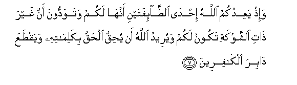

  
[Intangible Textual Heritage](../../index)  [Islam](../index) 
[Index](index)   
[Hypertext Qur'an](../htq/index)  [Unicode](../uq/008.htm#008_001) 
[Palmer](../sbe06/008)  [Pickthall](../pick/008.htm#008_001)  [Yusuf Ali
English](../yaq/yaq008)  [Rodwell](../qr/008)   
  
[Sūra VIII.: Anfāl, or the Spoils of War. Index](008)  
  [Previous](00724)  [Next](00802) 

------------------------------------------------------------------------

  
*The Holy Quran*, tr. by Yusuf Ali, \[1934\], at Intangible Textual
Heritage

------------------------------------------------------------------------

# Sūra VIII.: Anfāl, or the Spoils of War.

### Section 1

1. Yas-aloonaka AAani al-anf<u>a</u>li quli al-anf<u>a</u>lu
lill<u>a</u>hi wa**al**rrasooli fa**i**ttaqoo All<u>a</u>ha
waa<u>s</u>li<u>h</u>oo <u>tha</u>ta baynikum waa<u>t</u>eeAAoo
All<u>a</u>ha warasoolahu in kuntum mu/mineen**a**

1\. They ask thee concerning  
(Things taken as) spoils of war.  
Say: "(Such) spoils are  
At the disposal of God  
And the Apostle: so fear  
God, and keep straight  
The relations between yourselves:  
Obey God and His Apostle,  
If ye do believe."

------------------------------------------------------------------------

2. Innam<u>a</u> almu/minoona alla<u>th</u>eena i<u>tha</u>
<u>th</u>ukira All<u>a</u>hu wajilat quloobuhum wa-i<u>tha</u> tuliyat
AAalayhim <u>a</u>y<u>a</u>tuhu z<u>a</u>dat-hum eem<u>a</u>nan
waAAal<u>a</u> rabbihim yatawakkaloon**a**

2\. For, Believers are those  
Who, when God is mentioned,  
Feel a tremor in their hearts,  
And when they hear  
His Signs rehearsed, find  
Their faith strengthened,  
And put (all) their trust  
In their Lord;

------------------------------------------------------------------------

3. Alla<u>th</u>eena yuqeemoona a**l**<u>ss</u>al<u>a</u>ta
wamimm<u>a</u> razaqn<u>a</u>hum yunfiqoon**a**

3\. Who establish regular prayers  
And spend (freely) out of  
The gifts We have given  
Them for sustenance:

------------------------------------------------------------------------

4. Ol<u>a</u>-ika humu almu/minoona <u>h</u>aqqan lahum daraj<u>a</u>tun
AAinda rabbihim wamaghfiratun warizqun kareem**un**

4\. Such in truth are the Believers:  
They have grades of dignity  
With their Lord, and forgiveness,  
And generous sustenance:

------------------------------------------------------------------------

5. Kam<u>a</u> akhrajaka rabbuka min baytika bi**a**l<u>h</u>aqqi
wa-inna fareeqan mina almu/mineena lak<u>a</u>rihoon**a**

5\. Just as thy Lord ordered thee  
Out of thy house in truth,  
Even though a party among  
The Believers disliked it,

------------------------------------------------------------------------

6. Yuj<u>a</u>diloonaka fee al<u>h</u>aqqi baAAda m<u>a</u> tabayyana
kaannam<u>a</u> yus<u>a</u>qoona il<u>a</u> almawti wahum
yan*<u>th</u>*uroon**a**

6\. Disputing with thee concerning  
The truth after it was made  
Manifest, as if they were  
Being driven to death  
And they (actually) saw it.

------------------------------------------------------------------------

7. Wa-i<u>th</u> yaAAidukumu All<u>a</u>hu i<u>h</u>d<u>a</u>
a**l**<u>tta</u>-ifatayni annah<u>a</u> lakum watawaddoona anna ghayra
<u>tha</u>ti a**l**shshawkati takoonu lakum wayureedu All<u>a</u>hu an
yu<u>h</u>iqqa al<u>h</u>aqqa bikalim<u>a</u>tihi wayaq<u>t</u>aAAa
d<u>a</u>bira alk<u>a</u>fireen**a**

7\. Behold! God promised you  
One of the two (enemy) parties,  
That it should be yours:  
Ye wished that the one  
Unarmed should be yours,  
But God willed  
To justify the Truth  
According to His words,  
And to cut off the roots  
Of the Unbelievers;—

------------------------------------------------------------------------

8. Liyu<u>h</u>iqqa al<u>h</u>aqqa wayub<u>t</u>ila alb<u>at</u>ila
walaw kariha almujrimoon**a**

8\. That He might justify Truth  
And prove Falsehood false,  
Distasteful though it be  
To those in guilt.

------------------------------------------------------------------------

9. I<u>th</u> tastagheethoona rabbakum fa**i**staj<u>a</u>ba lakum annee
mumiddukum bi-alfin mina almal<u>a</u>-ikati murdifeen**a**

9\. Remember ye implored  
The assistance of your Lord,  
And He answered you:  
"I will assist you  
With a thousand of the angels,  
Ranks on ranks."

------------------------------------------------------------------------

10. Wam<u>a</u> jaAAalahu All<u>a</u>hu ill<u>a</u> bushr<u>a</u>
walita<u>t</u>ma-inna bihi quloobukum wam<u>a</u> a**l**nna<u>s</u>ru
ill<u>a</u> min AAindi All<u>a</u>hi inna All<u>a</u>ha AAazeezun
<u>h</u>akeem**un**

10\. God made it but a message  
Of hope, and an assurance  
To your hearts: (in any case)  
There is no help.  
Except from God:  
And God is Exalted in Power,  
Wise.

------------------------------------------------------------------------

[Next: Section 2 (11-19)](00802)

