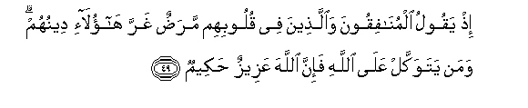
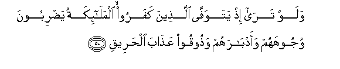
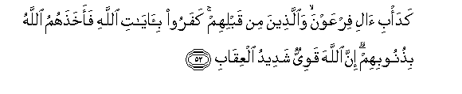
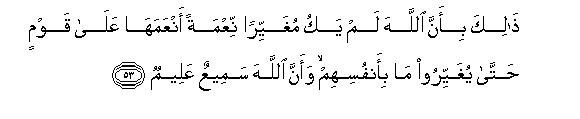
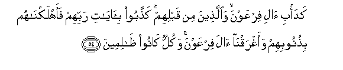
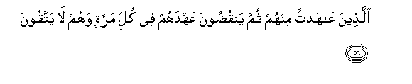

  
[Intangible Textual Heritage](../../index)  [Islam](../index) 
[Index](index)   
[Hypertext Qur'an](../htq/index)  [Unicode](../uq/008.htm#008_049) 
[Palmer](../sbe06/008)  [Pickthall](../pick/008.htm#008_049)  [Yusuf Ali
English](../yaq/yaq008)  [Rodwell](../qr/008)   
  
[Sūra VIII.: Anfāl, or the Spoils of War. Index](008)  
  [Previous](00806)  [Next](00808) 

------------------------------------------------------------------------

  
*The Holy Quran*, tr. by Yusuf Ali, \[1934\], at Intangible Textual
Heritage

------------------------------------------------------------------------

# Sūra VIII.: Anfāl, or the Spoils of War.

### Section 7

------------------------------------------------------------------------

49. I<u>th</u> yaqoolu almun<u>a</u>fiqoona wa**a**lla<u>th</u>eena fee
quloobihim mara<u>d</u>un gharra h<u>a</u>ol<u>a</u>-i deenuhum waman
yatawakkal AAal<u>a</u> All<u>a</u>hi fa-inna All<u>a</u>ha AAazeezun
<u>h</u>akeem**un**

49\. Lo! the Hypocrites say, and those  
In whose hearts is a disease:  
"These people,—their religion  
Has misled them." But  
If any trust in God, behold!  
God is Exalted in might, Wise.

------------------------------------------------------------------------

50. Walaw tar<u>a</u> i<u>th</u> yatawaff<u>a</u> alla<u>th</u>eena
kafaroo almal<u>a</u>-ikatu ya<u>d</u>riboona wujoohahum
waadb<u>a</u>rahum wa<u>th</u>ooqoo AAa<u>tha</u>ba al<u>h</u>areeq**i**

50\. If thou couldst see,  
When the angels take the souls  
Of the Unbelievers (at death),  
(How) they smite their faces  
And their backs, (saying):  
"Taste the Penalty of the blazing Fire—

------------------------------------------------------------------------

51. <u>Tha</u>lika bim<u>a</u> qaddamat aydeekum waanna All<u>a</u>ha
laysa bi*<u>th</u>*all<u>a</u>min lilAAabeed**i**

51\. "Because of (the deeds) which  
Your (own) hands sent forth:  
For God is never unjust  
To His servants:

------------------------------------------------------------------------

52. Kada/bi <u>a</u>li firAAawna wa**a**lla<u>th</u>eena min qablihim
kafaroo bi-<u>a</u>y<u>a</u>ti All<u>a</u>hi faakha<u>th</u>ahumu
All<u>a</u>hu bi<u>th</u>unoobihim inna All<u>a</u>ha qawiyyun shadeedu
alAAiq<u>a</u>b**i**

52\. "(Deeds) after the manner  
Of the People of Pharaoh  
And of those before them:  
They rejected the Signs of God,  
And God punished them  
For their crimes: for God  
Is Strong, and Strict in punishment:

------------------------------------------------------------------------

53. <u>Tha</u>lika bi-anna All<u>a</u>ha lam yaku mughayyiran niAAmatan
anAAamah<u>a</u> AAal<u>a</u> qawmin <u>h</u>att<u>a</u> yughayyiroo
m<u>a</u> bi-anfusihim waanna All<u>a</u>ha sameeAAun AAaleem**un**

53\. "Because God will never change  
The Grace which He hath bestowed  
On a people until they change  
What is in their (own) souls:  
And verily God is He  
Who heareth and knoweth (all things)."

------------------------------------------------------------------------

54. Kada/bi <u>a</u>li firAAawna wa**a**lla<u>th</u>eena min qablihim
ka<u>thth</u>aboo bi-<u>a</u>y<u>a</u>ti rabbihim faahlakn<u>a</u>hum
bi<u>th</u>unoobihim waaghraqn<u>a</u> <u>a</u>la firAAawna wakullun
k<u>a</u>noo *<u>th</u>*<u>a</u>limeen**a**

54\. "(Deeds) after the manner  
Of the People of Pharaoh  
And those before them":  
They treated as false the Signs  
Of their Lord: so We  
Destroyed them for their crimes,  
And We drowned the People  
Of Pharaoh: for they were all  
Oppressors and wrong-doers.

------------------------------------------------------------------------

55. Inna sharra a**l**ddaw<u>a</u>bbi AAinda All<u>a</u>hi
alla<u>th</u>eena kafaroo fahum l<u>a</u> yu/minoon**a**

55\. For the worst of beasts  
In the sight of God  
Are those who reject Him:  
They will not believe.

------------------------------------------------------------------------

56. Alla<u>th</u>eena AA<u>a</u>hadta minhum thumma yanqu<u>d</u>oona
AAahdahum fee kulli marratin wahum l<u>a</u> yattaqoon**a**

56\. They are those with whom  
Thou didst make a covenant,  
But they break their covenant  
Every time, and they have not  
The fear (of God).

------------------------------------------------------------------------

57. Fa-imm<u>a</u> tathqafannahum fee al<u>h</u>arbi fasharrid bihim man
khalfahum laAAallahum ya<u>thth</u>akkaroon**a**

57\. If ye gain the mastery  
Over them in war,  
Disperse, with them, those  
Who follow them,  
That they may remember.

------------------------------------------------------------------------

58. Wa-imm<u>a</u> takh<u>a</u>fanna min qawmin khiy<u>a</u>natan
fa**i**nbi<u>th</u> ilayhim AAal<u>a</u> sawa-in inna All<u>a</u>ha
l<u>a</u> yu<u>h</u>ibbu alkh<u>a</u>-ineen**a**

58\. If thou fearest treachery  
From any group, throw back  
(Their Covenant) to them, (so as  
To be) on equal terms:  
For God loveth not the treacherous.

------------------------------------------------------------------------

[Next: Section 8 (59-64)](00808)

