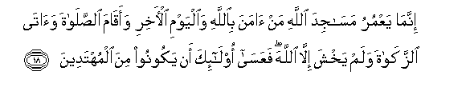
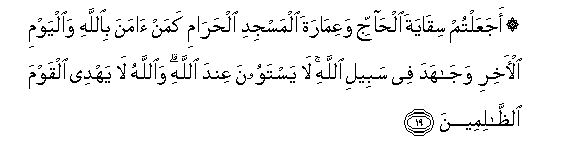
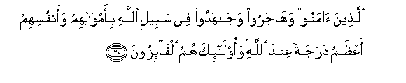
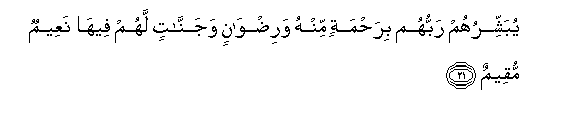
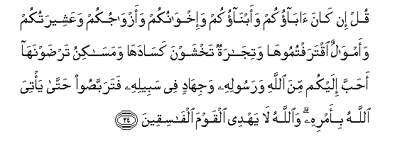

  
[Intangible Textual Heritage](../../index)  [Islam](../index) 
[Index](index)   
[Hypertext Qur'an](../htq/index)  [Unicode](../uq/009.htm#009_017) 
[Palmer](../sbe06/009)  [Pickthall](../pick/009.htm#009_017)  [Yusuf Ali
English](../yaq/yaq009)  [Rodwell](../qr/009)   
  
[Sūra IX.: Tauba (Repentance) or Barāat (Immunity). Index](009)  
  [Previous](00902)  [Next](00904) 

------------------------------------------------------------------------

  
*The Holy Quran*, tr. by Yusuf Ali, \[1934\], at Intangible Textual
Heritage

------------------------------------------------------------------------

# Sūra IX.: Tauba (Repentance) or Barāat (Immunity).

### Section 3

------------------------------------------------------------------------

17. M<u>a</u> k<u>a</u>na lilmushrikeena an yaAAmuroo mas<u>a</u>jida
All<u>a</u>hi sh<u>a</u>hideena AAal<u>a</u> anfusihim bi**a**lkufri
ol<u>a</u>-ika <u>h</u>abi<u>t</u>at aAAm<u>a</u>luhum wafee
a**l**nn<u>a</u>ri hum kh<u>a</u>lidoon**a**

17\. It is not for such  
As join gods with God,  
To visit or maintain  
The mosques of God  
While they witness  
Against their own souls  
To infidelity. The works  
Of such bear no fruit:  
In Fire shall they dwell.

------------------------------------------------------------------------

18. Innam<u>a</u> yaAAmuru mas<u>a</u>jida All<u>a</u>hi man
<u>a</u>mana bi**A**ll<u>a</u>hi wa**a**lyawmi al-<u>a</u>khiri
waaq<u>a</u>ma a**l**<u>ss</u>al<u>a</u>ta wa<u>a</u>t<u>a</u>
a**l**zzak<u>a</u>ta walam yakhsha ill<u>a</u> All<u>a</u>ha
faAAas<u>a</u> ol<u>a</u>-ika an yakoonoo mina almuhtadeen**a**

18\. The mosques of God  
Shall be visited and maintained  
By such as believe in God  
And the Last Day, establish  
Regular prayers, and practise  
Regular charity, and fear  
None (at all) except God.  
It is they who are expected  
To be on true guidance!

------------------------------------------------------------------------

19. AjaAAaltum siq<u>a</u>yata al<u>ha</u>jji waAAim<u>a</u>rata
almasjidi al<u>h</u>ar<u>a</u>mi kaman <u>a</u>mana bi**A**ll<u>a</u>hi
wa**a**lyawmi al-<u>a</u>khiri waj<u>a</u>hada fee sabeeli All<u>a</u>hi
l<u>a</u> yastawoona AAinda All<u>a</u>hi wa**A**ll<u>a</u>hu l<u>a</u>
yahdee alqawma a**l***<u>thth</u>*<u>a</u>limeen**a**

19\. Do ye make the giving  
Of drink to pilgrims,  
Or the maintenance of  
The Sacred Mosque, equal  
To (the pious service of) those  
Who believe in God  
And the Last Day, and strive  
With might and main  
In the cause of God?  
They are not comparable  
In the sight of God:  
And God guides not  
Those who do wrong.

------------------------------------------------------------------------

20. Alla<u>th</u>eena <u>a</u>manoo wah<u>a</u>jaroo waj<u>a</u>hadoo
fee sabeeli All<u>a</u>hi bi-amw<u>a</u>lihim waanfusihim
aAA*<u>th</u>*amu darajatan AAinda All<u>a</u>hi waol<u>a</u>-ika humu
alf<u>a</u>-izoon**a**

20\. Those who believe, and suffer  
Exile and strive with might  
And main, in God's cause,  
With their goods and their persons,  
Have the highest rank  
In the sight of God:  
They are the people  
Who will achieve (salvation).

------------------------------------------------------------------------

21. Yubashshiruhum rabbuhum bira<u>h</u>matin minhu
wari<u>d</u>w<u>a</u>nin wajann<u>a</u>tin lahum feeh<u>a</u> naAAeemun
muqeem**un**

21\. Their Lord doth give them  
Glad tidings of a Mercy  
From Himself, of His good pleasure,  
And of Gardens for them,  
Wherein are delights  
That endure:

------------------------------------------------------------------------

22. Kh<u>a</u>lideena feeh<u>a</u> abadan inna All<u>a</u>ha AAindahu
ajrun AAa*<u>th</u>*eem**un**

22\. They will dwell therein  
For ever. Verily in God's presence  
Is a reward, the greatest (of all).

------------------------------------------------------------------------

23. Y<u>a</u> ayyuh<u>a</u> alla<u>th</u>eena <u>a</u>manoo l<u>a</u>
tattakhi<u>th</u>oo <u>a</u>b<u>a</u>akum wa-ikhw<u>a</u>nakum
awliy<u>a</u>a ini ista<u>h</u>abboo alkufra AAal<u>a</u>
al-eem<u>a</u>ni waman yatawallahum minkum faol<u>a</u>-ika humu
a**l***<u>thth</u>*<u>a</u>limoon**a**

23\. O ye who believe! Take not  
For protectors your fathers  
And your brothers if they love  
Infidelity above Faith:  
If any of you do so,  
They do wrong.

------------------------------------------------------------------------

24. Qul in k<u>a</u>na <u>a</u>b<u>a</u>okum waabn<u>a</u>okum
wa-ikhw<u>a</u>nukum waazw<u>a</u>jukum waAAasheeratukum
waamw<u>a</u>lun iqtaraftumooh<u>a</u> watij<u>a</u>ratun takhshawna
kas<u>a</u>dah<u>a</u> wamas<u>a</u>kinu tar<u>d</u>awnah<u>a</u>
a<u>h</u>abba ilaykum mina All<u>a</u>hi warasoolihi wajih<u>a</u>din
fee sabeelihi fatarabba<u>s</u>oo <u>h</u>att<u>a</u> ya/tiya
All<u>a</u>hu bi-amrihi wa**A**ll<u>a</u>hu l<u>a</u> yahdee alqawma
alf<u>a</u>siqeen**a**

24\. Say; If it be that your fathers,  
Your sons, your brothers,  
Your mates, or your kindred;  
The wealth that ye have gained;  
The commerce in which ye fear  
A decline: or the dwellings  
In which ye delight—  
Are dearer to you than God,  
Or His Apostle, or the striving  
In His cause;—then wait  
Until God brings about  
His Decision: and God  
Guides not the rebellious.

------------------------------------------------------------------------

[Next: Section 4 (25-29)](00904)

