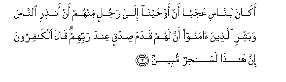
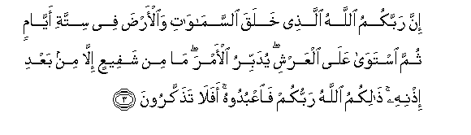
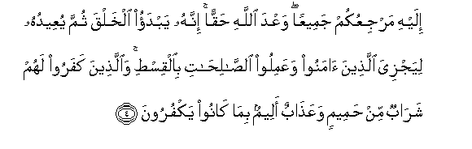
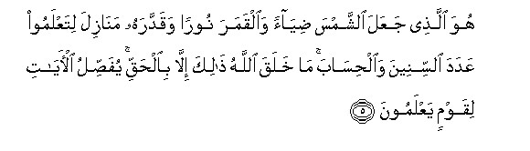
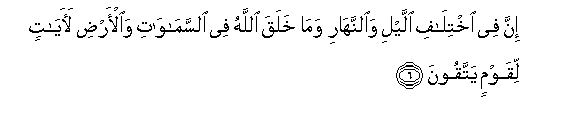
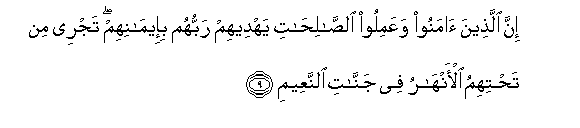
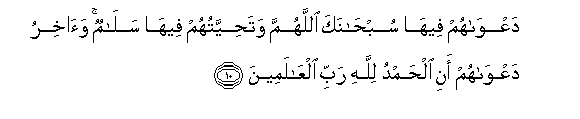

  
[Intangible Textual Heritage](../../index)  [Islam](../index) 
[Index](index)   
[Hypertext Qur'an](../htq/index)  [Unicode](../uq/010.htm#010_001) 
[Palmer](../sbe06/010)  [Pickthall](../pick/010.htm#010_001)  [Yusuf Ali
English](../yaq/yaq010)  [Rodwell](../qr/010)   
  
[Sūra X.: Yūnus, or Jonah. Index](010)  
  [Previous](00916)  [Next](01002) 

------------------------------------------------------------------------

  
*The Holy Quran*, tr. by Yusuf Ali, \[1934\], at Intangible Textual
Heritage

------------------------------------------------------------------------

# Sūra X.: Yūnus, or Jonah.

### Section 1

1. Alif-l<u>a</u>m-r<u>a</u> tilka <u>a</u>y<u>a</u>tu alkit<u>a</u>bi
al<u>h</u>akeem**i**

1\. A. L. R.  
These are the Āyats  
Of the Book of Wisdom.

------------------------------------------------------------------------

2. Ak<u>a</u>na li**l**nn<u>a</u>si AAajaban an aw<u>h</u>ayn<u>a</u>
il<u>a</u> rajulin minhum an an<u>th</u>iri a**l**nn<u>a</u>sa
wabashshiri alla<u>th</u>eena <u>a</u>manoo anna lahum qadama
<u>s</u>idqin AAinda rabbihim q<u>a</u>la alk<u>a</u>firoona inna
h<u>atha</u> las<u>ah</u>irun mubeen**un**

2\. Is it a matter  
Of wonderment to men  
That We have sent  
Our inspiration to a man  
From among themselves?—  
That he should warn mankind  
(Of their danger), and give  
The good news to the Believers  
That they have before their Lord  
The lofty rank of Truth.  
(But) say the Unbelievers:  
"This is indeed  
An evident sorcerer!"

------------------------------------------------------------------------

3. Inna rabbakumu All<u>a</u>hu alla<u>th</u>ee khalaqa
a**l**ssam<u>a</u>w<u>a</u>ti wa**a**l-ar<u>d</u>a fee sittati
ayy<u>a</u>min thumma istaw<u>a</u> AAal<u>a</u> alAAarshi yudabbiru
al-amra m<u>a</u> min shafeeAAin ill<u>a</u> min baAAdi i<u>th</u>nihi
<u>tha</u>likumu All<u>a</u>hu rabbukum fa**o**AAbudoohu afal<u>a</u>
ta<u>th</u>akkaroon**a**

3\. Verily your Lord is God,  
Who created the heavens  
And the earth in six Days,  
And is firmly established  
On the Throne (of authority),  
Regulating and governing all things.  
No intercessor (can plead with Him)  
Except after His leave  
(Hath been obtained). This  
Is God your Lord; Him therefore  
Serve ye: will ye not  
Receive admonition?

------------------------------------------------------------------------

4. Ilayhi marjiAAukum jameeAAan waAAda All<u>a</u>hi <u>h</u>aqqan
innahu yabdao alkhalqa thumma yuAAeeduhu liyajziya alla<u>th</u>eena
<u>a</u>manoo waAAamiloo a**l**<u>ssa</u>li<u>ha</u>ti
bi**a**lqis<u>t</u>i wa**a**lla<u>th</u>eena kafaroo lahum
shar<u>a</u>bun min <u>h</u>ameemin waAAa<u>tha</u>bun aleemun
bim<u>a</u> k<u>a</u>noo yakfuroon**a**

4\. To Him will be your return—  
Of all of you. The promise  
Of God is true and sure.  
It is He who beginneth  
The process of creation,  
And repeateth it, that He  
May reward with justice  
Those who believe  
And work righteousness;  
But those who reject Him  
Will have draughts  
Of boiling fluids,  
And a Penalty grievous,  
Because they did reject Him.

------------------------------------------------------------------------

5. Huwa alla<u>th</u>ee jaAAala a**l**shshamsa <u>d</u>iy<u>a</u>an
wa**a**lqamara nooran waqaddarahu man<u>a</u>zila litaAAlamoo AAadada
a**l**ssineena wa**a**l<u>h</u>is<u>a</u>ba m<u>a</u> khalaqa
All<u>a</u>hu <u>tha</u>lika ill<u>a</u> bi**a**l<u>h</u>aqqi
yufa<u>ss</u>ilu al-<u>a</u>y<u>a</u>ti liqawmin yaAAlamoon**a**

5\. It is He who made the sun  
To be a shining glory  
And the moon to be a light  
(Of beauty), and measured out  
Stages for her; that ye might  
Know the number of years  
And the count (of time).  
Nowise did God create this  
But in truth and righteousness.  
(Thus) doth He explain His Signs  
In detail, for those who understand.

------------------------------------------------------------------------

6. Inna fee ikhtil<u>a</u>fi allayli wa**al**nnah<u>a</u>ri wam<u>a</u>
khalaqa All<u>a</u>hu fee a**l**ssam<u>a</u>w<u>a</u>ti
wa**a**l-ar<u>d</u>i la<u>a</u>y<u>a</u>tin liqawmin yattaqoon**a**

6\. Verily, in the alternation  
Of the Night and the Day,  
And in all that God  
Hath created, in the heavens  
And the earth, are Signs  
For those who fear Him.

------------------------------------------------------------------------

7. Inna alla<u>th</u>eena l<u>a</u> yarjoona liq<u>a</u>an<u>a</u>
wara<u>d</u>oo bi**a**l<u>h</u>ay<u>a</u>ti a**l**dduny<u>a</u>
wa**i**<u>t</u>maannoo bih<u>a</u> wa**a**lla<u>th</u>eena hum AAan
<u>a</u>y<u>a</u>tin<u>a</u> gh<u>a</u>filoon**a**

7\. Those who rest not their hope  
On their meeting with Us,  
But are pleased and satisfied  
With the life of the Present,  
And those who heed not  
Our Signs,—

------------------------------------------------------------------------

8. Ol<u>a</u>-ika ma/w<u>a</u>humu a**l**nn<u>a</u>ru bim<u>a</u>
k<u>a</u>noo yaksiboon**a**

8\. Their abode is the Fire,  
Because of the (evil)  
They earned.

------------------------------------------------------------------------

9. Inna alla<u>th</u>eena <u>a</u>manoo waAAamiloo
a**l**<u>ssa</u>li<u>ha</u>ti yahdeehim rabbuhum bi-eem<u>a</u>nihim
tajree min ta<u>h</u>tihimu al-anh<u>a</u>ru fee jann<u>a</u>ti
a**l**nnaAAeem**i**

9\. Those who believe,  
And work righteousness,—  
Their Lord will guide them  
Because of their Faith:  
Beneath them will flow  
Rivers in Gardens of Bliss.

------------------------------------------------------------------------

10. DaAAw<u>a</u>hum feeh<u>a</u> sub<u>ha</u>naka all<u>a</u>humma
wata<u>h</u>iyyatuhum feeh<u>a</u> sal<u>a</u>mun wa<u>a</u>khiru
daAAw<u>a</u>hum ani al<u>h</u>amdu lill<u>a</u>hi rabbi
alAA<u>a</u>lameen**a**

10\. (This will be) their cry therein:  
"Glory to Thee, O God!"  
And "Peace" will be their greeting therein!  
And the close of their cry  
Will be: "Praise be to God,  
The Cherisher and Sustainer.  
Of the Worlds!"

------------------------------------------------------------------------

[Next: Section 2 (11-20)](01002)

