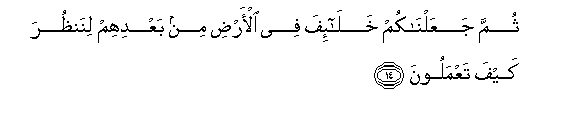
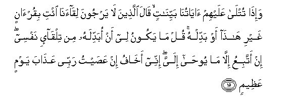

  
[Intangible Textual Heritage](../../index)  [Islam](../index) 
[Index](index)   
[Hypertext Qur'an](../htq/index)  [Unicode](../uq/010.htm#010_011) 
[Palmer](../sbe06/010)  [Pickthall](../pick/010.htm#010_011)  [Yusuf Ali
English](../yaq/yaq010)  [Rodwell](../qr/010)   
  
[Sūra X.: Yūnus, or Jonah. Index](010)  
  [Previous](01001)  [Next](01003) 

------------------------------------------------------------------------

  
*The Holy Quran*, tr. by Yusuf Ali, \[1934\], at Intangible Textual
Heritage

------------------------------------------------------------------------

# Sūra X.: Yūnus, or Jonah.

### Section 2

------------------------------------------------------------------------

11. Walaw yuAAajjilu All<u>a</u>hu li**l**nn<u>a</u>si a**l**shsharra
istiAAj<u>a</u>lahum bi**a**lkhayri laqu<u>d</u>iya ilayhim ajaluhum
fana<u>th</u>aru alla<u>th</u>eena l<u>a</u> yarjoona
liq<u>a</u>an<u>a</u> fee <u>t</u>ughy<u>a</u>nihim yaAAmahoon**a**

11\. If God were to hasten for men  
The ill (they have earned)  
As they would fain hasten on  
The good,—then would  
Their respite be settled at once.  
But We leave those  
Who rest not their hope  
On their meeting with Us,  
In their trespasses, wandering  
In distraction to and fro.

------------------------------------------------------------------------

12. Wa-i<u>tha</u> massa al-ins<u>a</u>na a**l**<u>dd</u>urru
daAA<u>a</u>n<u>a</u> lijanbihi aw q<u>a</u>AAidan aw q<u>a</u>-iman
falamm<u>a</u> kashafn<u>a</u> AAanhu <u>d</u>urrahu marra kaan lam
yadAAun<u>a</u> il<u>a</u> <u>d</u>urrin massahu ka<u>tha</u>lika
zuyyina lilmusrifeena m<u>a</u> k<u>a</u>noo yaAAmaloon**a**

12\. When trouble toucheth a man,  
He crieth unto Us  
(In all postures)—lying down  
On his side, or sitting,  
Or standing. But when We  
Have solved his trouble,  
He passeth on his way as if  
He had never cried to Us  
For a trouble that touched him!  
Thus do the deeds of transgressors  
Seem fair in their eyes!

------------------------------------------------------------------------

13. Walaqad ahlakn<u>a</u> alquroona min qablikum lamm<u>a</u>
*<u>th</u>*alamoo waj<u>a</u>at-hum rusuluhum bi**a**lbayyin<u>a</u>ti
wam<u>a</u> k<u>a</u>noo liyu/minoo ka<u>tha</u>lika najzee alqawma
almujrimeen**a**

13\. Generations before you  
We destroyed when they  
Did wrong: their Apostles  
Came to them with Clear Signs,  
But they would not believe!  
Thus do We requite  
Those who sin!

------------------------------------------------------------------------

14. Thumma jaAAaln<u>a</u>kum khal<u>a</u>-ifa fee al-ar<u>d</u>i min
baAAdihim linan*<u>th</u>*ura kayfa taAAmaloon**a**

14\. Then We made you heirs  
In the land after them,  
To see how ye would behave!

------------------------------------------------------------------------

15. Wa-i<u>tha</u> tutl<u>a</u> AAalayhim <u>a</u>y<u>a</u>tun<u>a</u>
bayyin<u>a</u>tin q<u>a</u>la alla<u>th</u>eena l<u>a</u> yarjoona
liq<u>a</u>an<u>a</u> i/ti biqur-<u>a</u>nin ghayri h<u>atha</u> aw
baddilhu qul m<u>a</u> yakoonu lee an obaddilahu min tilq<u>a</u>-i
nafsee in attabiAAu ill<u>a</u> m<u>a</u> yoo<u>ha</u> ilayya innee
akh<u>a</u>fu in AAa<u>s</u>aytu rabbee AAa<u>tha</u>ba yawmin
AAa*<u>th</u>*eem**in**

15\. But when Our Clear Signs  
Are rehearsed unto them,  
Those who rest not their hope  
On their meeting with Us,  
Say: "Bring us a Reading  
Other than this, or change this,"  
Say: "It is not for me,  
Of my own accord,  
To change it: I follow  
Naught but what is revealed  
Unto me: if I were  
To disobey my Lord,  
I should myself fear the Penalty  
Of a Great Day (to come)."

------------------------------------------------------------------------

16. Qul law sh<u>a</u>a All<u>a</u>hu m<u>a</u> talawtuhu AAalaykum
wal<u>a</u> adr<u>a</u>kum bihi faqad labithtu feekum AAumuran min
qablihi afal<u>a</u> taAAqiloon**a**

16\. Say: "If God had so willed,  
I should not have rehearsed it  
To you, nor whould He  
Have made it known to you.  
A whole life-time before this  
Have I tarried amongst you:  
Will ye not then understand?

------------------------------------------------------------------------

17. Faman a*<u>th</u>*lamu mimmani iftar<u>a</u> AAal<u>a</u>
All<u>a</u>hi ka<u>th</u>iban aw ka<u>thth</u>aba
bi-<u>a</u>y<u>a</u>tihi innahu l<u>a</u> yufli<u>h</u>u
almujrimoon**a**

17\. Who doth more wrong  
Than such as forge a lie  
Against God, or deny  
His Signs? But never  
Will prosper those who sin.

------------------------------------------------------------------------

18. WayaAAbudoona min dooni All<u>a</u>hi m<u>a</u> l<u>a</u>
ya<u>d</u>urruhum wal<u>a</u> yanfaAAuhum wayaqooloona
h<u>a</u>ol<u>a</u>-i shufaAA<u>a</u>on<u>a</u> AAinda All<u>a</u>hi qul
atunabbi-oona All<u>a</u>ha bim<u>a</u> l<u>a</u> yaAAlamu fee
a**l**ssam<u>a</u>w<u>a</u>ti wal<u>a</u> fee al-ar<u>d</u>i
sub<u>ha</u>nahu wataAA<u>a</u>l<u>a</u> AAamm<u>a</u> yushrikoon**a**

18\. They serve, besides God,  
Things that hurt them not  
Nor profit them, and they say:  
"These are our intercessors  
With God." Say: "Do ye  
Indeed inform God of something  
He knows not, in the heavens  
Or on earth?—Glory to Him!  
And far is He above the partners  
They ascribe (to Him)!"

------------------------------------------------------------------------

19. Wam<u>a</u> k<u>a</u>na a**l**nn<u>a</u>su ill<u>a</u> ommatan
w<u>ah</u>idatan fa**i**khtalafoo walawl<u>a</u> kalimatun sabaqat min
rabbika laqu<u>d</u>iya baynahum feem<u>a</u> feehi yakhtalifoon**a**

19\. Mankind was but one nation,  
But differed (later). Had it not  
Been for a Word  
That went forth before  
From thy Lord, their differences  
Would have been settled  
Between them.

------------------------------------------------------------------------

20. Wayaqooloona lawl<u>a</u> onzila AAalayhi <u>a</u>yatun min rabbihi
faqul innam<u>a</u> alghaybu lill<u>a</u>hi fa**i**nta*<u>th</u>*iroo
innee maAAakum mina almunta*<u>th</u>*ireen**a**

20\. They say: "Why is not  
A Sign sent down to him  
From his Lord?" Say:  
"The Unseen is only  
For God (to know).  
Then wait ye: I too  
Will wait with you.

------------------------------------------------------------------------

[Next: Section 3 (21-30)](01003)

