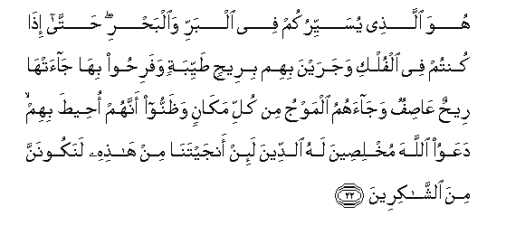
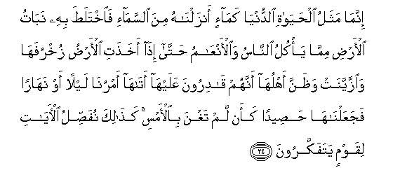
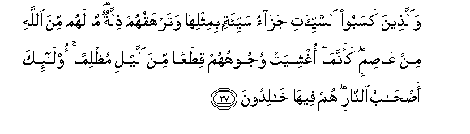

  
[Intangible Textual Heritage](../../index)  [Islam](../index) 
[Index](index)   
[Hypertext Qur'an](../htq/index)  [Unicode](../uq/010.htm#010_021) 
[Palmer](../sbe06/010)  [Pickthall](../pick/010.htm#010_021)  [Yusuf Ali
English](../yaq/yaq010)  [Rodwell](../qr/010)   
  
[Sūra X.: Yūnus, or Jonah. Index](010)  
  [Previous](01002)  [Next](01004) 

------------------------------------------------------------------------

  
*The Holy Quran*, tr. by Yusuf Ali, \[1934\], at Intangible Textual
Heritage

------------------------------------------------------------------------

# Sūra X.: Yūnus, or Jonah.

### Section 3

------------------------------------------------------------------------

21. Wa-i<u>tha</u> a<u>th</u>aqn<u>a</u> a**l**nn<u>a</u>sa
ra<u>h</u>matan min baAAdi <u>d</u>arr<u>a</u>a massat-hum i<u>tha</u>
lahum makrun fee <u>a</u>y<u>a</u>tin<u>a</u> quli All<u>a</u>hu asraAAu
makran inna rusulan<u>a</u> yaktuboona m<u>a</u> tamkuroon**a**

21\. When We make mankind  
Taste of some mercy after  
Adversity hath touched them,  
Behold! they take to plotting  
Against Our Signs! Say:  
"Swifter to plan is God!"  
Verily, Our messengers record  
All the plots that ye make!

------------------------------------------------------------------------

22. Huwa alla<u>th</u>ee yusayyirukum fee albarri wa**a**lba<u>h</u>ri
<u>h</u>att<u>a</u> i<u>tha</u> kuntum fee alfulki wajarayna bihim
biree<u>h</u>in <u>t</u>ayyibatin wafari<u>h</u>oo bih<u>a</u>
j<u>a</u>at-h<u>a</u> ree<u>h</u>un AA<u>as</u>ifun waj<u>a</u>ahumu
almawju min kulli mak<u>a</u>nin wa*<u>th</u>*annoo annahum
o<u>h</u>ee<u>t</u>a bihim daAAawoo All<u>a</u>ha mukhli<u>s</u>eena
lahu a**l**ddeena la-in anjaytan<u>a</u> min h<u>ath</u>ihi lanakoonanna
mina a**l**shsh<u>a</u>kireen**a**

22\. He it is who enableth you  
To traverse through land  
And sea; so that ye even board  
Ships;—they sail with them  
With a favourable wind,  
And they rejoice thereat;  
Then comes a stormy wind  
And the waves come to them  
From all sides, and they think  
They are being overwhelmed:  
They cry unto God, sincerely  
Offering (their) duty unto Him,  
Saying, "If Thou dost deliver us  
From this, we shall truly  
Show our gratitude!"

------------------------------------------------------------------------

23. Falamm<u>a</u> anj<u>a</u>hum i<u>tha</u> hum yabghoona fee
al-ar<u>d</u>i bighayri al<u>h</u>aqqi y<u>a</u> ayyuh<u>a</u>
a**l**nn<u>a</u>su innam<u>a</u> baghyukum AAal<u>a</u> anfusikum
mat<u>a</u>AAa al<u>h</u>ay<u>a</u>ti a**l**dduny<u>a</u> thumma
ilayn<u>a</u> marjiAAukum fanunabbi-okum bim<u>a</u> kuntum
taAAmaloon**a**

23\. But when he delivereth them,  
Behold! they transgress  
Insolently through the earth  
In defiance of right!  
O mankind! your insolence  
Is against your own souls,—  
An enjoyment of the life  
Of the Present: in the end,  
To Us is your return,  
And We shall show you  
The truth of all that ye did.

------------------------------------------------------------------------

24. Innam<u>a</u> mathalu al<u>h</u>ay<u>a</u>ti a**l**dduny<u>a</u>
kam<u>a</u>-in anzaln<u>a</u>hu mina a**l**ssam<u>a</u>-i
fa**i**khtala<u>t</u>a bihi nab<u>a</u>tu al-ar<u>d</u>i mimm<u>a</u>
ya/kulu a**l**nn<u>a</u>su wa**a**l-anAA<u>a</u>mu <u>h</u>att<u>a</u>
i<u>tha</u> akha<u>th</u>ati al-ar<u>d</u>u zukhrufah<u>a</u>
wa**i**zzayyanat wa*<u>th</u>*anna ahluh<u>a</u> annahum
q<u>a</u>diroona AAalayh<u>a</u> at<u>a</u>h<u>a</u> amrun<u>a</u>
laylan aw nah<u>a</u>ran fajaAAaln<u>a</u>h<u>a</u>
<u>h</u>a<u>s</u>eedan kaan lam taghna bi**a**l-amsi ka<u>tha</u>lika
nufa<u>ss</u>ilu al-<u>a</u>y<u>a</u>ti liqawmin yatafakkaroon**a**

24\. The likeness of the life  
Of the Present is  
As the rain which We  
Send down from the skies:  
By its mingling arises  
The produce of the earth—  
Which provides food  
For men and animals:  
(It grows) till the earth  
Is clad with its golden  
Ornaments and is decked out  
(In beauty): the people to whom  
It belongs think they have  
All powers of disposal over it:  
There reaches it Our command  
By night or by day,  
And We make it  
Like a harvest clean-mown,  
As if it had not flourished  
Only the day before!  
Thus do We explain  
The Signs in detail  
For those who reflect.

------------------------------------------------------------------------

25. Wa**A**ll<u>a</u>hu yadAAoo il<u>a</u> d<u>a</u>ri
a**l**ssal<u>a</u>mi wayahdee man yash<u>a</u>o il<u>a</u>
<u>s</u>ir<u>at</u>in mustaqeem**in**

25\. But God doth call  
To the Home of Peace:  
He doth guide whom He pleaseth  
To a Way that is straight.

------------------------------------------------------------------------

26. Lilla<u>th</u>eena a<u>h</u>sanoo al<u>h</u>usn<u>a</u>
waziy<u>a</u>datun wal<u>a</u> yarhaqu wujoohahum qatarun wal<u>a</u>
<u>th</u>illatun ol<u>a</u>-ika a<u>s</u>-<u>ha</u>bu aljannati hum
feeh<u>a</u> kh<u>a</u>lidoon**a**

26\. To those who do right  
Is a goodly (reward)—  
Yea, more (than in measure)!  
No darkness nor shame  
Shall cover their faces!  
They are Companions of the Garden;  
They will abide therein  
(For aye)!

------------------------------------------------------------------------

27. Wa**a**lla<u>th</u>eena kasaboo a**l**ssayyi-<u>a</u>ti jaz<u>a</u>o
sayyi-atin bimithlih<u>a</u> watarhaquhum <u>th</u>illatun m<u>a</u>
lahum mina All<u>a</u>hi min AA<u>as</u>imin kaannam<u>a</u> oghshiyat
wujoohuhum qi<u>t</u>aAAan mina allayli mu*<u>th</u>*liman
ol<u>a</u>-ika a<u>s</u>-<u>ha</u>bu a**l**nn<u>a</u>ri hum feeh<u>a</u>
kh<u>a</u>lidoon**a**

27\. But those who have earned  
Evil will have a reward  
Of like evil: ignominy  
Will cover their (faces):  
No defender will they have  
From (the wrath of) God:  
Their faces will be covered,  
As it were, with pieces  
From the depth of the darkness  
Of Night: they are Companions  
Of the Fire: they will  
Abide therein (for aye)!

------------------------------------------------------------------------

28. Wayawma na<u>h</u>shuruhum jameeAAan thumma naqoolu
lilla<u>th</u>eena ashrakoo mak<u>a</u>nakum antum washurak<u>a</u>okum
fazayyaln<u>a</u> baynahum waq<u>a</u>la shurak<u>a</u>ohum m<u>a</u>
kuntum iyy<u>a</u>n<u>a</u> taAAbudoon**a**

28\. One Day shall We gather them  
All together. Then shall We say  
To those who joined gods (with Us):  
"To your place! ye and those  
Ye joined as "partners"."  
We shall separate them,  
And their "partners" shall say:  
"It was not us  
That ye worshipped!

------------------------------------------------------------------------

29. Fakaf<u>a</u> bi**A**ll<u>a</u>hi shaheedan baynan<u>a</u>
wabaynakum in kunn<u>a</u> AAan AAib<u>a</u>datikum
lagh<u>a</u>fileen**a**

29\. "Enough is God for a witness  
Between us and you: we  
Certainly knew nothing  
Of your worship of us!"

------------------------------------------------------------------------

30. Hun<u>a</u>lika tabloo kullu nafsin m<u>a</u> aslafat waruddoo
il<u>a</u> All<u>a</u>hi mawl<u>a</u>humu al<u>h</u>aqqi wa<u>d</u>alla
AAanhum m<u>a</u> k<u>a</u>noo yaftaroon**a**

30\. There will every soul prove  
(The fruits of) the deeds  
It sent before : they will  
Be brought back to God  
Their rightful Lord,  
And their invented falsehoods  
Will leave them in the lurch.

------------------------------------------------------------------------

[Next: Section 4 (31-40)](01004)

