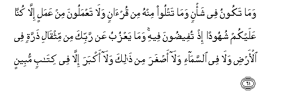
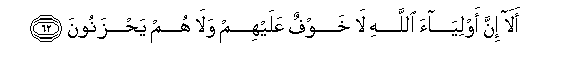
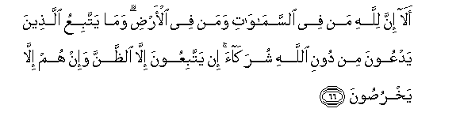
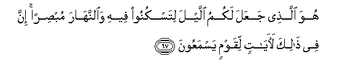

  
[Intangible Textual Heritage](../../index)  [Islam](../index) 
[Index](index)   
[Hypertext Qur'an](../htq/index)  [Unicode](../uq/010.htm#010_061) 
[Palmer](../sbe06/010)  [Pickthall](../pick/010.htm#010_061)  [Yusuf Ali
English](../yaq/yaq010)  [Rodwell](../qr/010)   
  
[Sūra X.: Yūnus, or Jonah. Index](010)  
  [Previous](01006)  [Next](01008) 

------------------------------------------------------------------------

  
*The Holy Quran*, tr. by Yusuf Ali, \[1934\], at Intangible Textual
Heritage

------------------------------------------------------------------------

# Sūra X.: Yūnus, or Jonah.

### Section 7

------------------------------------------------------------------------

61. Wam<u>a</u> takoonu fee sha/nin wam<u>a</u> tatloo minhu min
qur-<u>a</u>nin wal<u>a</u> taAAmaloona min AAamalin ill<u>a</u>
kunn<u>a</u> AAalaykum shuhoodan i<u>th</u> tufee<u>d</u>oona feehi
wam<u>a</u> yaAAzubu AAan rabbika min mithq<u>a</u>li <u>th</u>arratin
fee al-ar<u>d</u>i wal<u>a</u> fee a**l**ssam<u>a</u>-i wal<u>a</u>
a<u>s</u>ghara min <u>tha</u>lika wal<u>a</u> akbara ill<u>a</u> fee
kit<u>a</u>bin mubeen**un**

61\. In whatever business thou  
Mayest be, and whatever portion  
Thou mayest be reciting  
From the Qur-ān,—and whatever  
Deed ye (mankind) may be doing,—  
We are Witnesses thereof  
When ye are deeply engrossed  
Therein. Nor is hidden  
From thy Lord (so much as)  
The weight of an atom  
On the earth or in heaven.  
And not the least  
And not the greatest  
Of these things but are recorded  
In a clear Record.

------------------------------------------------------------------------

62. Al<u>a</u> inna awliy<u>a</u>a All<u>a</u>hi l<u>a</u> khawfun
AAalayhim wal<u>a</u> hum ya<u>h</u>zanoon**a**

62\. Behold! verily on the friends  
Of God there is no fear,  
Nor shall they grieve;

------------------------------------------------------------------------

63. Alla<u>th</u>eena <u>a</u>manoo wak<u>a</u>noo yattaqoon**a**

63\. Those who believe  
And (constantly) guard  
Against evil;—

------------------------------------------------------------------------

64. Lahumu albushr<u>a</u> fee al<u>h</u>ay<u>a</u>ti
a**l**dduny<u>a</u> wafee al-<u>a</u>khirati l<u>a</u> tabdeela
likalim<u>a</u>ti All<u>a</u>hi <u>tha</u>lika huwa alfawzu
alAAa*<u>th</u>*eem**u**

64\. For them are Glad Tidings,  
In the life of the Present  
And in the Hereafter:  
No change can there be  
In the Words of God.  
This is indeed  
The supreme Felicity.

------------------------------------------------------------------------

65. Wal<u>a</u> ya<u>h</u>zunka qawluhum inna alAAizzata lill<u>a</u>hi
jameeAAan huwa a**l**ssameeAAu alAAaleem**u**

65\. Let not their speech  
Grieve thee: for all power  
And honour belong to God:  
It is He Who heareth  
And knoweth (all things).

------------------------------------------------------------------------

66. Al<u>a</u> inna lill<u>a</u>hi man fee a**l**ssam<u>a</u>w<u>a</u>ti
waman fee al-ar<u>d</u>i wam<u>a</u> yattabiAAu alla<u>th</u>eena
yadAAoona min dooni All<u>a</u>hi shurak<u>a</u>a in yattabiAAoona
ill<u>a</u> a**l***<u>thth</u>*anna wa-in hum ill<u>a</u>
yakhru<u>s</u>oon**a**

66\. Behold! verily to God  
Belong all creatures,  
In the heavens and on earth.  
What do they follow  
Who worship as His "partners"  
Other than God? They follow  
Nothing but fancy, and  
They do nothing but lie.

------------------------------------------------------------------------

67. Huwa alla<u>th</u>ee jaAAala lakumu allayla litaskunoo feehi
wa**al**nnah<u>a</u>ra mub<u>s</u>iran inna fee <u>tha</u>lika
la<u>a</u>y<u>a</u>tin liqawmin yasmaAAoon**a**

67\. He it is that hath  
Made you the Night  
That ye may rest therein,  
And the Day to make  
Things visible (to you).  
Verily in this are Signs  
For those who listen  
(To His Message).

------------------------------------------------------------------------

68. Q<u>a</u>loo ittakha<u>th</u>a All<u>a</u>hu waladan
sub<u>ha</u>nahu huwa alghaniyyu lahu m<u>a</u> fee
a**l**ssam<u>a</u>w<u>a</u>ti wam<u>a</u> fee al-ar<u>d</u>i in
AAindakum min sul<u>ta</u>nin bih<u>atha</u> ataqooloona AAal<u>a</u>
All<u>a</u>hi m<u>a</u> l<u>a</u> taAAlamoon**a**

68\. They say, "God hath begotten  
A son!"—Glory be to Him!  
He is Self-Sufficient! His  
Are all things in the heavens  
And on earth! No warrant  
Have ye for this! Say ye  
About God what ye know not?

------------------------------------------------------------------------

69. Qul inna alla<u>th</u>eena yaftaroona AAal<u>a</u> All<u>a</u>hi
alka<u>th</u>iba l<u>a</u> yufli<u>h</u>oon**a**

69\. Say: "Those who invent  
A lie against God  
Will never prosper."

------------------------------------------------------------------------

70. Mat<u>a</u>AAun fee a**l**dduny<u>a</u> thumma ilayn<u>a</u>
marjiAAuhum thumma nu<u>th</u>eequhumu alAAa<u>tha</u>ba
a**l**shshadeeda bim<u>a</u> k<u>a</u>noo yakfuroon**a**

70\. A little enjoyment  
In this world!—  
And then, to Us  
Will be their return.  
Then shall We make them  
Taste the severest Penalty  
For their blasphemies.

------------------------------------------------------------------------

[Next: Section 8 (71-82)](01008)

