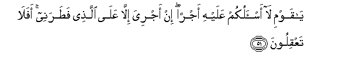
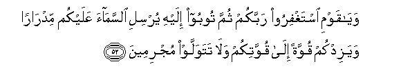
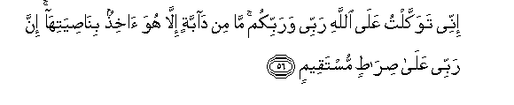
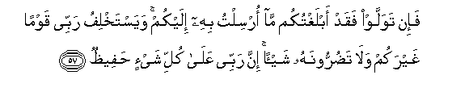
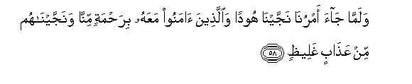

  
[Intangible Textual Heritage](../../index)  [Islam](../index) 
[Index](index)   
[Hypertext Qur'an](../htq/index)  [Unicode](../uq/011.htm#011_050) 
[Palmer](../sbe06/011)  [Pickthall](../pick/011.htm#011_050)  [Yusuf Ali
English](../yaq/yaq011)  [Rodwell](../qr/011)   
  
[Sūra XI.: Hūd (The Prophet Hūd). Index](011)  
  [Previous](01104)  [Next](01106) 

------------------------------------------------------------------------

  
*The Holy Quran*, tr. by Yusuf Ali, \[1934\], at Intangible Textual
Heritage

------------------------------------------------------------------------

# Sūra XI.: Hūd (The Prophet Hūd).

### Section 5

------------------------------------------------------------------------

50. Wa-il<u>a</u> AA<u>a</u>din akh<u>a</u>hum hoodan q<u>a</u>la
y<u>a</u> qawmi oAAbudoo All<u>a</u>ha m<u>a</u> lakum min il<u>a</u>hin
ghayruhu in antum ill<u>a</u> muftaroon**a**

50\. To the ’Ād People  
(We sent) Hūd, one  
Of their own brethren.  
He said: "O my people!  
Worship God! ye have  
No other god but Him.  
(Your other gods) ye do nothing  
But invent!

------------------------------------------------------------------------

51. Y<u>a</u> qawmi l<u>a</u> as-alukum AAalayhi ajran in ajriya
ill<u>a</u> AAal<u>a</u> alla<u>th</u>ee fa<u>t</u>aranee afal<u>a</u>
taAAqiloon**a**

51\. "O my people! I ask of you  
No reward for this (Message).  
My reward is from none  
But Him who created me:  
Will ye not then understand?

------------------------------------------------------------------------

52. Way<u>a</u> qawmi istaghfiroo rabbakum thumma tooboo ilayhi yursili
a**l**ssam<u>a</u>a AAalaykum midr<u>a</u>ran wayazidkum quwwatan
il<u>a</u> quwwatikum wal<u>a</u> tatawallaw mujrimeen**a**

52\. "And O my people! Ask  
Forgiveness of your Lord,  
And turn to Him (in repentance):  
He will send you the skies  
Pouring abundant rain,  
And add strength  
To your strength:  
So turn ye not back  
In sin!"

------------------------------------------------------------------------

53. Q<u>a</u>loo y<u>a</u> hoodu m<u>a</u> ji/tan<u>a</u> bibayyinatin
wam<u>a</u> na<u>h</u>nu bit<u>a</u>rikee <u>a</u>lihatin<u>a</u> AAan
qawlika wam<u>a</u> na<u>h</u>nu laka bimu/mineen**a**

53\. They said: "O Hūd!  
No Clear (Sign) hast thou  
Brought us, and we are not  
The ones to desert our gods  
On thy word! Nor shall we  
Believe in thee!

------------------------------------------------------------------------

54. In naqoolu ill<u>a</u> iAAtar<u>a</u>ka baAA<u>d</u>u
<u>a</u>lihatin<u>a</u> bisoo-in q<u>a</u>la innee oshhidu All<u>a</u>ha
wa**i**shhadoo annee baree-on mimm<u>a</u> tushrikoon**a**

54\. "We say nothing but that  
(Perhaps) some of our gods  
May have seized thee  
With imbecility." He said:  
"I call God to witness,  
And do ye bear witness,  
That I am free from the sin  
Of ascribing, to Him,

------------------------------------------------------------------------

55. Min doonihi fakeedoonee jameeAAan thumma l<u>a</u>
tun*<u>th</u>*iroon**i**

55\. "Other gods as partners!  
So scheme (your worst) against me,  
All of you, and give me  
No respite.

------------------------------------------------------------------------

56. Innee tawakkaltu AAal<u>a</u> All<u>a</u>hi rabbee warabbikum
m<u>a</u> min d<u>a</u>bbatin ill<u>a</u> huwa <u>a</u>khi<u>th</u>un
bin<u>as</u>iyatih<u>a</u> inna rabbee AAal<u>a</u>
<u>s</u>ir<u>at</u>in mustaqeem**in**

56\. "I put my trust in God,  
My Lord and your Lord!  
There is not a moving  
Creature, but He hath  
Grasp of its fore-lock.  
Verily, it is my Lord  
That is on a straight Path.

------------------------------------------------------------------------

57. Fa-in tawallaw faqad ablaghtukum m<u>a</u> orsiltu bihi ilaykum
wayastakhlifu rabbee qawman ghayrakum wal<u>a</u> ta<u>d</u>urroonahu
shay-an inna rabbee AAal<u>a</u> kulli shay-in
<u>h</u>afee*<u>th</u>***un**

57\. "If ye turn away,—  
I (at least) have conveyed  
The Message with which I  
Was sent to you. My Lord  
Will make another People  
To succeed you, and you  
Will not harm Him  
In the least. For my Lord  
Hath care and watch  
Over all things."

------------------------------------------------------------------------

58. Walamm<u>a</u> j<u>a</u>a amrun<u>a</u> najjayn<u>a</u> hoodan
wa**a**lla<u>th</u>eena <u>a</u>manoo maAAahu bira<u>h</u>matin
minn<u>a</u> wanajjayn<u>a</u>hum min AAa<u>tha</u>bin
ghalee*<u>th</u>***in**

58\. So when Our decree  
Issued, We saved Hūd  
And those who believed  
With him, by (special) Grace  
From Ourselves: We saved them  
From a severe Penalty.

------------------------------------------------------------------------

59. Watilka AA<u>a</u>dun ja<u>h</u>adoo bi-<u>a</u>y<u>a</u>ti rabbihim
waAAa<u>s</u>aw rusulahu wa**i**ttabaAAoo amra kulli jabb<u>a</u>rin
AAaneed**in**

59\. Such were the ’Ād People:  
They rejected the Signs  
Of their Lord and Cherisher;  
Disobeyed His Apostles;  
And followed the command  
Of every powerful, obstinate  
Transgressor.

------------------------------------------------------------------------

60. WaotbiAAoo fee h<u>ath</u>ihi a**l**dduny<u>a</u> laAAnatan wayawma
alqiy<u>a</u>mati al<u>a</u> inna AA<u>a</u>dan kafaroo rabbahum
al<u>a</u> buAAdan liAA<u>a</u>din qawmi hood**in**

60\. And they were pursued  
By a Curse in this Life,  
And on the Day of Judgment.  
Ah! Behold! For the ’Ād  
Rejected their Lord and Cherisher  
Ah! Behold! Removed (from sight)  
Were ’Ād the People of Hūd!

------------------------------------------------------------------------

[Next: Section 6 (61-68)](01106)

