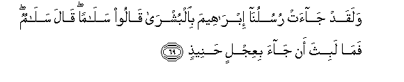
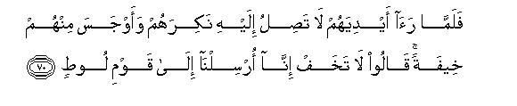
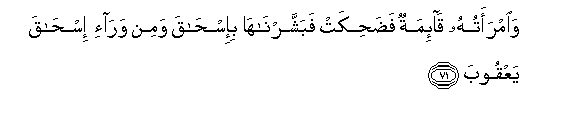
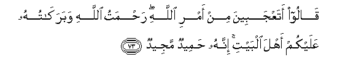
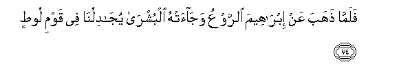
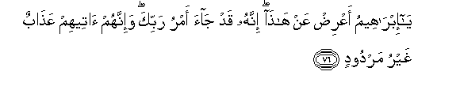
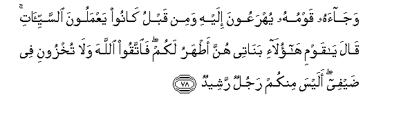
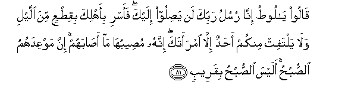
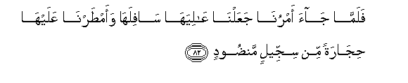

  
[Intangible Textual Heritage](../../index)  [Islam](../index) 
[Index](index)   
[Hypertext Qur'an](../htq/index)  [Unicode](../uq/011.htm#011_069) 
[Palmer](../sbe06/011)  [Pickthall](../pick/011.htm#011_069)  [Yusuf Ali
English](../yaq/yaq011)  [Rodwell](../qr/011)   
  
[Sūra XI.: Hūd (The Prophet Hūd). Index](011)  
  [Previous](01106)  [Next](01108) 

------------------------------------------------------------------------

  
*The Holy Quran*, tr. by Yusuf Ali, \[1934\], at Intangible Textual
Heritage

------------------------------------------------------------------------

# Sūra XI.: Hūd (The Prophet Hūd).

### Section 7

------------------------------------------------------------------------

69. Walaqad j<u>a</u>at rusulun<u>a</u> ibr<u>a</u>heema
bi**a**lbushr<u>a</u> q<u>a</u>loo sal<u>a</u>man q<u>a</u>la
sal<u>a</u>mun fam<u>a</u> labitha an j<u>a</u>a biAAijlin
<u>h</u>anee<u>th</u>**in**

69\. There came Our Messengers  
To Abraham with glad tidings.  
They said, "Peace!" He answered,  
"Peace!" and hastened  
To entertain them  
With a roasted calf.

------------------------------------------------------------------------

70. Falamm<u>a</u> ra<u>a</u> aydiyahum l<u>a</u> ta<u>s</u>ilu ilayhi
nakirahum waawjasa minhum kheefatan q<u>a</u>loo l<u>a</u> takhaf
inn<u>a</u> orsiln<u>a</u> il<u>a</u> qawmi loo<u>t</u>**in**

70\. But when he saw  
Their hands went not  
Towards the (meal), he felt  
Some mistrust of them,  
And conceived a fear of them.  
They said: "Fear not:  
We have been sent  
Against the people of Lūt."

------------------------------------------------------------------------

71. Wa**i**mraatuhu q<u>a</u>-imatun fa<u>d</u>a<u>h</u>ikat
fabashsharn<u>a</u>h<u>a</u> bi-is<u>ha</u>qa wamin war<u>a</u>-i
is<u>ha</u>qa yaAAqoob**a**

71\. And his wife was standing  
(There), and she laughed:  
But We gave her  
Glad tidings of Isaac,  
And after him, of Jacob.

------------------------------------------------------------------------

72. Q<u>a</u>lat y<u>a</u> waylat<u>a</u> aalidu waan<u>a</u> AAajoozun
wah<u>atha</u> baAAlee shaykhan inna h<u>atha</u> lashay-on
AAajeeb**un**

72\. She said: "Alas for me!  
Shall I bear a [child](errata.htm#3),  
Seeing I am an old woman,  
And my husband here  
Is an old man?  
That would indeed  
Be a wonderful thing!"

------------------------------------------------------------------------

73. Q<u>a</u>loo ataAAjabeena min amri All<u>a</u>hi ra<u>h</u>matu
All<u>a</u>hi wabarak<u>a</u>tuhu AAalaykum ahla albayti innahu
<u>h</u>ameedun majeed**un**

73\. They said: "Dost thou  
Wonder at God's decree?  
The grace of God  
And His blessings on you,  
O ye people of the house!  
For He is indeed  
Worthy of all praise,  
Full of all glory!"

------------------------------------------------------------------------

74. Falamm<u>a</u> <u>th</u>ahaba AAan ibr<u>a</u>heema a**l**rrawAAu
waj<u>a</u>at-hu albushr<u>a</u> yuj<u>a</u>dilun<u>a</u> fee qawmi
loo<u>t</u>**in**

74\. When fear had passed  
From (the mind of) Abraham  
And the glad tidings  
Had reached him, he  
Began to plead with Us  
For Lūt's people.

------------------------------------------------------------------------

75. Inna ibr<u>a</u>heema la<u>h</u>aleemun aww<u>a</u>hun muneeb**un**

75\. For Abraham was,  
Without doubt, forbearing  
(Of faults), compassionate,  
And given to look to God.

------------------------------------------------------------------------

76. Y<u>a</u> ibr<u>a</u>heemu aAAri<u>d</u> AAan h<u>atha</u> innahu
qad j<u>a</u>a amru rabbika wa-innahum <u>a</u>teehim AAa<u>tha</u>bun
ghayru mardood**in**

76\. O Abraham! Seek not this.  
The decree of thy Lord  
Hath gone forth: for them  
There cometh a Penalty  
That cannot be turned back!

------------------------------------------------------------------------

77. Walamm<u>a</u> j<u>a</u>at rusulun<u>a</u> loo<u>t</u>an see-a bihim
wa<u>da</u>qa bihim <u>th</u>arAAan waq<u>a</u>la h<u>atha</u> yawmun
AAa<u>s</u>eeb**un**

77\. When Our Messengers  
Came to Lūt, he was  
Grieved on their account  
And felt himself powerless  
(To protect) them. He said:  
"This is a distressful day."

------------------------------------------------------------------------

78. Waj<u>a</u>ahu qawmuhu yuhraAAoona ilayhi wamin qablu k<u>a</u>noo
yaAAmaloona a**l**ssayyi-<u>a</u>ti q<u>a</u>la y<u>a</u> qawmi
h<u>a</u>ol<u>a</u>-i ban<u>a</u>tee hunna a<u>t</u>haru lakum
fa**i**ttaqoo All<u>a</u>ha wal<u>a</u> tukhzooni fee <u>d</u>ayfee
alaysa minkum rajulun rasheed**un**

78\. And his people came  
Rushing towards him,  
And they had been long  
In the habit of practising  
Abominations. He said:  
"O my people! Here are  
My daughters: they are purer  
For you (if ye marry)!  
Now fear God, and cover me not  
With shame about my guests!  
Is there not among you  
A single right-minded man?"

------------------------------------------------------------------------

79. Q<u>a</u>loo laqad AAalimta m<u>a</u> lan<u>a</u> fee
ban<u>a</u>tika min <u>h</u>aqqin wa-innaka lataAAlamu m<u>a</u>
nureed**u**

79\. They said: "Well dost thou  
Know we have no need  
Of thy daughters: indeed  
Thou knowest quite well  
What we want!"

------------------------------------------------------------------------

80. Q<u>a</u>la law anna lee bikum quwwatan aw <u>a</u>wee il<u>a</u>
ruknin shadeed**in**

80\. He said: "Would that I  
Had power to suppress you  
Or that I could betake  
Myself to some powerful support."

------------------------------------------------------------------------

81. Q<u>a</u>loo y<u>a</u> loo<u>t</u>u inn<u>a</u> rusulu rabbika lan
ya<u>s</u>iloo ilayka faasri bi-ahlika biqi<u>t</u>AAin mina allayli
wal<u>a</u> yaltafit minkum a<u>h</u>adun ill<u>a</u> imraataka innahu
mu<u>s</u>eebuh<u>a</u> m<u>a</u> a<u>sa</u>bahum inna mawAAidahumu
a**l**<u>ss</u>ub<u>h</u>u alaysa a**l**<u>ss</u>ub<u>h</u>u
biqareeb**in**

81\. (The Messengers) said: "O Lūt  
We are Messengers from thy Lord!  
By no means shall they  
Reach thee! Now travel  
With thy family while yet  
A part of the night remains,  
And let not any of you  
Look back: but thy wife  
(Will remain behind):  
To her will happen  
What happens to the people.  
Morning is their time appointed:  
Is not the morning nigh?"

------------------------------------------------------------------------

82. Falamm<u>a</u> j<u>a</u>a amrun<u>a</u> jaAAaln<u>a</u>
AA<u>a</u>liyah<u>a</u> s<u>a</u>filah<u>a</u> waam<u>t</u>arn<u>a</u>
AAalayh<u>a</u> <u>h</u>ij<u>a</u>ratan min sijjeelin
man<u>d</u>ood**in**

82\. When Our decree issued,  
We turned (the cities)  
Upside down, and rained down  
On them brimstones  
Hard as baked clay,  
Spread, layer on layer,—

------------------------------------------------------------------------

83. Musawwamatan AAinda rabbika wam<u>a</u> hiya mina
a**l***<u>thth</u>*<u>a</u>limeena bibaAAeed**in**

83\. Marked as from thy Lord:  
Nor are they ever far  
From those who do wrong!

------------------------------------------------------------------------

[Next: Section 8 (84-95)](01108)

