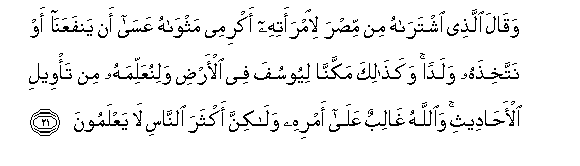
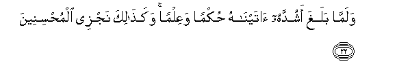
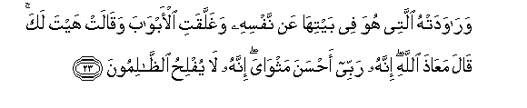
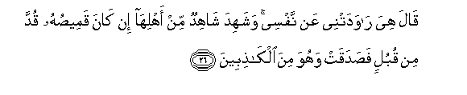
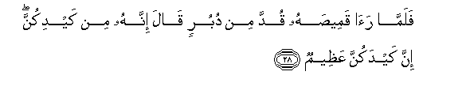
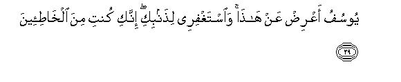

  
[Intangible Textual Heritage](../../index)  [Islam](../index) 
[Index](index)   
[Hypertext Qur'an](../htq/index)  [Unicode](../uq/012.htm#012_021) 
[Palmer](../sbe06/012)  [Pickthall](../pick/012.htm#012_021)  [Yusuf Ali
English](../yaq/yaq012)  [Rodwell](../qr/012)   
  
[Sūra XII.: Yūsuf, or Joseph. Index](012)  
  [Previous](01202)  [Next](01204) 

------------------------------------------------------------------------

  
*The Holy Quran*, tr. by Yusuf Ali, \[1934\], at Intangible Textual
Heritage

------------------------------------------------------------------------

# Sūra XII.: Yūsuf, or Joseph.

### Section 3

------------------------------------------------------------------------

21. Waq<u>a</u>la alla<u>th</u>ee ishtar<u>a</u>hu min mi<u>s</u>ra
li**i**mraatihi akrimee mathw<u>a</u>hu AAas<u>a</u> an
yanfaAAan<u>a</u> aw nattakhi<u>th</u>ahu waladan waka<u>tha</u>lika
makkann<u>a</u> liyoosufa fee al-ar<u>d</u>i walinuAAallimahu min
ta/weeli al-a<u>ha</u>deethi wa**A**ll<u>a</u>hu gh<u>a</u>libun
AAal<u>a</u> amrihi wal<u>a</u>kinna akthara a**l**nn<u>a</u>si
l<u>a</u> yaAAlamoon**a**

21\. The man in Egypt  
Who bought him, said  
To his wife: "Make his stay  
(Among us) honourable:  
Maybe he will bring us  
Much good, or we shall  
Adopt him as a son."  
Thus did We establish  
Joseph in the land,  
That We might teach him  
The interpretation of stories  
(And events). And God  
Hath full power and control  
Over His affairs; but most  
Among mankind know it not.

------------------------------------------------------------------------

22. Walamm<u>a</u> balagha ashuddahu <u>a</u>tayn<u>a</u>hu
<u>h</u>ukman waAAilman waka<u>tha</u>lika najzee
almu<u>h</u>sineen**a**

22\. When Joseph attained  
His full manhood, We gave him  
Power and knowledge: thus do We  
Reward those who do right.

------------------------------------------------------------------------

23. War<u>a</u>wadat-hu allatee huwa fee baytih<u>a</u> AAan nafsihi
waghallaqati al-abw<u>a</u>ba waq<u>a</u>lat hayta laka q<u>a</u>la
maAA<u>ath</u>a All<u>a</u>hi innahu rabbee a<u>h</u>sana
mathw<u>a</u>ya innahu l<u>a</u> yufli<u>h</u>u
a**l***<u>thth</u>*<u>a</u>limoon**a**

23\. But she in whose house  
He was, sought to seduce him  
From his (true) self: she fastened  
The doors, and said:  
"Now come, thou (dear one)!"  
He said: "God forbid!  
Truly (thy husband) is  
My lord! he made  
My sojourn agreeable!  
Truly to no good  
Come those who do wrong!"

------------------------------------------------------------------------

24. Walaqad hammat bihi wahamma bih<u>a</u> lawl<u>a</u> an ra<u>a</u>
burh<u>a</u>na rabbihi ka<u>tha</u>lika lina<u>s</u>rifa AAanhu
a**l**ssoo-a wa**a**lfa<u>h</u>sh<u>a</u>a innahu min
AAib<u>a</u>din<u>a</u> almukhla<u>s</u>een**a**

24\. And (with passion) did she  
Desire him, and he would  
Have desired her, but that  
He saw the evidence  
Of his Lord: thus  
(Did We order) that We  
Might turn away from him  
(All) evil and shameful deeds:  
For he was one of Our servants,  
Sincere and purified.

------------------------------------------------------------------------

25. Wa**i**stabaq<u>a</u> alb<u>a</u>ba waqaddat qamee<u>s</u>ahu min
duburin waalfay<u>a</u> sayyidah<u>a</u> lad<u>a</u> alb<u>a</u>bi
q<u>a</u>lat m<u>a</u> jaz<u>a</u>o man ar<u>a</u>da bi-ahlika soo-an
ill<u>a</u> an yusjana aw AAa<u>tha</u>bun aleem**un**

25\. So they both raced each other  
To the door, and she  
Tore his shirt from the back:  
They both found her lord  
Near the door. She said:  
"What is the (fitting) punishment  
For one who formed  
An evil design against  
Thy wife, but prison  
Or a grievous chastisement?"

------------------------------------------------------------------------

26. Q<u>a</u>la hiya r<u>a</u>wadatnee AAan nafsee washahida
sh<u>a</u>hidun min ahlih<u>a</u> in k<u>a</u>na qamee<u>s</u>uhu qudda
min qubulin fa<u>s</u>adaqat wahuwa mina alk<u>ath</u>ibeen**a**

26\. He said: "It was she  
That sought to seduce me—  
From my (true) self." And one  
Of her household saw (this)  
And bore witness, (thus):—  
"If it be that his shirt  
Is rent from the front, then  
Is her tale true,  
And he is a liar!

------------------------------------------------------------------------

27. Wa-in k<u>a</u>na qamee<u>s</u>uhu qudda min duburin
faka<u>th</u>abat wahuwa mina a**l**<u>ssa</u>diqeen**a**

27\. "But if it be that his shirt  
Is torn from the back,  
Then is she the liar,  
And he is telling the truth!"

------------------------------------------------------------------------

28. Falamm<u>a</u> ra<u>a</u> qamee<u>s</u>ahu qudda min duburin
q<u>a</u>la innahu min kaydikunna inna kaydakunna
AAa*<u>th</u>*eem**un**

28\. So when he saw his shirt,—  
That it was torn at the back,  
(Her husband) said: "Behold!  
It is a snare of you women!  
Truly, mighty is your snare!

------------------------------------------------------------------------

29. Yoosufu aAAri<u>d</u> AAan h<u>atha</u> wa**i**staghfiree
li<u>th</u>anbiki innaki kunti mina alkh<u>at</u>i-een**a**

29\. "O Joseph, pass this over!  
(O wife), ask forgiveness  
For thy sin, for truly  
Thou hast been at fault!"

------------------------------------------------------------------------

[Next: Section 4 (30-35)](01204)

