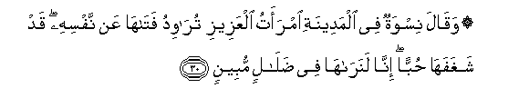
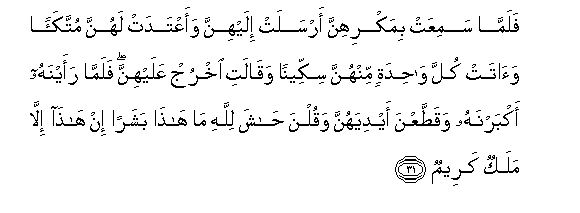
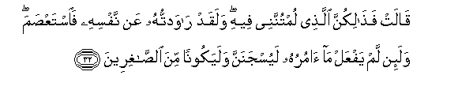

  
[Intangible Textual Heritage](../../index)  [Islam](../index) 
[Index](index)   
[Hypertext Qur'an](../htq/index)  [Unicode](../uq/012.htm#012_030) 
[Palmer](../sbe06/012)  [Pickthall](../pick/012.htm#012_030)  [Yusuf Ali
English](../yaq/yaq012)  [Rodwell](../qr/012)   
  
[Sūra XII.: Yūsuf, or Joseph. Index](012)  
  [Previous](01203)  [Next](01205) 

------------------------------------------------------------------------

  
*The Holy Quran*, tr. by Yusuf Ali, \[1934\], at Intangible Textual
Heritage

------------------------------------------------------------------------

# Sūra XII.: Yūsuf, or Joseph.

### Section 4

------------------------------------------------------------------------

30. Waq<u>a</u>la niswatun fee almadeenati imraatu alAAazeezi
tur<u>a</u>widu fat<u>a</u>h<u>a</u> AAan nafsihi qad shaghafah<u>a</u>
<u>h</u>ubban inn<u>a</u> lanar<u>a</u>h<u>a</u> fee
<u>d</u>al<u>a</u>lin mubeen**in**

30\. Ladies said in the City:  
"The wife of the (great) ’Aziz  
Is seeking to seduce her slave  
From his (true) self:  
Truly hath he inspired her  
With violent love: we see  
She is evidently going astray."

------------------------------------------------------------------------

31. Falamm<u>a</u> samiAAat bimakrihinna arsalat ilayhinna waaAAtadat
lahunna muttakaan wa<u>a</u>tat kulla w<u>ah</u>idatin minhunna
sikkeenan waq<u>a</u>lati okhruj AAalayhinna falamm<u>a</u> raaynahu
akbarnahu waqa<u>tt</u>aAAna aydiyahunna waqulna <u>ha</u>sha
lill<u>a</u>hi m<u>a</u> h<u>atha</u> basharan in h<u>atha</u>
ill<u>a</u> malakun kareem**un**

31\. When she heard  
Of their malicious talk,  
She sent for them  
And prepared a banquet  
For them: she gave  
Each of them a knife:  
And she said (to Joseph),  
"Come out before them."  
When they saw him,  
Thy did extol him,  
And (in their amazement)  
Cut their hands: they said,  
"God preserve us! no mortal  
Is this! This is none other  
Than a noble angel!"

------------------------------------------------------------------------

32. Q<u>a</u>lat fa<u>tha</u>likunna alla<u>th</u>ee lumtunnanee feehi
walaqad r<u>a</u>wadtuhu AAan nafsihi fa**i**stAA<u>s</u>ama wala-in lam
yafAAal m<u>a</u> <u>a</u>muruhu layusjananna walayakoonan mina
a**l**<u>ssa</u>ghireen**a**

32\. She said: "There before you  
Is the man about whom  
Ye did blame me!  
I did seek to seduce him from  
His (true) self but he did  
Firmly save himself guiltless!…  
And now, if he doth not  
My bidding, he shall certainly  
Be cast into prison,  
And (what is more)  
Be of the company of the vilest!"

------------------------------------------------------------------------

33. Q<u>a</u>la rabbi a**l**ssijnu a<u>h</u>abbu ilayya mimm<u>a</u>
yadAAoonanee ilayhi wa-ill<u>a</u> ta<u>s</u>rif AAannee kaydahunna
a<u>s</u>bu ilayhinna waakun mina alj<u>a</u>hileen**a**

33\. He said: "O my Lord!  
The prison is more  
To my liking than that  
To which they invite me:  
Unless Thou turn away  
Their snare from me,  
I should (in my youthful folly)  
Feel inclined towards them  
And join the ranks of the ignorant."

------------------------------------------------------------------------

34. Fa**i**staj<u>a</u>ba lahu rabbuhu fa<u>s</u>arafa AAanhu kaydahunna
innahu huwa a**l**ssameeAAu alAAaleem**u**

34\. So his Lord hearkened to him  
(In his prayer), and turned  
Away from him their snare:  
Verily He heareth and knoweth  
(All things).

------------------------------------------------------------------------

35. Thumma bad<u>a</u> lahum min baAAdi m<u>a</u> raawoo
al-<u>a</u>y<u>a</u>ti layasjununnahu <u>h</u>att<u>a</u>
<u>h</u>een**in**

35\. Then it occurred to the men,  
After they had seen the Signs,  
(That it was best)  
To Imprison him  
For a time.

------------------------------------------------------------------------

[Next: Section 5 (36-42)](01205)

