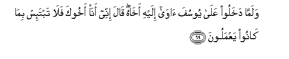
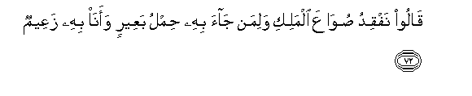
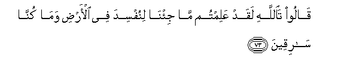
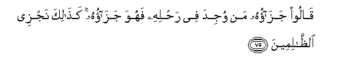
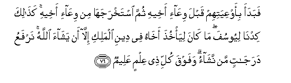
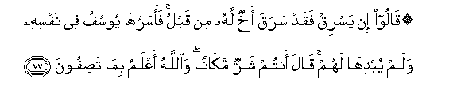
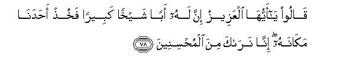
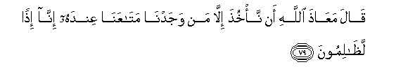

  
[Intangible Textual Heritage](../../index)  [Islam](../index) 
[Index](index)   
[Hypertext Qur'an](../htq/index)  [Unicode](../uq/012.htm#012_069) 
[Palmer](../sbe06/012)  [Pickthall](../pick/012.htm#012_069)  [Yusuf Ali
English](../yaq/yaq012)  [Rodwell](../qr/012)   
  
[Sūra XII.: Yūsuf, or Joseph. Index](012)  
  [Previous](01208)  [Next](01210) 

------------------------------------------------------------------------

  
*The Holy Quran*, tr. by Yusuf Ali, \[1934\], at Intangible Textual
Heritage

------------------------------------------------------------------------

# Sūra XII.: Yūsuf, or Joseph.

### Section 9

------------------------------------------------------------------------

69. Walamm<u>a</u> dakhaloo AAal<u>a</u> yoosufa <u>a</u>w<u>a</u>
ilayhi akh<u>a</u>hu q<u>a</u>la innee an<u>a</u> akhooka fal<u>a</u>
tabta-is bim<u>a</u> k<u>a</u>noo yaAAmaloon**a**

69\. Now when they came  
Into Joseph's presence,  
He received his (full) brother  
To stay with him. He said  
(To him): "Behold! I am thy (own)  
Brother; so grieve not  
At aught of their doings."

------------------------------------------------------------------------

70. Falamm<u>a</u> jahhazahum bijah<u>a</u>zihim jaAAala
a**l**ssiq<u>a</u>yata fee ra<u>h</u>li akheehi thumma a<u>thth</u>ana
mu-a<u>thth</u>inun ayyatuh<u>a</u> alAAeeru innakum
las<u>a</u>riqoon**a**

70\. At length when he had furnished  
Them forth with provisions  
(Suitable) for them, he put  
The drinking cup into  
His brother's saddle-bag.  
Then shouted out a Crier:  
"O ye (in) the Caravan!  
Behold! ye are thieves,  
Without doubt!"

------------------------------------------------------------------------

71. Q<u>a</u>loo waaqbaloo AAalayhim m<u>atha</u> tafqidoon**a**

71\. They said, turning towards them:  
"What is it that ye miss?"

------------------------------------------------------------------------

72. Q<u>a</u>loo nafqidu <u>s</u>uw<u>a</u>AAa almaliki waliman
j<u>a</u>a bihi <u>h</u>imlu baAAeerin waan<u>a</u> bihi zaAAeem**un**

72\. They said: "We miss  
The great beaker of the king;  
For him who produces it,—  
Is (the reward of)  
A camel load; I  
Will be bound by it."

------------------------------------------------------------------------

73. Q<u>a</u>loo ta**A**ll<u>a</u>hi laqad AAalimtum m<u>a</u>
ji/n<u>a</u> linufsida fee al-ar<u>d</u>i wam<u>a</u> kunn<u>a</u>
s<u>a</u>riqeen**a**

73\. (The brothers) said: "By God!  
Well ye know that we  
Came not to make mischief  
In the land, and we are  
No thieves!"

------------------------------------------------------------------------

74. Q<u>a</u>loo fam<u>a</u> jaz<u>a</u>ohu in kuntum
k<u>ath</u>ibeen**a**

74\. (The Egyptians) said: "What then  
Shall be the penalty of this,  
If ye are (proved) to have lied?"

------------------------------------------------------------------------

75. Q<u>a</u>loo jaz<u>a</u>ohu man wujida fee ra<u>h</u>lihi fahuwa
jaz<u>a</u>ohu ka<u>tha</u>lika najzee
a**l***<u>thth</u>*<u>a</u>limeen**a**

75\. They said: "The penalty  
Should be that he  
In whose saddle-bag  
It is found, should be held  
(As bondman) to atone  
For the (crime). Thus it is  
We punish the wrong-doers!"

------------------------------------------------------------------------

76. Fabadaa bi-awAAiyatihim qabla wiAA<u>a</u>-i akheehi thumma
istakhrajah<u>a</u> min wiAA<u>a</u>-i akheehi ka<u>tha</u>lika
kidn<u>a</u> liyoosufa m<u>a</u> k<u>a</u>na liya/khu<u>th</u>a
akh<u>a</u>hu fee deeni almaliki ill<u>a</u> an yash<u>a</u>a
All<u>a</u>hu narfaAAu daraj<u>a</u>tin man nash<u>a</u>o wafawqa kulli
<u>th</u>ee AAilmin AAaleem**un**

76\. So he began (the search)  
With their baggage,  
Before (he came to) the baggage  
Of his brother: at length  
He brought it out of his  
Brother's baggage. Thus did We  
Plan for Joseph. He could not  
Take his brother by the law  
Of the king except that God  
Willed it (so). We raise  
To degrees (of wisdom) whom  
We please: but over all  
Endued with knowledge is One,  
The All-Knowing.

------------------------------------------------------------------------

77. Q<u>a</u>loo in yasriq faqad saraqa akhun lahu min qablu
faasarrah<u>a</u> yoosufu fee nafsihi walam yubdih<u>a</u> lahum
q<u>a</u>la antum sharrun mak<u>a</u>nan wa**A**ll<u>a</u>hu aAAlamu
bim<u>a</u> ta<u>s</u>ifoon**a**

77\. They said: "If he steals,  
There was a brother of his  
Who did steal before (him)."  
But these things did Joseph  
Keep locked in his heart,  
Revealing not the secrets to them.  
He (simply) said (to himself):  
"Ye are the worse situated;  
And God knoweth best  
The truth of what ye assert!"

------------------------------------------------------------------------

78. Q<u>a</u>loo y<u>a</u> ayyuh<u>a</u> alAAazeezu inna lahu aban
shaykhan kabeeran fakhu<u>th</u> a<u>h</u>adan<u>a</u> mak<u>a</u>nahu
inn<u>a</u> nar<u>a</u>ka mina almu<u>h</u>sineen**a**

78\. They said: "O exalted one!  
Behold! he has a father,  
Aged and venerable, (who will  
Grieve for him); so take  
One of us in his place;  
For we see that thou art  
(Gracious) in doing good."

------------------------------------------------------------------------

79. Q<u>a</u>la maAA<u>ath</u>a All<u>a</u>hi an na/khu<u>th</u>a
ill<u>a</u> man wajadn<u>a</u> mat<u>a</u>AAan<u>a</u> AAindahu
inn<u>a</u> i<u>th</u>an la*<u>th</u>*<u>a</u>limoon**a**

79\. He said: "God forbid  
That we take other than him  
With whom we found  
Our property: indeed  
(If we did so), we should  
Be acting wrongfully.

------------------------------------------------------------------------

[Next: Section 10 (80-93)](01210)

