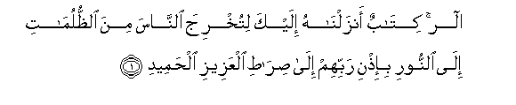
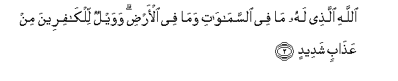
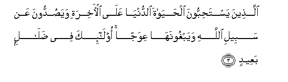
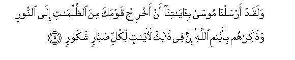

  
[Intangible Textual Heritage](../../index)  [Islam](../index) 
[Index](index)   
[Hypertext Qur'an](../htq/index)  [Unicode](../uq/014.htm#014_001) 
[Palmer](../sbe06/014)  [Pickthall](../pick/014.htm#014_001)  [Yusuf Ali
English](../yaq/yaq014)  [Rodwell](../qr/014)   
  
[Sūra XIV.: Ibrāhīm, or Abraham. Index](014)  
  [Previous](01306)  [Next](01402) 

------------------------------------------------------------------------

  
*The Holy Quran*, tr. by Yusuf Ali, \[1934\], at Intangible Textual
Heritage

------------------------------------------------------------------------

# Sūra XIV.: Ibrāhīm, or Abraham.

### Section 1

1. Alif-l<u>a</u>m-r<u>a</u> kit<u>a</u>bun anzaln<u>a</u>hu ilayka
litukhrija a**l**nn<u>a</u>sa mina a**l***<u>thth</u>*ulum<u>a</u>ti
il<u>a</u> a**l**nnoori bi-i<u>th</u>ni rabbihim il<u>a</u>
<u>s</u>ir<u>at</u>i alAAazeezi al<u>h</u>ameed**i**

1\. A. L. R. A Book  
Which We have revealed  
Unto thee, in order that  
Thou mightest lead mankind  
Out of the depths of darkness  
Into light—by the leave  
Of their Lord—to the Way  
Of (Him) the Exalted in Power,  
Worthy of all Praise!—

------------------------------------------------------------------------

2. All<u>a</u>hi alla<u>th</u>ee lahu m<u>a</u> fee
a**l**ssam<u>a</u>w<u>a</u>ti wam<u>a</u> fee al-ar<u>d</u>i wawaylun
lilk<u>a</u>fireena min AAa<u>tha</u>bin shadeed**in**

2\. Of God, to Whom do belong  
All things in the heavens  
And on earth!  
But alas for the Unbelievers  
For a terrible Penalty  
(Their Unfaith will bring them)!—

------------------------------------------------------------------------

3. Alla<u>th</u>eena yasta<u>h</u>ibboona al<u>h</u>ay<u>a</u>ta
a**l**dduny<u>a</u> AAal<u>a</u> al-<u>a</u>khirati waya<u>s</u>uddoona
AAan sabeeli All<u>a</u>hi wayabghoonah<u>a</u> AAiwajan ol<u>a</u>-ika
fee <u>d</u>al<u>a</u>lin baAAeed**in**

3\. Those who love the life  
Of this world more than  
The Hereafter, who hinder (men)  
From the Path of God  
And seek therein something crooked:  
They are astray  
By a long distance.

------------------------------------------------------------------------

4. Wam<u>a</u> arsaln<u>a</u> min rasoolin ill<u>a</u> bilis<u>a</u>ni
qawmihi liyubayyina lahum fayu<u>d</u>illu All<u>a</u>hu man
yash<u>a</u>o wayahdee man yash<u>a</u>o wahuwa alAAazeezu
al<u>h</u>akeem**u**

4\. We sent not an apostle  
Except (to teach) in the language  
Of his (own) people, in order  
To make (things) clear to them.  
Now God leaves straying  
Those whom He pleases  
And guides whom He pleases:  
And He is Exalted in Power,  
Full of Wisdom.

------------------------------------------------------------------------

5. Walaqad arsaln<u>a</u> moos<u>a</u> bi-<u>a</u>y<u>a</u>tin<u>a</u>
an akhrij qawmaka mina a**l***<u>thth</u>*ulum<u>a</u>ti il<u>a</u>
a**l**nnoori wa<u>th</u>akkirhum bi-ayy<u>a</u>mi All<u>a</u>hi inna fee
<u>tha</u>lika la<u>a</u>y<u>a</u>tin likulli <u>s</u>abb<u>a</u>rin
shakoor**in**

5\. We sent Moses with Our Signs  
(And the command). "Bring out  
Thy people from the depths  
Of darkness into light,  
And teach them to remember  
The Days of God." Verily  
In this there are Signs  
For such as are firmly patient  
And constant,—grateful and appreciative.

------------------------------------------------------------------------

6. Wa-i<u>th</u> q<u>a</u>la moos<u>a</u> liqawmihi o<u>th</u>kuroo
niAAmata All<u>a</u>hi AAalaykum i<u>th</u> anj<u>a</u>kum min
<u>a</u>li firAAawna yasoomoonakum soo-a alAAa<u>tha</u>bi
wayu<u>th</u>abbi<u>h</u>oona abn<u>a</u>akum wayasta<u>h</u>yoona
nis<u>a</u>akum wafee <u>tha</u>likum bal<u>a</u>on min rabbikum
AAa*<u>th</u>*eem**un**

6\. Remember! Moses said  
To his people: "Call to mind  
The favour of God to you  
When He delivered you  
From the people of Pharaoh:  
They set you hard tasks  
And punishments, slaughtered  
Your sons, and let your women-folk  
Live: therein was  
A tremendous trial from your Lord."

------------------------------------------------------------------------

[Next: Section 2 (7-12)](01402)

