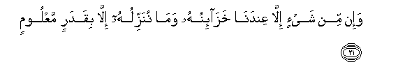
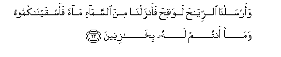

  
[Intangible Textual Heritage](../../index)  [Islam](../index) 
[Index](index)   
[Hypertext Qur'an](../htq/index)  [Unicode](../uq/015.htm#015_016) 
[Palmer](../sbe06/015)  [Pickthall](../pick/015.htm#015_016)  [Yusuf Ali
English](../yaq/yaq015)  [Rodwell](../qr/015)   
  
[Sūra XV.: Al-Hijr, or The Rocky Tract. Index](015)  
  [Previous](01501)  [Next](01503) 

------------------------------------------------------------------------

  
*The Holy Quran*, tr. by Yusuf Ali, \[1934\], at Intangible Textual
Heritage

------------------------------------------------------------------------

# Sūra XV.: Al-Hijr, or The Rocky Tract.

### Section 2

------------------------------------------------------------------------

16. Walaqad jaAAaln<u>a</u> fee a**l**ssam<u>a</u>-i buroojan
wazayyann<u>a</u>h<u>a</u> li**l**nn<u>a</u>*<u>th</u>*ireen**a**

16\. It is We Who have set out  
The Zodiacal Signs in the heavens,  
And made them fair-seeming  
To (all) beholders;

------------------------------------------------------------------------

17. Wa<u>h</u>afi*<u>th</u>*n<u>a</u>h<u>a</u> min kulli
shay<u>ta</u>nin rajeem**in**

17\. And (moreover) We have guarded them  
From every evil spirit accursed:

------------------------------------------------------------------------

18. Ill<u>a</u> mani istaraqa a**l**ssamAAa faatbaAAahu shih<u>a</u>bun
mubeen**un**

18\. But any that gains a hearing  
By stealth, is pursued  
By a flaming fire, bright (to see).

------------------------------------------------------------------------

19. Wa**a**l-ar<u>d</u>a madadn<u>a</u>h<u>a</u> waalqayn<u>a</u>
feeh<u>a</u> raw<u>a</u>siya waanbatn<u>a</u> feeh<u>a</u> min kulli
shay-in mawzoon**in**

19\. And the earth We have spread out  
(Like a carpet); set thereon  
Mountains firm and immovable;  
And produced therein all kinds  
Of things in due balance.

------------------------------------------------------------------------

20. WajaAAaln<u>a</u> lakum feeh<u>a</u> maAA<u>a</u>yisha waman lastum
lahu bir<u>a</u>ziqeen**a**

20\. And We have provided therein  
Means of subsistence,—for you  
And for those for whose sustenance  
Ye are not responsible.

------------------------------------------------------------------------

21. Wa-in min shay-in ill<u>a</u> AAindan<u>a</u> khaz<u>a</u>-inuhu
wam<u>a</u> nunazziluhu ill<u>a</u> biqadarin maAAloom**in**

21\. And there is not a thing  
But its (sources and) treasures  
(Inexhaustible) are with Us;  
But We only send down  
Thereof in due and ascertainable measures.

------------------------------------------------------------------------

22. Waarsaln<u>a</u> a**l**rriy<u>ah</u>a law<u>a</u>qi<u>h</u>a
faanzaln<u>a</u> mina a**l**ssam<u>a</u>-i m<u>a</u>an
faasqayn<u>a</u>kumoohu wam<u>a</u> antum lahu bikh<u>a</u>zineen**a**

22\. And We send the fecundating winds,  
Then cause the rain to descend  
From the sky, therewith providing  
You with water (in abundance),  
Though ye are not the guardians  
Of its stores.

------------------------------------------------------------------------

23. Wa-inn<u>a</u> lana<u>h</u>nu nu<u>h</u>yee wanumeetu wana<u>h</u>nu
alw<u>a</u>rithoon**a**

23\. And verily, it is We  
Who give life, and Who give  
Death: it is We Who remain Inheritors  
(After all else passes away).

------------------------------------------------------------------------

24. Walaqad AAalimn<u>a</u> almustaqdimeena minkum walaqad
AAalimn<u>a</u> almusta/khireen**a**

24\. To Us are known those of you  
Who hasten forward, and those  
Who lag behind.

------------------------------------------------------------------------

25. Wa-inna rabbaka huwa ya<u>h</u>shuruhum innahu <u>h</u>akeemun
AAaleem**un**

25\. Assuredly it is thy Lord  
Who will gather them together:  
For He is Perfect in Wisdom  
And Knowledge.

------------------------------------------------------------------------

[Next: Section 3 (26-44)](01503)

