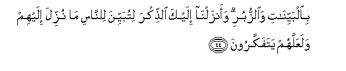

  
[Intangible Textual Heritage](../../index)  [Islam](../index) 
[Index](index)   
[Hypertext Qur'an](../htq/index)  [Unicode](../uq/016.htm#016_041) 
[Palmer](../sbe06/016)  [Pickthall](../pick/016.htm#016_041)  [Yusuf Ali
English](../yaq/yaq016)  [Rodwell](../qr/016)   
  
[Sūra XVI.: Naḥl or The Bee. Index](016)  
  [Previous](01605)  [Next](01607) 

------------------------------------------------------------------------

  
*The Holy Quran*, tr. by Yusuf Ali, \[1934\], at Intangible Textual
Heritage

------------------------------------------------------------------------

# Sūra XVI.: Naḥl or The Bee.

### Section 6

------------------------------------------------------------------------

41. Wa**a**lla<u>th</u>eena h<u>a</u>jaroo fee All<u>a</u>hi min baAAdi
m<u>a</u> *<u>th</u>*ulimoo lanubawwi-annahum fee a**l**dduny<u>a</u>
<u>h</u>asanatan walaajru al-<u>a</u>khirati akbaru law k<u>a</u>noo
yaAAlamoon**a**

41\. To those who leave  
Their homes in the cause  
Of God, after suffering  
oppression,—  
We will assuredly give  
A goodly home in this world;  
But truly the reward  
Of the Hereafter will be greater.  
If they only realised (this)!

------------------------------------------------------------------------

42. Alla<u>th</u>eena <u>s</u>abaroo waAAal<u>a</u> rabbihim
yatawakkaloon**a**

42\. (They are) those who persevere  
In patience, and put  
Their trust on their Lord.

------------------------------------------------------------------------

43. Wam<u>a</u> arsaln<u>a</u> min qablika ill<u>a</u> rij<u>a</u>lan
noo<u>h</u>ee ilayhim fa**i**s-aloo ahla a**l**<u>thth</u>ikri in kuntum
l<u>a</u> taAAlamoon**a**

43\. And before thee also  
The apostles We sent  
Were but men, to whom  
We granted inspiration: if ye  
Realise this not, ask of those  
Who possess the Message.

------------------------------------------------------------------------

44. Bi**a**lbayyin<u>a</u>ti wa**al**zzuburi waanzaln<u>a</u> ilayka
a**l**<u>thth</u>ikra litubayyina li**l**nn<u>a</u>si m<u>a</u> nuzzila
ilayhim walaAAallahum yatafakkaroon**a**

44\. (We sent them) with Clear Signs  
And Books of dark prophecies;  
And We have sent down  
Unto thee (also) the Message;  
That thou mayest explain clearly  
To men what is sent  
For them, and that they  
May give thought.

------------------------------------------------------------------------

45. Afaamina alla<u>th</u>eena makaroo a**l**ssayyi-<u>a</u>ti an
yakhsifa All<u>a</u>hu bihimu al-ar<u>d</u>a aw ya/tiyahumu
alAAa<u>tha</u>bu min <u>h</u>aythu l<u>a</u> yashAAuroon**a**

45\. Do then those who devise  
Evil (plots) feel secure  
That God will not cause  
the earth to swallow them up,  
Or that the Wrath will not  
Seize them from directions  
They little perceive?—

------------------------------------------------------------------------

46. Aw ya/khu<u>th</u>ahum fee taqallubihim fam<u>a</u> hum
bimuAAjizeen**a**

46\. Or that He may not  
Call them to account  
In the midst of their goings  
To and fro, without a chance  
Of their frustrating Him?—

------------------------------------------------------------------------

47. Aw ya/khu<u>th</u>ahum AAal<u>a</u> takhawwufin fa-inna rabbakum
laraoofun ra<u>h</u>eem**un**

47\. Or that He may not  
Call them to account  
By a process of slow wastage—  
For thy Lord is indeed  
Full of kindness and mercy.

------------------------------------------------------------------------

48. Awa lam yaraw il<u>a</u> m<u>a</u> khalaqa All<u>a</u>hu min shay-in
yatafayyao *<u>th</u>*il<u>a</u>luhu AAani alyameeni
wa**al**shsham<u>a</u>-ili sujjadan lill<u>a</u>hi wahum
d<u>a</u>khiroon**a**

48\. Do they not look  
At God's creation, (even)  
Among (inanimate) things,—  
How their (very) shadows  
Turn round, from the right  
And the left, prostrating  
Themselves to God, and that  
In the humblest manner?

------------------------------------------------------------------------

49. Walill<u>a</u>hi yasjudu m<u>a</u> fee a**l**ssam<u>a</u>w<u>a</u>ti
wam<u>a</u> fee al-ar<u>d</u>i min d<u>a</u>bbatin
wa**a**lmal<u>a</u>-ikatu wahum l<u>a</u> yastakbiroon**a**

49\. And to God doth obeisance  
All that is in the heavens  
And on earth, whether  
Moving (living) creatures  
Or the angels: for none  
Are arrogant (before their Lord).

------------------------------------------------------------------------

50. Yakh<u>a</u>foona rabbahum min fawqihim wayafAAaloona m<u>a</u>
yu/maroon**a**

50\. They all revere their Lord,  
High above them, and they do  
All that they are commanded.

------------------------------------------------------------------------

[Next: Section 7 (51-60)](01607)

