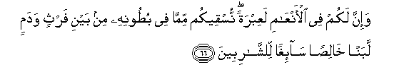
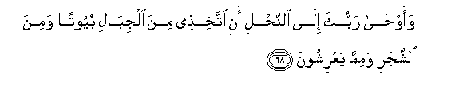
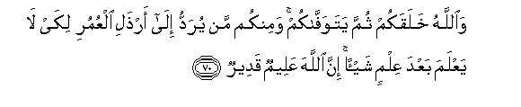

  
[Intangible Textual Heritage](../../index)  [Islam](../index) 
[Index](index)   
[Hypertext Qur'an](../htq/index)  [Unicode](../uq/016.htm#016_066) 
[Palmer](../sbe06/016)  [Pickthall](../pick/016.htm#016_066)  [Yusuf Ali
English](../yaq/yaq016)  [Rodwell](../qr/016)   
  
[Sūra XVI.: Naḥl or The Bee. Index](016)  
  [Previous](01608)  [Next](01610) 

------------------------------------------------------------------------

  
*The Holy Quran*, tr. by Yusuf Ali, \[1934\], at Intangible Textual
Heritage

------------------------------------------------------------------------

# Sūra XVI.: Naḥl or The Bee.

### Section 9

------------------------------------------------------------------------

66. Wa-inna lakum fee al-anAA<u>a</u>mi laAAibratan nusqeekum
mimm<u>a</u> fee bu<u>t</u>oonihi min bayni farthin wadamin labanan
kh<u>a</u>li<u>s</u>an s<u>a</u>-ighan li**l**shsh<u>a</u>ribeen**a**

66\. And verily in cattle (too)  
Will ye find an instructive Sign.  
From what is within their bodies,  
Between excretions and blood,  
We produce, for your drink,  
Milk, pure and agreeable  
To those who drink it.

------------------------------------------------------------------------

67. Wamin thamar<u>a</u>ti a**l**nnakheeli wa**a**l-aAAn<u>a</u>bi
tattakhi<u>th</u>oona minhu sakaran warizqan <u>h</u>asanan inna fee
<u>tha</u>lika la<u>a</u>yatan liqawmin yaAAqiloon**a**

67\. And from the fruit  
Of the date-palm and the vine,  
Ye get out wholesome drink  
And food: behold, in this  
Also is a Sign  
For those who are wise.

------------------------------------------------------------------------

68. Waaw<u>ha</u> rabbuka il<u>a</u> a**l**nna<u>h</u>li ani
ittakhi<u>th</u>ee mina aljib<u>a</u>li buyootan wamina a**l**shshajari
wamimm<u>a</u> yaAArishoon**a**

68\. And thy Lord taught the Bee  
To build its cells in hills,  
On trees, and in (men's) habitations;

------------------------------------------------------------------------

69. Thumma kulee min kulli a**l**ththamar<u>a</u>ti fa**o**slukee subula
rabbiki <u>th</u>ululan yakhruju min bu<u>t</u>oonih<u>a</u>
shar<u>a</u>bun mukhtalifun alw<u>a</u>nuhu feehi shif<u>a</u>on
li**l**nn<u>a</u>si inna fee <u>tha</u>lika la<u>a</u>yatan liqawmin
yatafakkaroon**a**

69\. Then to eat of all  
The produce (of the earth),  
And find with skill the spacious  
Paths of its Lord: there issues  
From within their bodies  
A drink of varying colours,  
Wherein is healing for men:  
Verily in this is a Sign  
For those who give thought.

------------------------------------------------------------------------

70. Wa**A**ll<u>a</u>hu khalaqakum thumma yatawaff<u>a</u>kum waminkum
man yuraddu il<u>a</u> ar<u>th</u>ali alAAumuri likay l<u>a</u> yaAAlama
baAAda AAilmin shay-an inna All<u>a</u>ha AAaleemun qadeer**un**

70\. It is God Who creates you  
And takes your souls at death;  
And of you there are  
Some who are sent back  
To a feeble age, so that  
They know nothing after  
Having known (much):  
For God is All-Knowing,  
All-Powerful.

------------------------------------------------------------------------

[Next: Section 10 (71-76)](01610)

