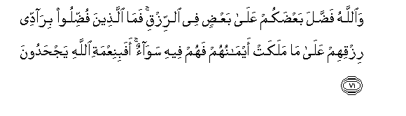
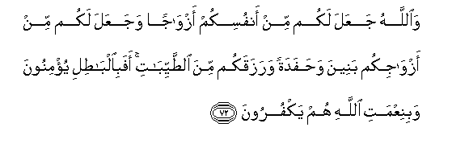
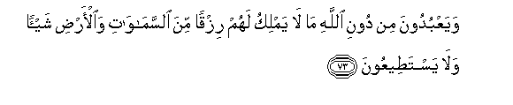
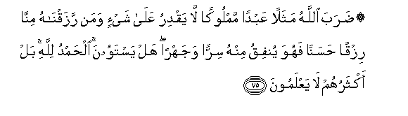
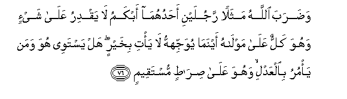

  
[Intangible Textual Heritage](../../index)  [Islam](../index) 
[Index](index)   
[Hypertext Qur'an](../htq/index)  [Unicode](../uq/016.htm#016_071) 
[Palmer](../sbe06/016)  [Pickthall](../pick/016.htm#016_071)  [Yusuf Ali
English](../yaq/yaq016)  [Rodwell](../qr/016)   
  
[Sūra XVI.: Naḥl or The Bee. Index](016)  
  [Previous](01609)  [Next](01611) 

------------------------------------------------------------------------

  
*The Holy Quran*, tr. by Yusuf Ali, \[1934\], at Intangible Textual
Heritage

------------------------------------------------------------------------

# Sūra XVI.: Naḥl or The Bee.

### Section 10

------------------------------------------------------------------------

71. Wa**A**ll<u>a</u>hu fa<u>dd</u>ala baAA<u>d</u>akum AAal<u>a</u>
baAA<u>d</u>in fee a**l**rrizqi fam<u>a</u> alla<u>th</u>eena
fu<u>dd</u>iloo bir<u>a</u>ddee rizqihim AAal<u>a</u> m<u>a</u> malakat
aym<u>a</u>nuhum fahum feehi saw<u>a</u>on afabiniAAmati All<u>a</u>hi
yaj<u>h</u>adoon**a**

71\. God has bestowed His gifts  
Of sustenance more freely on some  
Of you than on others: those  
More favoured are not going  
To throw back their gifts  
To those whom their right hands  
Possess, so as to be equal  
In that respect. Will they then  
Deny the favours of God?

------------------------------------------------------------------------

72. Wa**A**ll<u>a</u>hu jaAAala lakum min anfusikum azw<u>a</u>jan
wajaAAala lakum min azw<u>a</u>jikum baneena wa<u>h</u>afadatan
warazaqakum mina a**l**<u>tt</u>ayyib<u>a</u>ti afabi**a**lb<u>at</u>ili
yu/minoona wabiniAAmati All<u>a</u>hi hum yakfuroon**a**

72\. And God has made for you  
Mates (and Companions) of your own nature,  
And made for you, out of them,  
Sons and daughters and grandchildren,  
And provided for you sustenance  
Of the best: will they  
Then believe in vain things,  
And be ungrateful for God's favours?—

------------------------------------------------------------------------

73. WayaAAbudoona min dooni All<u>a</u>hi m<u>a</u> l<u>a</u> yamliku
lahum rizqan mina a**l**ssam<u>a</u>w<u>a</u>ti wa**a**l-ar<u>d</u>i
shay-an wal<u>a</u> yasta<u>t</u>eeAAoon**a**

73\. And worship others than God,—  
Such as have no power  
Of providing them, for sustenance,  
With anything in heavens or earth,  
And cannot possibly have  
Such power?

------------------------------------------------------------------------

74. Fal<u>a</u> ta<u>d</u>riboo lill<u>a</u>hi al-amth<u>a</u>la inna
All<u>a</u>ha yaAAlamu waantum l<u>a</u> taAAlamoon**a**

74\. Invent not similitudes  
For God: for God knoweth,  
And ye know not.

------------------------------------------------------------------------

75. <u>D</u>araba All<u>a</u>hu mathalan AAabdan mamlookan l<u>a</u>
yaqdiru AAal<u>a</u> shay-in waman razaqn<u>a</u>hu minn<u>a</u> rizqan
<u>h</u>asanan fahuwa yunfiqu minhu sirran wajahran hal yastawoona
al<u>h</u>amdu lill<u>a</u>hi bal aktharuhum l<u>a</u> yaAAlamoon**a**

75\. God sets forth the Parable  
(Of two men: one) a slave  
Under the dominion of another;  
He has no power of any sort;  
And (the other) a man  
On whom We have bestowed  
Goodly favours from Ourselves,  
And he spends thereof (freely),  
Privately and publicly:  
Are the two equal?  
(By no means;)  
Praise be to God. But  
Most of them understand not.

------------------------------------------------------------------------

76. Wa<u>d</u>araba All<u>a</u>hu mathalan rajulayni
a<u>h</u>aduhum<u>a</u> abkamu l<u>a</u> yaqdiru AAal<u>a</u> shay-in
wahuwa kallun AAal<u>a</u> mawl<u>a</u>hu aynam<u>a</u> yuwajjihhu
l<u>a</u> ya/ti bikhayrin hal yastawee huwa waman ya/muru bi**a**lAAadli
wahuwa AAal<u>a</u> <u>s</u>ir<u>at</u>in mustaqeem**in**

76\. God sets forth (another) Parable  
Of two men: one of them  
Dumb, with no power  
Of any sort; a wearisome burden  
Is he to his master;  
Whichever way he directs him,  
He brings no good:  
Is such a man equal  
With one who commands  
Justice, and is on  
A Straight Way?

------------------------------------------------------------------------

[Next: Section 11 (77-83)](01611)

