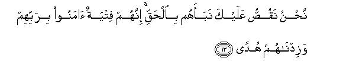
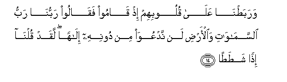
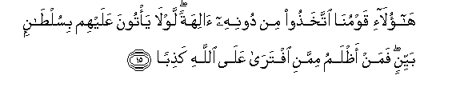
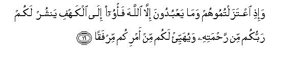
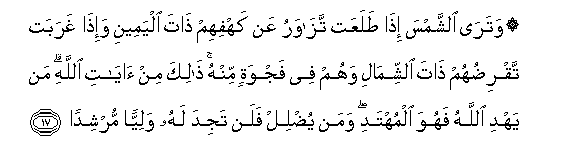

  
[Intangible Textual Heritage](../../index)  [Islam](../index) 
[Index](index)   
[Hypertext Qur'an](../htq/index)  [Unicode](../uq/018.htm#018_013) 
[Palmer](../sbe09/018)  [Pickthall](../pick/018.htm#018_013)  [Yusuf Ali
English](../yaq/yaq018)  [Rodwell](../qr/018)   
  
[Sūra XVIII.: Kahf, or the Cave. Index](018)  
  [Previous](01801)  [Next](01803) 

------------------------------------------------------------------------

  
*The Holy Quran*, tr. by Yusuf Ali, \[1934\], at Intangible Textual
Heritage

------------------------------------------------------------------------

# Sūra XVIII.: Kahf, or the Cave.

### Section 2

------------------------------------------------------------------------

13. Na<u>h</u>nu naqu<u>ss</u>u AAalayka nabaahum bi**a**l<u>h</u>aqqi
innahum fityatun <u>a</u>manoo birabbihim wazidn<u>a</u>hum
hud<u>a</u>**n**

13\. We relate to thee their story  
In truth: they were youths  
Who believed in their Lord,  
And We advanced them In guidance:

------------------------------------------------------------------------

14. Waraba<u>t</u>n<u>a</u> AAal<u>a</u> quloobihim i<u>th</u>
q<u>a</u>moo faq<u>a</u>loo rabbun<u>a</u> rabbu
a**l**ssam<u>a</u>w<u>a</u>ti wa**a**l-ar<u>d</u>i lan nadAAuwa min
doonihi il<u>a</u>han laqad quln<u>a</u> i<u>th</u>an
sha<u>t</u>a<u>ta</u>**n**

14\. We gave strength to their hearts:  
Behold, they stood up  
And said: "Our Lord is  
The Lord of the heavens  
And of the earth: never  
Shall we call upon any god  
Other than Him: if we  
Did, we should indeed  
Have uttered an enormity!

------------------------------------------------------------------------

15. H<u>a</u>ol<u>a</u>-i qawmun<u>a</u> ittakha<u>th</u>oo min doonihi
<u>a</u>lihatan lawl<u>a</u> ya/toona AAalayhim bisul<u>ta</u>nin
bayyinin faman a*<u>th</u>*lamu mimmani iftar<u>a</u> AAal<u>a</u>
All<u>a</u>hi ka<u>th</u>ib<u>a</u>**n**

15\. "These our people have taken  
For worship gods other  
Than Him: why do they  
Not bring forward an authority  
Clear (and convincing)  
For what they do?  
Who doth more wrong  
Than such as invent  
A falsehood against God?

------------------------------------------------------------------------

16. Wa-i<u>th</u>i iAAtazaltumoohum wam<u>a</u> yaAAbudoona ill<u>a</u>
All<u>a</u>ha fa/woo il<u>a</u> alkahfi yanshur lakum rabbukum min
ra<u>h</u>matihi wayuhayyi/ lakum min amrikum mirfaq<u>a</u>**n**

16\. "When ye turn away  
From them and the things  
They worship other than God,  
Betake yourselves to the Cave:  
Your Lord will shower  
His mercies on you  
And dispose of your affair  
Towards comfort and ease."

------------------------------------------------------------------------

17. Watar<u>a</u> a**l**shshamsa i<u>tha</u> <u>t</u>alaAAat
taz<u>a</u>waru AAan kahfihim <u>tha</u>ta alyameeni wa-i<u>tha</u>
gharabat taqri<u>d</u>uhum <u>tha</u>ta a**l**shshim<u>a</u>li wahum fee
fajwatin minhu <u>tha</u>lika min <u>a</u>y<u>a</u>ti All<u>a</u>hi man
yahdi All<u>a</u>hu fahuwa almuhtadi waman yu<u>d</u>lil falan tajida
lahu waliyyan murshid<u>a</u>**n**

17\. Thou wouldst have seen  
The sun, when it rose,  
Declining to the right  
From their Cave, and when  
It set, turning away  
From them to the left,  
While they lay in the open  
Space in the midst  
Of the Cave. Such are  
Among the Signs of God:  
He whom God guides  
Is rightly guided; but he  
Whom God leaves to stray,—  
For him wilt thou find  
No protector to lead him  
To the Right Way.

------------------------------------------------------------------------

[Next: Section 3 (18-22)](01803)

