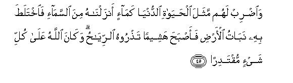
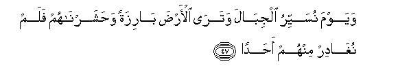
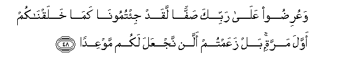
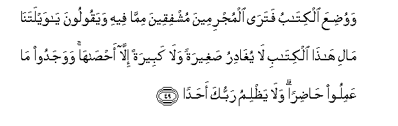

  
[Intangible Textual Heritage](../../index)  [Islam](../index) 
[Index](index)   
[Hypertext Qur'an](../htq/index)  [Unicode](../uq/018.htm#018_045) 
[Palmer](../sbe09/018)  [Pickthall](../pick/018.htm#018_045)  [Yusuf Ali
English](../yaq/yaq018)  [Rodwell](../qr/018)   
  
[Sūra XVIII.: Kahf, or the Cave. Index](018)  
  [Previous](01805)  [Next](01807) 

------------------------------------------------------------------------

  
*The Holy Quran*, tr. by Yusuf Ali, \[1934\], at Intangible Textual
Heritage

------------------------------------------------------------------------

# Sūra XVIII.: Kahf, or the Cave.

### Section 6

------------------------------------------------------------------------

45. Wa**i**<u>d</u>rib lahum mathala al<u>h</u>ay<u>a</u>ti
a**l**dduny<u>a</u> kam<u>a</u>-in anzaln<u>a</u>hu mina
a**l**ssam<u>a</u>-i fa**i**khtala<u>t</u>a bihi nab<u>a</u>tu
al-ar<u>d</u>i faa<u>s</u>ba<u>h</u>a hasheeman ta<u>th</u>roohu
a**l**rriy<u>ah</u>u wak<u>a</u>na All<u>a</u>hu AAal<u>a</u> kulli
shay-in muqtadir<u>a</u>**n**

45\. Set forth to them  
The similitude of the life  
Of this world: it is like  
The rain which We send  
Down from the skies:  
The earth's vegetation absorbs it,  
But soon it becomes  
Dry stubble, which the winds  
Do scatter: it is (only) God  
Who prevails over all things.

------------------------------------------------------------------------

46. Alm<u>a</u>lu wa**a**lbanoona zeenatu al<u>h</u>ay<u>a</u>ti
a**l**dduny<u>a</u> wa**a**lb<u>a</u>qiy<u>a</u>tu
a**l**<u>ssa</u>li<u>ha</u>tu khayrun AAinda rabbika thaw<u>a</u>ban
wakhayrun amal<u>a</u>**n**

46\. Wealth and sons are allurements  
Of the life of this world:  
But the things that endure,  
Good Deeds, are best  
In the sight of thy Lord,  
As rewards, and best  
As (the foundation for) hopes.

------------------------------------------------------------------------

47. Wayawma nusayyiru aljib<u>a</u>la watar<u>a</u> al-ar<u>d</u>a
b<u>a</u>rizatan wa<u>h</u>asharn<u>a</u>hum falam nugh<u>a</u>dir
minhum a<u>h</u>ad<u>a</u>**n**

47\. One Day We shall  
Remove the mountains, and thou  
Wilt see the earth  
As a level stretch,  
And We shall gather them,  
All together, nor shall We  
Leave out any one of them.

------------------------------------------------------------------------

48. WaAAuri<u>d</u>oo AAal<u>a</u> rabbika <u>s</u>affan laqad
ji/tumoon<u>a</u> kam<u>a</u> khalaqn<u>a</u>kum awwala marratin bal
zaAAamtum allan najAAala lakum mawAAid<u>a</u>**n**

48\. And they will be marshalled  
Before thy Lord in ranks,  
(With the announcement),  
"Now have ye come to Us  
(Bare) as We created you  
First: aye, ye thought  
We shall not fulfil  
The appointment made to you  
To meet (Us)!":

------------------------------------------------------------------------

49. Wawu<u>d</u>iAAa alkit<u>a</u>bu fatar<u>a</u> almujrimeena
mushfiqeena mimm<u>a</u> feehi wayaqooloona y<u>a</u> waylatan<u>a</u>
m<u>a</u> lih<u>atha</u> alkit<u>a</u>bi l<u>a</u> yugh<u>a</u>diru
<u>s</u>agheeratan wal<u>a</u> kabeeratan ill<u>a</u>
a<u>hsa</u>h<u>a</u> wawajadoo m<u>a</u> AAamiloo <u>had</u>iran
wal<u>a</u> ya*<u>th</u>*limu rabbuka a<u>h</u>ad<u>a</u>**n**

49\. And the Book (of Deeds)  
Will be placed (before you);  
And thou wilt see  
The sinful in great terror  
Because of what is (recorded)  
Therein; they will say,  
"Ah! woe to us!  
What a book is this!  
It leaves out nothing  
Small or great, but  
Takes account thereof!"  
They will find all that they  
Did, placed before them:  
And not one will thy Lord  
Treat with injustice.

------------------------------------------------------------------------

[Next: Section 7 (50-53)](01807)

