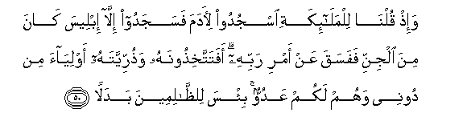
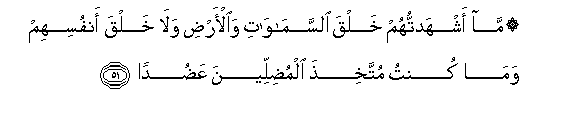
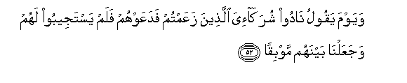
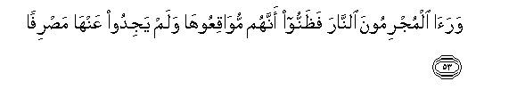

  
[Intangible Textual Heritage](../../index)  [Islam](../index) 
[Index](index)   
[Hypertext Qur'an](../htq/index)  [Unicode](../uq/018.htm#018_050) 
[Palmer](../sbe09/018)  [Pickthall](../pick/018.htm#018_050)  [Yusuf Ali
English](../yaq/yaq018)  [Rodwell](../qr/018)   
  
[Sūra XVIII.: Kahf, or the Cave. Index](018)  
  [Previous](01806)  [Next](01808) 

------------------------------------------------------------------------

  
*The Holy Quran*, tr. by Yusuf Ali, \[1934\], at Intangible Textual
Heritage

------------------------------------------------------------------------

# Sūra XVIII.: Kahf, or the Cave.

### Section 7

------------------------------------------------------------------------

50. Wa-i<u>th</u> quln<u>a</u> lilmal<u>a</u>-ikati osjudoo
li-<u>a</u>dama fasajadoo ill<u>a</u> ibleesa k<u>a</u>na mina aljinni
fafasaqa AAan amri rabbihi afatattakhi<u>th</u>oonahu
wa<u>th</u>urriyyatahu awliy<u>a</u>a min doonee wahum lakum AAaduwwun
bi/sa li**l***<u>thth</u>*<u>a</u>limeena badal<u>a</u>**n**

50\. Behold! We said  
To the angels, "Bow down  
To Adam": they bowed down  
Except Iblīs. He was  
One of the Jinns, and he  
Broke the Command  
Of his Lord.  
Will ye then take him  
And his progeny as protectors  
Rather than Me? And they  
Are enemies to you!  
Evil would be the exchange  
For the wrong-doers!

------------------------------------------------------------------------

51. M<u>a</u> ashhadtuhum khalqa a**l**ssam<u>a</u>w<u>a</u>ti
wa**a**l-ar<u>d</u>i wal<u>a</u> khalqa anfusihim wam<u>a</u> kuntu
muttakhi<u>th</u>a almu<u>d</u>illeena AAa<u>d</u>ud<u>a</u>**n**

51\. I called them not  
To witness the creation  
Of the heavens and the earth,  
Nor (even) their own creation:  
Nor is it for Me  
To take as helpers  
Such as lead (men) astray!

------------------------------------------------------------------------

52. Wayawma yaqoolu n<u>a</u>doo shurak<u>a</u>-iya alla<u>th</u>eena
zaAAamtum fadaAAawhum falam yastajeeboo lahum wajaAAaln<u>a</u> baynahum
mawbiq<u>a</u>**n**

52\. One Day He will say,  
"Call on those whom ye  
Thought to be My partners,"  
And they will call on them,  
But they will not listen  
To them; and We shall  
Make for them a place  
Of common perdition

------------------------------------------------------------------------

53. Wara<u>a</u> almujrimoona a**l**nn<u>a</u>ra fa*<u>th</u>*annoo
annahum muw<u>a</u>qiAAooh<u>a</u> walam yajidoo AAanh<u>a</u>
ma<u>s</u>rif<u>a</u>**n**

53\. And the Sinful shall see  
The Fire and apprehend  
That they have to fall  
Therein no means will they  
Find to turn away therefrom.

------------------------------------------------------------------------

[Next: Section 8 (54-59)](01808)

