

  
[Intangible Textual Heritage](../../index)  [Islam](../index) 
[Index](index)   
[Hypertext Qur'an](../htq/index)  [Unicode](../uq/018.htm#018_083) 
[Palmer](../sbe09/018)  [Pickthall](../pick/018.htm#018_083)  [Yusuf Ali
English](../yaq/yaq018)  [Rodwell](../qr/018)   
  
[Sūra XVIII.: Kahf, or the Cave. Index](018)  
  [Previous](01810)  [Next](01812) 

------------------------------------------------------------------------

  
*The Holy Quran*, tr. by Yusuf Ali, \[1934\], at Intangible Textual
Heritage

------------------------------------------------------------------------

# Sūra XVIII.: Kahf, or the Cave.

### Section 11

------------------------------------------------------------------------

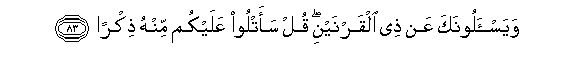

83. Wayas-aloonaka AAan <u>th</u>ee alqarnayni qul saatloo AAalaykum
minhu <u>th</u>ikr<u>a</u>**n**

83\. They ask thee concerning  
Ẓul-qarnain. Say,  
"I will rehearse to you  
Something of his story."

------------------------------------------------------------------------

84. Inn<u>a</u> makkann<u>a</u> lahu fee al-ar<u>d</u>i
wa<u>a</u>tayn<u>a</u>hu min kulli shay-in sabab<u>a</u>**n**

84\. Verily We established his power  
On earth, and We gave him  
The ways and the means  
To all ends.

------------------------------------------------------------------------

85. FaatbaAAa sabab<u>a</u>**n**

85\. One (such) way he followed,

------------------------------------------------------------------------

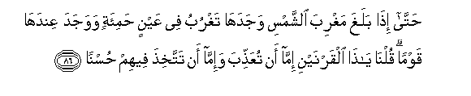

86. <u>H</u>att<u>a</u> i<u>tha</u> balagha maghriba a**l**shshamsi
wajadah<u>a</u> taghrubu fee AAaynin <u>h</u>ami-atin wawajada
AAindah<u>a</u> qawman quln<u>a</u> y<u>a</u> <u>tha</u> alqarnayni
imm<u>a</u> an tuAAa<u>thth</u>iba wa-imm<u>a</u> an tattakhi<u>th</u>a
feehim <u>h</u>usn<u>a</u>**n**

86\. Until, when he reached  
The setting of the sun,  
He found it set  
In a spring of murky water:  
Near it he found a People:  
We said: "O Ẓul-qarnain!  
(Thou hast authority,) either  
To punish them, or  
To treat them with kindness."

------------------------------------------------------------------------

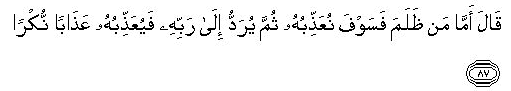

87. Q<u>a</u>la amm<u>a</u> man *<u>th</u>*alama fasawfa
nuAAa<u>thth</u>ibuhu thumma yuraddu il<u>a</u> rabbihi
fayuAAa<u>thth</u>ibuhu AAa<u>tha</u>ban nukr<u>a</u>**n**

87\. He said: "Whoever doth wrong,  
Him shall we punish; then  
Shall he be sent back  
To his Lord; and He will  
Punish him with a punishment  
Unheard-of (before).

------------------------------------------------------------------------

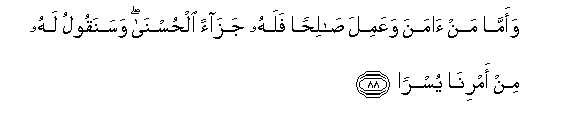

88. Waamm<u>a</u> man <u>a</u>mana waAAamila <u>sa</u>li<u>h</u>an
falahu jaz<u>a</u>an al<u>h</u>usn<u>a</u> wasanaqoolu lahu min
amrin<u>a</u> yusr<u>a</u>**n**

88\. "But whoever believes,  
And works righteousness,—  
He shall have a goodly  
Reward, and easy will be  
His task as we order it  
By our command."

------------------------------------------------------------------------

89. Thumma atbaAAa sabab<u>a</u>**n**

89\. Then followed he (another) way,

------------------------------------------------------------------------

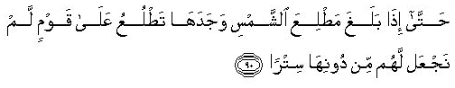

90. <u>H</u>att<u>a</u> i<u>tha</u> balagha ma<u>t</u>liAAa
a**l**shshamsi wajadah<u>a</u> ta<u>t</u>luAAu AAal<u>a</u> qawmin lam
najAAal lahum min doonih<u>a</u> sitr<u>a</u>**n**

90\. Until, when he came  
To the rising of the sun,  
He found it rising  
On a people for whom  
We had provided  
No covering protection  
Against the sun.

------------------------------------------------------------------------

91. Ka<u>tha</u>lika waqad a<u>h</u>a<u>t</u>n<u>a</u> bim<u>a</u>
ladayhi khubr<u>a</u>**n**

91\. (He left them) as they were:  
We completely understood  
What was before him.

------------------------------------------------------------------------

92. Thumma atbaAAa sabab<u>a</u>**n**

92\. Then followed he (another) way,

------------------------------------------------------------------------

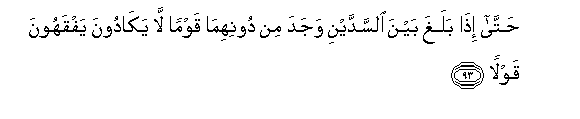

93. <u>H</u>att<u>a</u> i<u>tha</u> balagha bayna a**l**ssaddayni wajada
min doonihim<u>a</u> qawman l<u>a</u> yak<u>a</u>doona yafqahoona
qawl<u>a</u>**n**

93\. Until, when he reached  
(A tract) between two mountains,  
He found, beneath them, a people  
Who scarcely understood a word.

------------------------------------------------------------------------

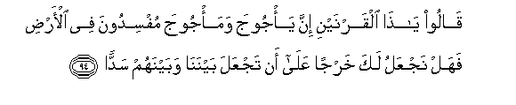

94. Q<u>a</u>loo y<u>a</u> <u>tha</u> alqarnayni inna ya/jooja
wama/jooja mufsidoona fee al-ar<u>d</u>i fahal najAAalu laka kharjan
AAal<u>a</u> an tajAAala baynan<u>a</u> wabaynahum sadd<u>a</u>**n**

94\. They said: "O Ẓul-qarnain!  
The Gog and Magog (people)  
Do great mischief on earth:  
Shall we then render thee  
Tribute in order that  
Thou mightest erect a barrier  
Between us and them?

------------------------------------------------------------------------

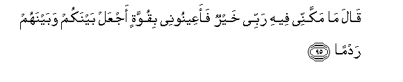

95. Q<u>a</u>la m<u>a</u> makkannee feehi rabbee khayrun faaAAeenoonee
biquwwatin ajAAal baynakum wabaynahum radm<u>a</u>**n**

95\. He said: "(The power) in which  
My Lord has established me  
Is better (than tribute):  
Help me therefore with strength  
(And labour): I will  
Erect a strong barrier  
Between you and them:

------------------------------------------------------------------------

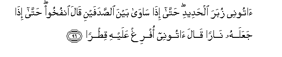

96. <u>A</u>toonee zubara al<u>h</u>adeedi <u>h</u>att<u>a</u>
i<u>tha</u> s<u>a</u>w<u>a</u> bayna a**l**<u>s</u>adafayni q<u>a</u>la
onfukhoo <u>h</u>att<u>a</u> i<u>tha</u> jaAAalahu n<u>a</u>ran
q<u>a</u>la <u>a</u>toonee ofrigh AAalayhi qi<u>t</u>r<u>a</u>**n**

96\. "Bring me blocks of iron."  
At length, when he had  
Filled up the space between  
The two steep mountain-sides,  
He said, "Blow (with your bellows)"  
Then, when he had made  
It (red) as fire, he said:  
"Bring me, that I may  
Pour over it, molten lead."

------------------------------------------------------------------------

97. Fam<u>a</u> is<u>ta</u>AAoo an ya*<u>th</u>*haroohu wam<u>a</u>
ista<u>ta</u>AAoo lahu naqb<u>a</u>**n**

97\. Thus were they made  
Powerless to scale it  
Or to dig through it.

------------------------------------------------------------------------

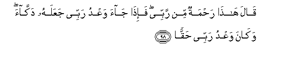

98. Q<u>a</u>la h<u>atha</u> ra<u>h</u>matun min rabbee fa-i<u>tha</u>
j<u>a</u>a waAAdu rabbee jaAAalahu dakk<u>a</u>a wak<u>a</u>na waAAdu
rabbee <u>h</u>aqq<u>a</u>**n**

98\. He said: "This is  
A mercy from my Lord:  
But when the promise  
Of my Lord comes to pass,  
He will make it into dust;  
And the promise of  
My Lord is true."

------------------------------------------------------------------------

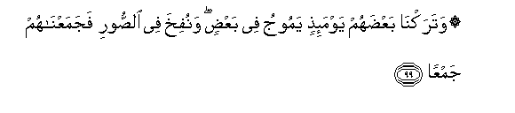

99. Watarakn<u>a</u> baAA<u>d</u>ahum yawma-i<u>th</u>in yamooju fee
baAA<u>d</u>in wanufikha fee a**l**<u>ss</u>oori fajamaAAn<u>a</u>hum
jamAA<u>a</u>**n**

99\. On that day We shall  
Leave them to surge  
Like waves on one another  
The trumpet will be blown,  
And We shall collect them  
All together.

------------------------------------------------------------------------

100. WaAAara<u>d</u>n<u>a</u> jahannama yawma-i<u>th</u>in
lilk<u>a</u>fireena AAar<u>da</u>**n**

100\. And We shall present  
Hell that day for Unbelievers  
To see, all spread out,—

------------------------------------------------------------------------

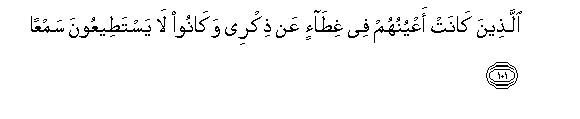

101. Alla<u>th</u>eena k<u>a</u>nat aAAyunuhum fee ghi<u>ta</u>-in AAan
<u>th</u>ikree wak<u>a</u>noo l<u>a</u> yasta<u>t</u>eeAAoona
samAA<u>a</u>**n**

101\. (Unbelievers) whose eyes  
Had been under a veil  
From Remembrance of Me,  
And who had been unable  
Even to hear.

------------------------------------------------------------------------

[Next: Section 12 (102-110)](01812)

